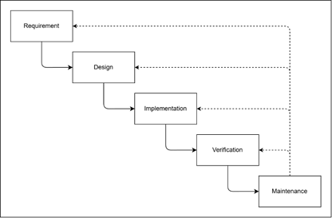

# BAB I PENDAHULUAN ^bab-1

## 1.1 Latar Belakang ^latar-belakang

Olahraga telah menjadi bagian tak terpisahkan dari gaya hidup masyarakat modern. Meningkatnya kesadaran akan pentingnya kesehatan dan kebugaran mendorong lonjakan minat masyarakat terhadap berbagai aktivitas fisik dan olahraga kelompok, seperti futsal, bulu tangkis (*badminton*), bola basket, dan sepak bola mini (*mini soccer*). Peningkatan tren ini sejalan dengan melonjaknya permintaan terhadap ketersediaan fasilitas dan penyewaan lapangan olahraga yang representatif. Bagi para pemilik dan penyedia sarana olahraga, kondisi ini membuka peluang bisnis yang menjanjikan, namun sekaligus menghadirkan tantangan signifikan dalam tata kelola operasional dan mutu pelayanan pelanggan.

Hingga saat ini, sebagian besar penyedia jasa penyewaan lapangan olahraga masih mengandalkan mekanisme konvensional atau manual dalam menjalankan proses bisnisnya, seperti pencatatan pada buku agenda harian serta komunikasi reservasi melalui panggilan telepon atau aplikasi pesan instan WhatsApp. Pola kerja manual ini memiliki berbagai kelemahan mendasar yang berdampak langsung pada penurunan efisiensi operasional. Menurut penelitian Nadjamuddin (2023) serta Swastika dan Khasanah (2017), sistem manual menyulitkan pelanggan dalam memastikan ketersediaan jadwal dan membebani pengelola dalam mengolah data pemesanan yang menumpuk. Permasalahan klasik seperti jadwal ganda (*double booking*), kesalahan pencatatan waktu sewa, lambatnya rekapitulasi laporan pendapatan, serta ketidakefisienan waktu operasional menjadi kendala utama yang kerap dihadapi oleh pengelola fasilitas olahraga (Pramono et al., 2025; Ratama et al., 2022). Secara teknis, ketiadaan mekanisme kendali konkurensi (*concurrency control*) pada sistem pemesanan konvensional menjadi penyebab utama terjadinya konflik jadwal ketika beberapa calon penyewa memperebutkan slot jam sewa yang sama secara bersamaan (Saputra, 2018).

Selain masalah penjadwalan, alur pembayaran pada sistem konvensional umumnya masih mengandalkan transfer bank manual dengan bukti transfer berupa gambar atau struk. Pola transaksi ini memperlambat proses konfirmasi karena pengelola harus memeriksa mutasi rekening secara manual satu per satu, sekaligus membuka celah manipulasi bukti transfer palsu (*fraudulent transfer receipt*) (Hafiz et al., 2023). Sebagaimana ditegaskan oleh Ramadan dan Arifin (2025) serta Siahaan dan Sianturi (2024), integrasi teknologi transaksi digital otomatis (*payment gateway*) menjadi komponen krusial untuk mengotomatisasi konfirmasi pembayaran secara instan, mengunci slot waktu sewa secara *real-time*, dan mengeliminasi ketergantungan pada verifikasi manual pengelola.

Dari perspektif kebutuhan pasar dan penelitian terdahulu, sebagian besar pengembangan sistem informasi reservasi olahraga yang telah ada hanya berfokus pada satu fasilitas tertentu (*single-tenant / single-venue*) (Fortunata & Cahyaningtyas, 2023; Nurhakim dkk., 2023). Pendekatan *single-venue* tersebut memiliki keterbatasan, yaitu memicu fragmentasi layanan di mana pelanggan harus mengakses banyak aplikasi berbeda untuk membandingkan fasilitas, harga, dan ketersediaan jadwal. Di sisi lain, pemilik sarana olahraga skala kecil dan menengah menghadapi kendala biaya investasi yang tinggi apabila harus membangun sistem aplikasi digital secara mandiri. Oleh karena itu, penerapan konsep *marketplace multi-tenant* menjadi solusi strategis yang efektif karena mampu mempertemukan banyak penyedia lapangan (*Renter*) dengan masyarakat luas (*User*) dalam satu wadah terpusat berbasis pencarian cabang olahraga, harga, dan lokasi (Anwar et al., 2020; Sidiarta, 2018).

Berdasarkan latar belakang permasalahan dan kesenjangan (*gap*) penelitian tersebut, penelitian ini mengusulkan **"Rancang Bangun Sistem Informasi Reservasi dan Fasilitas Olahraga Multi-Tenant Berbasis Web"** yang dinamakan **FieldMax**. Platform FieldMax dirancang dengan arsitektur modern berbasis *full-stack TypeScript monorepo* yang mengintegrasikan tiga peran pengguna (*User*, *Renter*, dan *Admin*). Platform ini memfasilitasi Pemilik Fasilitas (*Renter*) dalam mengelola jadwal operasional, data lapangan, galeri fasilitas, dan visualisasi laporan pendapatan, sekaligus memberikan kemudahan bagi Pelanggan (*User*) untuk mengecek ketersediaan jadwal secara *real-time*, melakukan pemesanan instan, serta menyelesaikan pembayaran digital otomatis melalui *payment gateway* Midtrans Snap. Implementasi sistem ini diharapkan menjadi solusi komprehensif untuk mengeliminasi masalah *double booking*, mencegah kecurangan bukti transaksi, meningkatkan efisiensi operasional pengelola, dan memberikan pengalaman reservasi digital yang praktis bagi masyarakat.

## 1.2 Rumusan Masalah ^rumusan-masalah

Berdasarkan latar belakang yang telah diuraikan, rumusan masalah dalam penelitian ini adalah sebagai berikut:

1. Bagaimana merancang dan membangun sistem informasi reservasi dan fasilitas olahraga *multi-tenant* berbasis web (FieldMax) yang mampu mengotomatisasi proses bisnis penyewaan lapangan, memfasilitasi transaksi secara digital, serta menyediakan layanan terpadu bagi pengelola fasilitas dan pelanggan?
2. Bagaimana menguji dan membuktikan keandalan sistem informasi FieldMax menggunakan metode *Black Box Testing* dalam mengeliminasi terjadinya bentrok jadwal (*double booking*) pada proses reservasi lapangan?

## 1.3 Tujuan Penelitian ^tujuan-penelitian

Tujuan yang ingin dicapai dalam penelitian ini adalah:

1. Merancang dan mengimplementasikan sistem informasi reservasi dan fasilitas olahraga *multi-tenant* berbasis web (FieldMax) guna mendigitalisasi pengelolaan sarana olahraga, mempermudah proses transaksi pemesanan secara mandiri, dan menyediakan platform terpadu bagi seluruh pengguna sistem (*User*, *Renter*, dan *Admin*).
2. Menguji dan membuktikan secara empiris keandalan sistem informasi FieldMax menggunakan metode *Black Box Testing* dalam mencegah dan mengeliminasi terjadinya pemesanan ganda (*double booking*) pada slot waktu dan lapangan yang sama.

## 1.4 Batasan Masalah ^batasan-masalah

Untuk menjaga fokus penelitian agar terarah dan sesuai dengan sasaran yang ditetapkan, batasan masalah dalam penelitian ini mencakup:

1. Sistem dibangun berbasis web responsif menggunakan *framework* Next.js (App Router) pada sisi antarmuka (*frontend*) dan Express.js pada sisi layanan peladen (*backend*), yang dapat diakses melalui peramban (*browser*) desktop maupun perangkat bergerak (*mobile*).
2. Pengelolaan dan persistensi data menggunakan sistem manajemen basis data relasional PostgreSQL yang diakses menggunakan Prisma *Object-Relational Mapping* (ORM).
3. Transaksi pembayaran terintegrasi secara daring menggunakan *payment gateway* Midtrans Snap pada lingkungan *sandbox/production* yang mendukung metode pembayaran digital Indonesia (QRIS, *Virtual Account*, dan *e-Wallet*).
4. Pengelolaan dan penyimpanan berkas media (foto profil, foto venue, dan foto lapangan) menggunakan layanan pihak ketiga ImageKit *Content Delivery Network* (CDN).
5. Sistem otentikasi pengguna menggunakan mekanisme *session-based authentication* yang disimpan langsung di dalam basis data (tanpa *JSON Web Token* / JWT).
6. Sistem tidak mencakup pengelolaan akuntansi keuangan mendalam (seperti neraca, jurnal umum, atau buku besar), melainkan berfokus pada rekapitulasi transaksi sewa, status pembayaran, dan total pendapatan operasional lapangan.
7. Pengujian sistem dibatasi pada evaluasi fungsionalitas perangkat lunak menggunakan metode *Black Box Testing* untuk memverifikasi kesesuaian alur bisnis dan keandalan pencegahan *double booking*, serta tidak mencakup pengujian keamanan penetrasi mendalam (*penetration testing*) maupun uji beban masif (*stress testing*).

## 1.5 Manfaat Penelitian ^manfaat-penelitian

Hasil dari penelitian ini diharapkan dapat memberikan manfaat baik secara teoretis maupun praktis:

1. **Manfaat Teoretis**:
   Menjadi referensi akademik dalam penerapan metode *Design Science Research* (DSR) dan siklus pengembangan *Waterfall* pada perancangan sistem informasi *multi-tenant* dan *marketplace* reservasi berbasis web dengan arsitektur *full-stack TypeScript monorepo*.

2. **Manfaat Praktis**:
   - **Bagi Pelanggan (*User*)**: Memperoleh kemudahan dalam mencari informasi venue olahraga, memantau ketersediaan lapangan secara akurat dan *real-time*, serta melakukan pemesanan dan pembayaran digital secara mandiri dan fleksibel tanpa batasan waktu.
   - **Bagi Pemilik Fasilitas (*Renter*)**: Meningkatkan efisiensi tata kelola operasional sarana olahraga, mengeliminasi kesalahan pencatatan jadwal ganda (*double booking*), mempermudah pemantauan rekapitulasi pendapatan secara transparan, serta memperluas jangkauan promosi fasilitas olahraga kepada masyarakat luas.
   - **Bagi Administrator (*Admin*)**: Mempermudah proses moderasi, verifikasi kelayakan mitra pengelola/venue baru, serta penanganan keluhan dan laporan pengguna secara terpusat.
   - **Bagi Peneliti**: Menerapkan dan menguji integrasi teknologi rekayasa web modern (Next.js, Express.js, PostgreSQL, Prisma ORM, Midtrans Snap, dan ImageKit CDN) dalam memecahkan masalah riil di industri layanan olahraga.

## 1.6 Landasan Teori ^landasan-teori

### 1.6.1 Sistem Informasi Berbasis Web

Sistem informasi merupakan keterpaduan komponen yang terdiri atas manusia, perangkat keras (*hardware*), perangkat lunak (*software*), jaringan komunikasi, dan sumber data yang saling berinteraksi untuk mengumpulkan, mengolah, menyimpan, serta mendistribusikan informasi guna mendukung pengambilan keputusan, koordinasi, dan kendali dalam suatu organisasi (O'Brien & Marakas, 2011). Melalui sistem informasi, proses bisnis operasional dan transaksi dapat berjalan secara lebih cepat, tepat, dan transparan.

Di era digital, sistem informasi berbasis web (*web-based information system*) menjadi solusi dominan karena mengombinasikan kekuatan basis data terpusat dengan fleksibilitas antarmuka web yang dapat diakses secara luas melalui jaringan internet menggunakan peramban (*browser*) tanpa memerlukan instalasi aplikasi lokal yang rumit (Rahmi et al., 2023). Pada platform FieldMax, sistem informasi berbasis web difungsikan sebagai media penghubung interaktif yang mengotomatisasi proses bisnis reservasi lapangan dan manajemen fasilitas olahraga bagi seluruh pihak yang terlibat.

### 1.6.2 Reservasi Lapangan Olahraga

Reservasi merupakan proses perikatan awal antara konsumen dan penyedia jasa mengenai pemanfaatan suatu produk atau fasilitas pada waktu tertentu di masa mendatang (Christanto et al., 2012). Selama proses reservasi berlangsung, terjadi pertukaran informasi terstruktur antara konsumen mengenai kebutuhan spesifik (seperti pilihan lapangan, tanggal sewa, dan rentang jam main) dengan penyedia jasa mengenai ketersediaan jadwal serta tarif yang berlaku.

Penerapan reservasi secara daring (*online reservation*) terbukti mampu meminimalkan friksi operasional, seperti antrean panjang, ketidakpastian ketersediaan lapangan, dan risiko bentrok jadwal (*double booking*). Penelitian Hasibuan dkk. (2024) menunjukkan bahwa sistem informasi reservasi olahraga berbasis web berhasil meningkatkan efisiensi operasional pengelola tempat olahraga secara sistematis dan terkontrol, sekaligus memberikan kepastian konfirmasi instan bagi pelanggan.

### 1.6.3 Layanan Penyewaan Lapangan di FieldMax

Platform FieldMax dikembangkan sebagai platform *marketplace multi-tenant* yang dirancang khusus untuk memfasilitasi ekosistem penyewaan lapangan olahraga. Platform ini membagi hak akses ke dalam tiga tingkatan peran (*role*):
1. **User (Pelanggan)**: Masyarakat umum yang memanfaatkan platform untuk menjelajahi katalog venue/lapangan, memfilter berdasarkan cabang olahraga atau harga, mengecek jadwal kosong secara *real-time*, membuat reservasi, melakukan pembayaran daring, serta memberikan ulasan (*review*) pasca bermain.
2. **Renter (Mitra Pengelola)**: Pemilik atau pengelola sarana olahraga yang memiliki hak mengelola profil venue, mendaftarkan lapangan, mengatur jadwal jam operasional (*VenueSchedule*), menetapkan tarif per jam, memantau kalender booking, serta melihat statistik pendapatan.
3. **Admin (Administrator)**: Pengelola platform FieldMax yang bertugas memverifikasi kelayakan akun *Renter* dan venue baru, mengawasi kepatuhan operasional, serta menangani tiket laporan permasalahan (*Report*) dari pengguna.

Melalui arsitektur ini, FieldMax mentransformasi alur reservasi konvensional (yang sebelumnya mengandalkan percakapan manual WhatsApp dan transfer bank manual) menjadi proses yang terintegrasi secara otomatis dari awal hingga akhir (*end-to-end*).

### 1.6.4 Teknologi Pengembangan

#### 1. Next.js

Next.js merupakan kerangka kerja (*framework*) berbasis React.js yang digunakan untuk membangun antarmuka web modern dengan performa tinggi dan ramah terhadap *Search Engine Optimization* (SEO). Next.js memadukan keunggulan *Server-Side Rendering* (SSR), *Static Site Generation* (SSG), serta *Client-Side Rendering* (CSR) melalui arsitektur terbarunya, yaitu *App Router* dan *React Server Components* (Pati & Zaki, 2025). Pemanfaatan Next.js pada sisi *frontend* FieldMax memungkinkan rendering halaman dinamis yang cepat, pembagian rute modular (*file-system based routing*), dan pengelolaan status aplikasi yang efisien dengan TanStack React Query.

#### 2. Express.js

Express.js adalah kerangka kerja sisi peladen (*backend framework*) berbasis Node.js yang bersifat minimalis, cepat, dan fleksibel (Nasution & Pane, 2025). Express.js memfasilitasi pembuatan *Application Programming Interface* (RESTful API) yang kokoh, dilengkapi mekanisme *middleware* untuk penanganan otentikasi sesi, validasi skema data permintaan menggunakan Zod, serta pengendalian galat terpusat (*centralized error handling*) (Azkarin et al., 2023).

#### 3. PostgreSQL dan Prisma ORM

PostgreSQL merupakan sistem manajemen basis data relasional (*Relational Database Management System* / RDBMS) sumber terbuka tingkat lanjut yang andal dalam menangani transaksi data kompleks. PostgreSQL mengimplementasikan mekanisme *Multi-Version Concurrency Control* (MVCC), yang memastikan konsistensi dan integritas data ketika banyak pengguna melakukan transaksi secara bersamaan (*concurrency*) tanpa saling mengunci tabel secara berlebihan (Salunke & Ouda, 2024).

Untuk menjembatani komunikasi antara kode TypeScript dan basis data PostgreSQL, digunakan **Prisma ORM**. Prisma menyediakan *type-safe database client*, pengelolaan skema basis data terpadu, dan sistem migrasi otomatis (*Prisma Migrate*) yang meminimalkan kesalahan penulisan kueri SQL manual.

#### 4. *Payment Gateway* Midtrans Snap

*Payment gateway* adalah layanan perantara otorisasi pembayaran elektronik yang menghubungkan sistem aplikasi perdagangan digital (*e-commerce*) dengan berbagai institusi finansial dan bank secara aman (Siahaan & Sianturi, 2024). Pada platform FieldMax, integrasi pembayaran digital memanfaatkan layanan **Midtrans Snap**.

Midtrans memfasilitasi berbagai kanal pembayaran lokal di Indonesia, termasuk *Virtual Account* (BCA, Mandiri, BNI, BRI, Permata), QRIS (GoPay, ShopeePay, OVO, Dana), dan *e-Wallet*. Melalui mekanisme *Snap Token* dan notifikasi *HTTP Webhook*, server FieldMax dapat mendeteksi perubahan status pembayaran secara instan, sehingga status pemesanan (*Booking*) dapat diperbarui secara otomatis dari status `PENDING` menjadi `CONFIRMED`/`PAID` tanpa memerlukan verifikasi manual bukti struk pembayaran oleh pengelola (Hafiz et al., 2023).

#### 5. ImageKit CDN dan Nodemailer

Pengelolaan media foto (seperti foto profil pengguna, foto fasilitas venue, dan foto lapangan) dioptimalkan menggunakan **ImageKit**, sebuah layanan *Content Delivery Network* (CDN) berbasis komputasi awan yang menyediakan penyimpanan berkas terpusat dan optimasi resolusi gambar otomatis sesuai perangkat pengguna. Sedangkan untuk kebutuhan komunikasi notifikasi sistem, digunakan pustaka **Nodemailer** yang terhubung dengan protokol SMTP (*Simple Mail Transfer Protocol*) guna mengirimkan tautan verifikasi alamat email serta token pemulihan kata sandi (*password reset*).

### 1.6.5 Pemodelan Sistem Berbasis UML

*Unified Modeling Language* (UML) merupakan standar bahasa visual untuk menspesifikasikan, memvisualisasikan, membangun, dan mendokumentasikan artefak dari suatu sistem perangkat lunak (Pressman, 2010). Pemodelan berorientasi objek ini mempermudah pemahaman arsitektur dan alur kerja sistem. Diagram UML yang digunakan dalam penelitian ini meliputi:

#### 1. *Use Case Diagram*

*Use Case Diagram* menggambarkan interaksi fungsional antara satu atau lebih aktor eksternal dengan sistem dari sudut pandang perilaku (*behavioral view*). Diagram ini mendefinisikan batasan sistem dan hak akses fungsionalitas bagi masing-masing pengguna.

**Tabel 1.** Komponen *Use Case Diagram* ^tabel-1

| SIMBOL | NAMA | KETERANGAN |
| :---: | :--- | :--- |
| <svg width="24" height="24" viewBox="0 0 24 24" fill="none" stroke="currentColor" stroke-width="2" stroke-linecap="round" stroke-linejoin="round"><circle cx="12" cy="7" r="4"/><path d="M19 21v-2a4 4 0 0 0-4-4H9a4 4 0 0 0-4 4v2"/></svg> | *Actor* | Mewakili peran pengguna, sistem lain, atau perangkat luar yang berinteraksi dengan sistem |
| <svg width="40" height="20" viewBox="0 0 40 20"><ellipse cx="20" cy="10" rx="18" ry="8" stroke="currentColor" stroke-width="2" fill="none"/></svg> | *Use Case* | Deskripsi urutan aksi yang dilakukan sistem untuk menghasilkan nilai terukur bagi aktor |
| <svg width="40" height="20" viewBox="0 0 40 20"><line x1="2" y1="10" x2="38" y2="10" stroke="currentColor" stroke-width="2"/></svg> | *Association* | Garis penghubung komunikasi antara aktor dengan *use case* yang bersangkutan |
| <svg width="40" height="20" viewBox="0 0 40 20"><line x1="2" y1="10" x2="30" y2="10" stroke="currentColor" stroke-width="2"/><polygon points="30,6 38,10 30,14" stroke="currentColor" stroke-width="2" fill="none"/></svg> | *Generalization* | Relasi hierarki pewarisan sifat atau perilaku dari *use case* umum ke khusus |
| <svg width="40" height="20" viewBox="0 0 40 20"><line x1="2" y1="10" x2="30" y2="10" stroke="currentColor" stroke-width="2" stroke-dasharray="3,3"/><polygon points="30,6 38,10 30,14" fill="currentColor"/></svg> | *Include* | Relasi keharusan di mana eksekusi *use case* sumber mutlak menyertakan fungsionalitas *use case* target |

#### 2. *Activity Diagram*

*Activity Diagram* memodelkan alur kerja (*workflow*) dari suatu proses bisnis atau urutan eksekusi logika sistem dari suatu aktivitas ke aktivitas lainnya, termasuk percabangan kondisi (*decision*) dan titik awal/akhir proses.

**Tabel 2.** Komponen *Activity Diagram* ^tabel-2

| SIMBOL | NAMA | KETERANGAN |
| :---: | :--- | :--- |
| <svg width="20" height="20" viewBox="0 0 20 20"><circle cx="10" cy="10" r="8" fill="currentColor"/></svg> | *Initial Node (Start Point)* | Menandai titik awal dimulainya suatu aliran aktivitas |
| <svg width="20" height="20" viewBox="0 0 20 20"><circle cx="10" cy="10" r="8" stroke="currentColor" stroke-width="2" fill="none"/><circle cx="10" cy="10" r="4" fill="currentColor"/></svg> | *Activity Final Node (End Point)* | Menandai titik akhir penyelesaian seluruh aliran aktivitas |
| <svg width="40" height="20" viewBox="0 0 40 20"><rect x="2" y="2" width="36" height="16" rx="5" ry="5" stroke="currentColor" stroke-width="2" fill="none"/></svg> | *Action / Activity* | Menunjukkan pekerjaan atau tindakan komputasi yang sedang dilakukan dalam alur proses |
| <svg width="20" height="20" viewBox="0 0 20 20"><polygon points="10,2 18,10 10,18 2,10" stroke="currentColor" stroke-width="2" fill="none"/></svg> | *Decision Node* | Titik percabangan logika untuk menentukan arah alur berdasarkan evaluasi kondisi boolean tertentu |

#### 3. *Entity Relationship Diagram* (ERD)

*Entity Relationship Diagram* (ERD) adalah notasi grafis yang digunakan untuk memodelkan struktur konseptual dan relasional dari suatu basis data. ERD mendefinisikan entitas objek, atribut-atribut pembentuknya, kunci utama (*primary key*), kunci asing (*foreign key*), serta derajat kardinalitas hubungan antar-entitas (1:1, 1:N, M:N).

**Tabel 3.** Komponen *Entity Relationship Diagram* ^tabel-3

| SIMBOL | NAMA | KETERANGAN |
| :---: | :--- | :--- |
| <svg width="40" height="20" viewBox="0 0 40 20"><rect x="2" y="2" width="36" height="16" stroke="currentColor" stroke-width="2" fill="none"/></svg> | *Entity* | Objek data riil atau konseptual yang memiliki karakteristik tersendiri dalam basis data |
| <svg width="40" height="20" viewBox="0 0 40 20"><ellipse cx="20" cy="10" rx="18" ry="8" stroke="currentColor" stroke-width="2" fill="none"/></svg> | *Attribute* | Properti atau karakteristik spesifik yang mendeskripsikan suatu entitas |
| <svg width="30" height="20" viewBox="0 0 30 20"><polygon points="15,2 27,10 15,18 3,10" stroke="currentColor" stroke-width="2" fill="none"/></svg> | *Relationship* | Keterhubungan logis antara dua entitas atau lebih di dalam sistem basis data |
| <svg width="40" height="20" viewBox="0 0 40 20"><line x1="2" y1="10" x2="38" y2="10" stroke="currentColor" stroke-width="2"/></svg> | *Line / Connector* | Garis penghubung yang mengaitkan entitas dengan atribut maupun relasinya |

### 1.6.6 Ruang Lingkup Penelitian Sistem Informasi (Design Science Research)

Kerangka kerja *Design Science Research* (DSR) dalam bidang Sistem Informasi berfokus pada penciptaan dan evaluasi artefak teknologi informasi yang inovatif untuk memecahkan permasalahan manajerial dan organisasi yang nyata (Hevner et al., 2004).

![Design science research in information systems according to [33] | Download Scientific Diagram](images/image015.png)

**Gambar 1.** Kerangka *Design Science Research* ^gambar-1

Berdasarkan Gambar 1, kerangka DSR terdiri atas tiga domain utama:
1. **Environment (Lingkungan)**: Merupakan ruang permasalahan (*problem space*) yang mencakup interaksi antara manusia (*People*), organisasi (*Organizations*), dan teknologi (*Technology*). Lingkungan ini mendefinisikan sasaran bisnis, kendala operasional, dan peluang transformasi digital dari sistem yang diteliti.
2. **Knowledge Base (Basis Pengetahuan)**: Merupakan landasan ilmiah (*foundations*) dan metodologi (*methodologies*) yang menjamin keketatan (*rigor*) akademis penelitian. Meliputi teori sistem informasi, pola arsitektur perangkat lunak, paradigma basis data, dan metode pengujian standar.
3. **IS Research (Riset Sistem Informasi)**: Siklus iteratif yang menghubungkan ruang permasalahan dan basis pengetahuan melalui dua aktivitas inti: pembangunan artefak (*Build*) dan evaluasi performa artefak (*Evaluate*) guna menghasilkan kontribusi keilmuan yang dapat dipertanggungjawabkan.

### 1.6.7 Metode Pengembangan Perangkat Lunak (*Waterfall*)

Metode *Waterfall* merupakan model klasik dalam *Software Development Life Cycle* (SDLC) yang menerapkan pendekatan sekuensial dan linier dalam rekayasa perangkat lunak (Pressman, 2010). Setiap fase pengembangan harus diselesaikan dan diverifikasi secara menyeluruh sebelum melangkah ke fase berikutnya guna memastikan kejelasan spesifikasi dan pengendalian kualitas artefak secara ketat.

**Gambar 2.** Tahapan Metode *Waterfall* ^gambar-2

Tahapan dalam model *Waterfall* meliputi:
1. ***Requirement Analysis***: Mengidentifikasi dan menganalisis seluruh kebutuhan fungsional dan non-fungsional sistem melalui observasi proses bisnis dan studi literatur.
2. ***System Design***: Merancang arsitektur sistem perangkat lunak, diagram alir proses (UML), struktur basis data (ERD), serta desain antarmuka pengguna (*User Interface* / UI).
3. ***Implementation***: Mengonversi rancangan desain ke dalam bentuk baris kode program (*coding*) fungsional menggunakan bahasa pemrograman TypeScript, Next.js, Express.js, dan skema Prisma ORM.
4. ***Testing / Verification***: Menguji seluruh fungsionalitas dan integrasi modul sistem untuk memastikan kesesuaian dengan kebutuhan yang telah didefinisikan sebelumnya.
5. ***Maintenance***: Memperbaiki kendala teknis atau galat (*bug*) yang terdeteksi serta melakukan pembaruan berkala untuk menjaga keandalan sistem.

### 1.6.8 *Black Box Testing*

*Black Box Testing* (pengujian kotak hitam) merupakan teknik pengujian perangkat lunak yang berfokus pada evaluasi spesifikasi fungsional sistem tanpa memerlukan pengetahuan terhadap struktur kode internal atau algoritma logika program (Pressman, 2010; Uminingsih et al., 2022). Pengujian dilakukan dari sudut pandang pengguna akhir (*end-user*) dengan memberikan serangkaian nilai masukan (*input*) pada form antarmuka sistem dan memverifikasi apakah keluaran (*output*) serta perubahan status data yang dihasilkan telah sesuai dengan skenario hasil yang diharapkan (*expected results*) (Shadiq et al., 2021).
