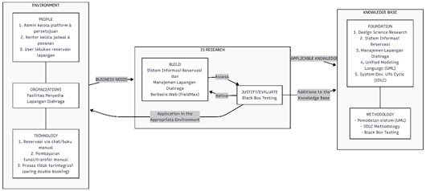

# BAB II METODE PENELITIAN ^bab-2

## 2.1 Waktu dan Lokasi Penelitian ^waktu-dan-lokasi-penelitian

Penelitian ini dilaksanakan pada bulan Juli 2025 sampai bulan November 2025.

**Tabel 4.** Waktu Penelitian ^tabel-4

| No | Tahapan Penelitian | Juli M1 | Juli M2 | Juli M3 | Juli M4 | Ags M1 | Ags M2 | Ags M3 | Ags M4 | Sep M1 | Sep M2 | Sep M3 | Sep M4 | Okt M1 | Okt M2 | Okt M3 | Okt M4 | Nov M1 | Nov M2 | Nov M3 | Nov M4 |
| :--- | :--- | :---: | :---: | :---: | :---: | :---: | :---: | :---: | :---: | :---: | :---: | :---: | :---: | :---: | :---: | :---: | :---: | :---: | :---: | :---: | :---: |
| 1 | Studi Literatur | ✓ | ✓ | ✓ | ✓ | ✓ | ✓ | | | | | | | | | | | | | | |
| 2 | Analisis Kebutuhan (*Requirements*) | | | | ✓ | ✓ | ✓ | | | | | | | | | | | | | | |
| 3 | Desain Sistem (*Design*) | | | | | | | ✓ | ✓ | ✓ | ✓ | | | | | | | | | | |
| 4 | Implementasi Sistem (*Implementation*) | | | | | | | | | | | ✓ | ✓ | ✓ | ✓ | ✓ | ✓ | | | | |
| 5 | Pengujian Sistem (*Testing*) | | | | | | | | | | | | | | | | | ✓ | ✓ | ✓ | ✓ |
| 6 | Pemeliharaan Sistem (*Maintenance*) | | | | | | | | | | | | | | | | | | | ✓ | ✓ |

## 2.2 Design Science Research ^design-science-research

Berikut ini adalah gambaran Kerangka *Information Systems Research Framework* yang digunakan dalam penelitian ini. Konsep metode penelitian ini menggunakan Design Science Research yang sering digunakan dalam Penelitian Sistem Informasi (Hevner et al., 2004). Berikut pada Gambar 3 menjelaskan kerangka penelitian sistem informasi yang digunakan pada penelitian ini.

**Gambar 3.** Kerangka Penelitian Sistem Informasi yang Digunakan Pada Penelitian Ini ^gambar-3

 

Pada aspek environment terdiri dari *People* (orang), *Organizations* (organisasi), dan *Technology* (teknologi). *People* (orang) mencakup admin, renter, dan juga user dari website ini. *Organizations* yang terlibat yaitu Platform FieldMax. Kemudian, *Technology* yang digunakan dalam penelitian adalah Visual Studio Code, Tailwind CSS, TypeScript, Next.js, Express.js, dan Figma.

Pada aspek *IS Research*, terdiri dari *Build* (membangun), dan *Evaluate* (evaluasi). Pada tahap *Build*, dilakukan perancangan dan pembangunan artefak sistem informasi berupa platform web FieldMax, meliputi perancangan use case diagram, activity diagram, ERD, desain UI/UX, serta implementasi kode program menggunakan Next.js dan Express.js. Pada tahap *Evaluate*, dilakukan pengujian fungsionalitas Sistem Reservasi dan Manajemen Layanan Penyewaan Lapangan yang bertujuan untuk menilai kinerja dan efektivitasnya.

Adapun aspek *Knowledge Base* dalam penelitian ini terdiri dari *Foundation* (dasar) dan *Methodologies* (metodologi). *Foundation* mencakup konsep SSR dan CSR. Adapun bagian *Methodologies* yang digunakan adalah Design Science Research dan model pengembangan SDLC *Waterfall*. Penerapan metode DSR ini diharapkan dapat berguna dalam meningkatkan kemudahan renter dalam melakukan booking dan pengelolaan lapangan secara efisien.

Berikut pada Gambar 4 merupakan pemetaan spesifik dari kerangka *Design Science Research* yang diterapkan dalam pengembangan Platform FieldMax, yang merinci setiap komponen *Environment*, *IS Research*, dan *Knowledge Base* sesuai konteks penelitian ini.

![[images/gambar-dsr-fieldmax.svg]]

**Gambar 4.** Pemetaan Design Science Research pada Platform FieldMax ^gambar-4

## 2.3 Metode Pengumpulan Data ^metode-pengumpulan-data

Dalam penelitian ini, tahap pengumpulan data diperlukan untuk mendukung pengembangan sistem. Pemilihan metode pengumpulan data penting karena hasil yang diperoleh akan menjadi dasar dalam proses pengembangan aplikasi. Metode pengumpulan data yang dilakukan dalam penelitian ini adalah studi literatur.

Studi literatur adalah metode pengumpulan data dengan menelaah berbagai sumber-sumber tertulis, meliputi buku, jurnal, laporan penelitian, dan lainnya. Dalam penelitian ini, penulis melakukan studi literatur dengan mencari berbagai informasi yang relevan mengenai pengembangan sistem reservasi berbasis web dan manajemen layanan fasilitas olahraga.

## 2.4 Metode Pengembangan Sistem ^metode-pengembangan-sistem

Metode pengembangan sistem atau *System Development Life Cycle* (SDLC) yang digunakan adalah *Waterfall*. Adapun tahapannya sebagai berikut:

![[images/gambar-waterfall-sdlc.svg]]

**Gambar 5.** Tahapan Metode Waterfall pada Pengembangan Platform FieldMax ^gambar-5

### 2.4.1 Requirements (Kebutuhan)

Pada tahap ini, dilakukan analisis untuk menentukan kebutuhan-kebutuhan yang harus ada. Hal ini bertujuan untuk memahami fitur-fitur yang diharapkan pada sistem yang akan digunakan di tahap selanjutnya.

### 2.4.2 Design (Desain)

Pada tahapan ini, peneliti merancang *Use Case Diagram* dan *Activity Diagram* untuk memberikan gambaran umum mengenai cara kerja sistem. Kemudian, akan dibuat sebuah *Entity Relationship Diagram* (ERD) untuk memvisualisasikan struktur data dan aliran informasi. Setelah itu, dilakukan perancangan antarmuka pengguna (*User Interface*) untuk memberikan gambaran visual yang lebih jelas mengenai tampilan sistem. Selain itu, perancangan *Database* juga dilakukan untuk menyimpan data-data yang berkaitan dengan aplikasi.

### 2.4.3 Implementation (Implementasi)

Pada tahapan ini, dimulai implementasi desain yang telah dibuat menjadi aplikasi berbasis website menggunakan teknologi Next.js dan Express.js sebagai framework utama pengembangan website. Terdapat pula Tailwind CSS sebagai framework Front-end dan TypeScript sebagai bahasa pemrograman utama. Selain itu, terdapat Figma sebagai platform yang digunakan untuk merancang *User Interface / User Experience* (UI/UX).

### 2.4.4 Testing (Pengujian)

Pada tahapan ini, peneliti melakukan pengujian dengan metode Black Box Testing untuk memastikan bahwa sistem yang telah dibangun berfungsi dengan baik. Pengujian dilakukan berdasarkan skenario fungsional yang mencakup seluruh fitur utama sistem, yaitu: registrasi dan login pengguna, pencarian dan reservasi lapangan, pembayaran melalui Midtrans, pengelolaan venue dan lapangan oleh Renter, serta moderasi oleh Admin. Setiap skenario diuji berdasarkan input dan output yang diharapkan untuk memverifikasi kesesuaian dengan kebutuhan yang telah didefinisikan pada tahap Requirements.

### 2.4.5 Maintenance (Pemeliharaan)

Pada tahapan ini, peneliti melakukan pemeliharaan pada website untuk memastikan tidak ada bug atau error yang terjadi pada website.

## 2.5 Tahapan Penelitian ^tahapan-penelitian

Tahapan pengembangan sistem ini menggunakan metode Waterfall, yang dimulai dengan tahap *Requirements* (Analisis Kebutuhan). Pada tahap ini, dilakukan analisis kebutuhan sistem yang harus ada untuk aplikasi Sistem Reservasi dan Manajemen Layanan Penyewaan Lapangan, sekaligus melakukan analisis masalah dan analisis kebutuhan sistem. Setelah itu, penelitian dilanjutkan dengan tahapan Design (Desain), yaitu melalui perancangan use case diagram, activity diagram, user interface (UI), serta perancangan database (ERD) untuk memberikan gambaran tentang bagaimana sistem akan berfungsi dan memiliki struktur data.

Tahap berikutnya adalah Implementation (Implementasi), yang merupakan perwujudan rancangan yang telah dibuat menjadi aplikasi berbasis web menggunakan teknologi Next.js dan Express.js. Setelah aplikasi dibangun, Testing (Pengujian) dilakukan dengan menggunakan metode *Black Box Testing* untuk memastikan aplikasi berfungsi dengan baik sesuai spesifikasi dan fungsionalitas. Jika sistem tidak memenuhi fungsi atau kebutuhan yang ditentukan, maka tahapan akan diulang kembali ke tahap Requirements untuk diperbaiki (disebut siklus umpan balik). Namun, jika sistem sudah berjalan sesuai dengan kebutuhan, maka penelitian dapat dianggap selesai, menghasilkan Hasil Penelitian dan Kesimpulan.

![[images/gambar-4-alur-penelitian.svg]]

**Gambar 6.** Alur Penelitian ^gambar-6

## 2.6 Analisis Pengembangan Sistem ^analisis-pengembangan-sistem

### 2.6.1 Analisis Masalah

Berdasarkan hasil studi literatur, ditemukan beberapa permasalahan pada model sistem reservasi dan manajemen layanan penyewaan lapangan yang dijalankan oleh Platform FieldMax. Permasalahan-permasalahan tersebut dirangkum dalam sepuluh poin berikut.

1. **Pemesanan lapangan masih dilakukan secara manual melalui Google Form** tanpa integrasi dengan sistem pembayaran, sehingga pengelolaan jadwal dan konfirmasi pemesanan dilakukan secara terpisah dan rawan kesalahan pencatatan.

2. **Proses pembayaran tidak terintegrasi dengan pemesanan**, sehingga verifikasi pembayaran harus dilakukan secara manual oleh pihak pengelola. Hal ini memperlambat konfirmasi pemesanan dan meningkatkan risiko kesalahan pencocokan data pembayaran.

3. **Pengelolaan data venue dan lapangan tidak terpusat** — Renter tidak memiliki dasbor khusus untuk mendaftarkan, memperbarui, atau mengelola fasilitas olahraganya secara mandiri, sehingga setiap perubahan data harus dikomunikasikan secara terpisah kepada admin.

4. **Tidak adanya mekanisme moderasi dan verifikasi kelayakan** venue serta lapangan sebelum ditampilkan kepada publik, sehingga kualitas dan kelengkapan informasi fasilitas tidak terjamin.

5. **Tidak tersedia dasbor analitik** yang memungkinkan Renter memantau pendapatan, tren pemesanan, dan kinerja bisnis secara visual, sehingga keputusan bisnis hanya dapat diambil berdasarkan data yang dikumpulkan secara manual.

6. **Pengguna tidak dapat mencari dan memfilter lapangan** berdasarkan lokasi, jenis olahraga, atau harga secara *real-time*, sehingga proses menemukan lapangan yang sesuai menjadi tidak efisien.

7. **Tidak adanya sistem autentikasi terpadu** — calon pengguna tidak dapat mendaftarkan akun, masuk, atau memulihkan kata sandi secara mandiri melalui platform.

8. **Pengguna tidak dapat melihat riwayat pemesanan** atau memberikan ulasan terhadap lapangan yang telah digunakan, sehingga tidak ada mekanisme umpan balik yang dapat membantu calon penyewa lain dalam memilih lapangan.

9. **Tidak tersedia saluran pengaduan resmi** bagi pengguna maupun Renter untuk melaporkan masalah teknis, kendala pembayaran, atau indikasi penipuan, sehingga keluhan hanya dapat disampaikan melalui komunikasi informal di luar platform.

10. **Admin tidak memiliki panel terpusat** untuk memantau seluruh aktivitas platform, mengelola data pengguna, mengelola jenis olahraga, serta menangani pengaduan dari pengguna dan Renter.

![[images/gambar-analisis-masalah.svg]]

**Gambar 7.** Diagram Analisis Masalah Sistem Reservasi Lapangan ^gambar-7

![[images/gambar-booking-flow.drawio]]

**Gambar 8.** Activity Diagram Proses Reservasi Lapangan di FieldMax  ^gambar-8

### 2.6.2 Analisis Kebutuhan Sistem

Berdasarkan permasalahan yang telah diidentifikasi pada bagian 2.6.1, sistem yang dikembangkan harus memenuhi kebutuhan fungsional setiap aktor agar dapat mengatasi permasalahan tersebut secara efektif. Adapun kebutuhan sistem dalam penelitian ini dikelompokkan menjadi kebutuhan fungsional, kebutuhan perangkat lunak dan perangkat keras, serta identifikasi pengguna sistem.

#### 1. Kebutuhan Fungsional

**a. Kebutuhan Fungsional Admin:**

1. Admin dapat memverifikasi dan menyetujui atau menolak pendaftaran venue dan lapangan yang diajukan oleh Renter.

2. Admin dapat melihat daftar seluruh pengguna yang terdaftar di platform.

3. Admin dapat memantau seluruh riwayat transaksi pemesanan dan aliran pembayaran yang terjadi di platform.

4. Admin dapat mengelola data referensi jenis olahraga, termasuk menambah dan menghapus kategori.

5. Admin dapat meninjau, membalas, dan menyelesaikan laporan pengaduan dari pengguna maupun Renter.

6. Admin memiliki dasbor ringkasan yang menampilkan statistik platform secara keseluruhan.

**b. Kebutuhan Fungsional Renter:**

1. Renter dapat mendaftarkan venue baru beserta informasi alamat, deskripsi, dan jadwal operasional.

2. Renter dapat menambahkan lapangan olahraga di bawah venue miliknya, termasuk menentukan jenis olahraga dan harga sewa per jam.

3. Renter dapat mengunggah foto venue dan lapangan sebagai dokumentasi fasilitas.

4. Renter dapat mengajukan venue dan lapangan kepada Admin untuk ditinjau dan disetujui.

5. Renter dapat melihat daftar pemesanan yang masuk pada lapangan miliknya serta mengonfirmasi dan menyelesaikan jadwal sewa.

6. Renter dapat memantau pendapatan dari seluruh lapangan yang dikelola melalui dasbor analitik.

7. Renter dapat membuat laporan pengaduan kepada Admin jika mengalami kendala.

**c. Kebutuhan Fungsional User:**

1. User dapat mendaftarkan akun, melakukan login, serta mengelola proses autentikasi seperti verifikasi email dan pemulihan kata sandi.

2. User dapat mencari dan memfilter lapangan olahraga berdasarkan lokasi, jenis olahraga, atau harga.

3. User dapat melihat informasi detail venue dan lapangan, termasuk foto, harga, dan jadwal ketersediaan.

4. User dapat melakukan reservasi lapangan secara *real-time* dengan memilih tanggal dan rentang waktu yang tersedia.

5. User dapat melakukan pembayaran melalui *payment gateway* Midtrans yang terintegrasi langsung dengan sistem pemesanan.

6. User dapat melihat riwayat pemesanan yang telah dilakukan.

7. User dapat memberikan ulasan dan rating terhadap lapangan yang telah digunakan.

8. User dapat membuat laporan pengaduan kepada Admin jika mengalami kendala teknis, pembayaran, atau indikasi penipuan.

#### 2. Kebutuhan Perangkat Lunak

Perangkat lunak yang digunakan dalam pengembangan sistem ini terdiri dari:

1. Visual Studio Code (VS Code)
2. Node.js
3. Git & GitHub
4. Figma
5. Prisma ORM
6. PostgreSQL (PgAdmin)
7. Postman
8. TypeScript

#### 3. Kebutuhan Perangkat Keras

Selama penelitian, peneliti menggunakan Laptop Lenovo LOQ 15IRX9 dengan prosesor Intel Core i5-12450HX @ 2,40 GHz (8-core), RAM 28 GB, dan penyimpanan SSD 512 GB yang menjalankan sistem operasi Windows 11.

#### 4. Pengguna Sistem

1. **Admin** merupakan pengguna yang berperan sebagai moderator dalam sistem. Admin bertugas memverifikasi dan menyetujui pendaftaran profil penyedia lapangan (Renter) ke dalam platform. Admin juga berwenang meninjau kelayakan dan kelengkapan data venue beserta unit spesifik lapangan (field) yang ditambahkan oleh Renter sebelum fasilitas tersebut dapat diakses oleh publik. Selain itu, Admin memiliki akses menyeluruh untuk melihat daftar semua pengguna, serta memantau seluruh riwayat transaksi pemesanan (booking) dan aliran pembayaran yang terjadi di dalam FieldMax.

2. **Renter (Pemilik/Pengelola Lapangan)** merupakan mitra penyedia jasa yang menyewakan fasilitas olahraga. Renter dapat mendaftarkan venue miliknya dan menambahkan jenis-jenis lapangan secara tersendiri. Setelah mendapatkan persetujuan (approval) dari Admin, Renter berkuasa penuh untuk menentukan harga sewa, mengatur rentang waktu operasional, serta memperbarui jadwal lapangan secara mandiri. Sebagai pengguna yang mengoperasikan layanan di lapangan, Renter juga bertugas untuk mengonfirmasi kehadiran pengguna dan merampungkan jadwal sewa pesanan. Selain itu, Renter dapat melihat seluruh daftar pesanannya, mengawasi laporan status pembayaran pelanggannya, hingga memantau ikhtisar riwayat pendapatan dari lapangan yang ia kelola.

3. **User (Pengguna/Penyewa)** merupakan pengguna akhir atau pelanggan yang menggunakan layanan sewa lapangan olahraga. Untuk menjadi User, pengguna terlebih dahulu melakukan pendaftaran akun ke dalam platform FieldMax. User diberikan kemudahan mencari tempat olahraga yang sesuai, mencocokkan ketersediaan jadwal, dan melakukan reservasi lapangan (booking) secara *real-time*. Proses transaksinya melibatkan *payment gateway* sehingga dapat langsung disahkan oleh sistem setelah ia menyelesaikan tagihan. User dapat melihat jadwal lapangan yang telah ia pesan, melihat keseluruhan riwayat pemesanan, dan memiliki kemampuan untuk memberikan ulasan (review) terhadap kualitas fasilitas lapangan yang telah ia gunakan.
## 2.7 Perancangan Sistem ^perancangan-sistem

Dalam prosesnya, peneliti menggunakan *use case diagram* untuk merepresentasikan aktivitas yang dapat dilakukan oleh pengguna di dalam sistem. Berikut *use case diagram* untuk merepresentasikannya.

![[images/gambar-use-case-diagram.drawio]]

**Gambar 9.** Use Case Diagram Web Platform FieldMax ^gambar-9

Diagram *use case* di atas menggambarkan interaksi antara tiga aktor — Admin, Renter, dan User — dengan sistem FieldMax. Setiap aktor memiliki akses ke sejumlah *use case* yang dikelompokkan berdasarkan peran dan kebutuhan fungsional yang telah diidentifikasi pada bagian 2.6.2. Berikut adalah penjabaran *use case* untuk masing-masing aktor.

### 2.7.1 *Use Case* Admin

1. **Login** — Admin melakukan autentikasi untuk mengakses panel administrasi.

2. **Kelola Data Pengguna** — Admin dapat melihat, mencari, memfilter, menambah, dan menghapus data seluruh pengguna yang terdaftar di platform. *(Memenuhi kebutuhan fungsional Admin poin 2)*.

3. **Kelola Sport Type** — Admin dapat menambah, mengedit, dan menghapus jenis olahraga yang tersedia di platform. *(Memenuhi kebutuhan fungsional Admin poin 4)*.

4. **Moderasi Venue dan Lapangan** — Admin meninjau pengajuan venue dan lapangan dari Renter, kemudian menyetujui (APPROVED) atau menolak (REJECTED) disertai alasan penolakan. *(Memenuhi kebutuhan fungsional Admin poin 1)*.

5. **Pantau Pemesanan dan Pembayaran** — Admin dapat melihat seluruh riwayat transaksi pemesanan dan aliran pembayaran di platform. *(Memenuhi kebutuhan fungsional Admin poin 3)*.

6. **Kelola Pengaduan** — Admin meninjau, membalas, dan menyelesaikan laporan pengaduan dari pengguna maupun Renter. *(Memenuhi kebutuhan fungsional Admin poin 5)*.

7. **Lihat Dashboard** — Admin memantau ringkasan statistik platform secara keseluruhan. *(Memenuhi kebutuhan fungsional Admin poin 6)*.

### 2.7.2 *Use Case* Renter

1. **Daftar dan Login** — Renter melakukan pendaftaran akun dan autentikasi untuk mengakses panel Renter.

2. **Kelola Venue** — Renter dapat mendaftarkan venue baru, mengisi informasi alamat dan deskripsi, mengatur jadwal operasional, serta mengunggah foto venue. *(Memenuhi kebutuhan fungsional Renter poin 1 dan 3)*.

3. **Kelola Lapangan** — Renter dapat menambahkan lapangan di bawah venue miliknya, menentukan jenis olahraga dan harga sewa per jam, serta mengatur status penutupan sementara. *(Memenuhi kebutuhan fungsional Renter poin 2)*.

4. **Ajukan Venue dan Lapangan** — Renter mengajukan venue dan lapangan yang telah dilengkapi kepada Admin untuk ditinjau dan disetujui. *(Memenuhi kebutuhan fungsional Renter poin 4)*.

5. **Kelola Pemesanan** — Renter melihat daftar pemesanan yang masuk, mengonfirmasi kehadiran penyewa, dan menyelesaikan jadwal sewa. *(Memenuhi kebutuhan fungsional Renter poin 5)*.

6. **Lihat Pendapatan** — Renter memantau pendapatan dari seluruh lapangan yang dikelola melalui dasbor analitik. *(Memenuhi kebutuhan fungsional Renter poin 6)*.

7. **Buat Pengaduan** — Renter membuat laporan pengaduan kepada Admin jika mengalami kendala. *(Memenuhi kebutuhan fungsional Renter poin 7)*.

### 2.7.3 *Use Case* User

1. **Daftar dan Login** — User melakukan pendaftaran akun, verifikasi email, dan autentikasi untuk mengakses platform. *(Memenuhi kebutuhan fungsional User poin 1)*.

2. **Cari dan Filter Lapangan** — User mencari lapangan olahraga berdasarkan lokasi, jenis olahraga, atau harga. *(Memenuhi kebutuhan fungsional User poin 2)*.

3. **Lihat Detail Venue dan Lapangan** — User melihat informasi lengkap venue dan lapangan, termasuk foto, harga, jadwal operasional, dan ulasan. *(Memenuhi kebutuhan fungsional User poin 3)*.

4. **Reservasi Lapangan** — User memilih tanggal dan rentang waktu yang tersedia, kemudian melakukan pemesanan lapangan secara *real-time*. *(Memenuhi kebutuhan fungsional User poin 4)*.

5. **Lakukan Pembayaran** — User melakukan pembayaran melalui *payment gateway* Midtrans yang terintegrasi langsung dengan sistem. *(Memenuhi kebutuhan fungsional User poin 5)*.

6. **Lihat Riwayat Pemesanan** — User melihat daftar pemesanan yang telah dilakukan. *(Memenuhi kebutuhan fungsional User poin 6)*.

7. **Beri Ulasan** — User memberikan ulasan dan rating terhadap lapangan yang telah digunakan setelah pemesanan selesai. *(Memenuhi kebutuhan fungsional User poin 7)*.

8. **Buat Pengaduan** — User membuat laporan pengaduan kepada Admin jika mengalami kendala teknis, pembayaran, atau indikasi penipuan. *(Memenuhi kebutuhan fungsional User poin 8)*.

Seluruh *use case* yang telah dijabarkan menjadi dasar dalam perancangan antarmuka pengguna (*user interface*) yang disajikan pada bagian 2.8. Setiap *use case* diterjemahkan ke dalam satu atau lebih halaman antarmuka yang memungkinkan aktor terkait untuk menjalankan fungsinya di dalam sistem.

 

## 2.8 Rancangan *User Interface* (UI) ^rancangan-user-interface ^rancangan-user-interface

Rancangan antarmuka pengguna (*user interface*) pada platform FieldMax dirancang untuk memberikan kemudahan bagi semua aktor dalam berinteraksi dengan sistem. Berikut adalah rancangan antarmuka yang dikelompokkan berdasarkan peran pengguna.

### 2.8.1 Halaman Autentikasi (*Auth*) ^halaman-autentikasi

Halaman autentikasi merupakan halaman yang digunakan oleh seluruh pengguna untuk masuk ke dalam sistem. Pada bagian ini, pengguna dapat melakukan pendaftaran akun, masuk (*login*), serta mengelola proses autentikasi seperti lupa kata sandi dan verifikasi email.

#### 1. Halaman Login
Halaman Login berfungsi sebagai gerbang masuk bagi pengguna terdaftar untuk mengakses sistem melalui kredensial email dan kata sandi. Halaman ini menjawab permasalahan **Poin 7** pada bagian 2.6.1, yaitu tidak adanya sistem autentikasi terpadu yang memungkinkan pengguna masuk ke dalam platform secara mandiri.

![[figma/Auth/Login.jpg]]

**Gambar 10.** Halaman Login ^gambar-10

#### 2. Halaman Register User
Halaman Register User berfungsi untuk mendaftarkan akun baru bagi calon penyewa lapangan dengan mengisi data nama lengkap, email, dan kata sandi. Halaman ini menjawab permasalahan **Poin 7** pada bagian 2.6.1, yaitu tidak adanya sistem autentikasi terpadu yang memungkinkan calon pengguna mendaftarkan akun secara mandiri melalui platform.

![[figma/Auth/Register User.jpg]]

**Gambar 11.** Halaman Register User ^gambar-11

#### 3. Halaman Register Renter
Halaman Register Renter berfungsi untuk mendaftarkan akun bagi calon pemilik atau pengelola lapangan yang ingin menyewakan fasilitas olahraganya melalui platform. Halaman ini menjawab permasalahan **Poin 7** pada bagian 2.6.1, yaitu tidak adanya sistem autentikasi terpadu yang memungkinkan calon Renter mendaftarkan akun bisnisnya secara mandiri melalui platform.

![[figma/Auth/Register Renter.jpg]]

**Gambar 12.** Halaman Register Renter ^gambar-12

#### 4. Halaman Forgot Password
Halaman Forgot Password berfungsi untuk memulai proses pemulihan akun bagi pengguna yang lupa kata sandinya dengan mengirimkan tautan reset ke email terdaftar. Halaman ini menjawab permasalahan **Poin 7** pada bagian 2.6.1, yaitu tidak adanya sistem autentikasi terpadu yang menyediakan mekanisme pemulihan kata sandi secara mandiri.

![[figma/Auth/Forgot Password.jpg]]

**Gambar 13.** Halaman Forgot Password ^gambar-13

#### 5. Halaman Reset Password
Halaman Reset Password berfungsi untuk mengatur ulang kata sandi baru setelah pengguna mengakses tautan pemulihan yang dikirimkan melalui email. Halaman ini menjawab permasalahan **Poin 7** pada bagian 2.6.1, yaitu tidak adanya sistem autentikasi terpadu yang menyediakan mekanisme pengaturan ulang kata sandi secara mandiri dan aman.

![[figma/Auth/Reset Password.jpg]]

**Gambar 14.** Halaman Reset Password ^gambar-14

#### 6. Halaman Verify Email
Halaman Verify Email berfungsi untuk memasukkan kode verifikasi enam digit yang dikirimkan ke email pengguna setelah pendaftaran guna mengaktifkan akun. Halaman ini menjawab permasalahan **Poin 7** pada bagian 2.6.1, yaitu tidak adanya sistem autentikasi terpadu yang menyediakan mekanisme verifikasi email untuk mengaktifkan akun pengguna.

![[figma/Auth/Verify Email.jpg]]

**Gambar 15.** Halaman Verify Email ^gambar-15

### 2.8.2 Halaman Publik ^halaman-publik

Halaman publik merupakan halaman yang dapat diakses oleh semua pengunjung tanpa perlu melakukan autentikasi terlebih dahulu. Halaman ini mencakup beranda, pencarian lapangan, detail venue dan lapangan, serta halaman informasi pendukung seperti tentang kami, harga, FAQ, dan kebijakan privasi.

#### 7. Halaman Home
Halaman Home berfungsi sebagai halaman utama yang memperkenalkan platform FieldMax, menampilkan lapangan dan venue unggulan, serta menyediakan pencarian langsung bagi pengunjung. Halaman ini menjawab permasalahan **Poin 1 dan 6** pada bagian 2.6.1, yaitu pemesanan manual dan ketidakmampuan pengguna mencari serta memfilter lapangan secara real-time.

![[figma/Public/Home.jpg]]

**Gambar 16.** Halaman Home ^gambar-16

#### 8. Halaman Search
Halaman Search berfungsi untuk menampilkan daftar lapangan olahraga yang tersedia berdasarkan kata kunci pencarian, sehingga pengguna dapat menemukan lapangan yang sesuai dengan cepat. Halaman ini menjawab permasalahan **Poin 1 dan 6** pada bagian 2.6.1, yaitu pemesanan manual dan ketidakmampuan pengguna mencari serta memfilter lapangan secara real-time.

![[figma/Public/Search.jpg]]

**Gambar 17.** Halaman Search ^gambar-17

#### 9. Halaman Venue Detail
Halaman Venue Detail berfungsi untuk menampilkan informasi lengkap suatu venue olahraga beserta daftar lapangan yang tersedia di dalamnya. Halaman ini menjawab permasalahan **Poin 6** pada bagian 2.6.1, yaitu ketidakmampuan pengguna mencari dan memfilter lapangan berdasarkan lokasi secara real-time.

![[figma/Public/Venue Detail.jpg]]

**Gambar 18.** Halaman Venue Detail ^gambar-18

#### 10. Halaman Field Detail
Halaman Field Detail berfungsi untuk menampilkan informasi spesifik satu lapangan beserta fitur pemilihan jadwal dan pemesanan yang terintegrasi dengan pembayaran. Halaman ini menjawab permasalahan **Poin 1 dan 2** pada bagian 2.6.1, yaitu pemesanan manual melalui Google Form dan proses pembayaran yang tidak terintegrasi dengan pemesanan.

![[figma/Public/Field Detail.jpg]]

**Gambar 19.** Halaman Field Detail ^gambar-19

#### 11. Halaman About
Halaman About berfungsi untuk menyajikan informasi mengenai visi, misi, dan latar belakang platform FieldMax kepada pengunjung. Halaman ini mendukung kelengkapan informasi platform sebagaimana diidentifikasi dalam analisis kebutuhan sistem pada bagian 2.6.2.

![[figma/Public/About.jpg]]

**Gambar 20.** Halaman About ^gambar-20

#### 12. Halaman Pricing
Halaman Pricing berfungsi untuk menampilkan informasi mengenai struktur harga dan biaya layanan yang berlaku di platform FieldMax. Halaman ini mendukung kelengkapan informasi platform sebagaimana diidentifikasi dalam analisis kebutuhan sistem pada bagian 2.6.2.

![[figma/Public/Pricing.jpg]]

**Gambar 21.** Halaman Pricing ^gambar-21

#### 13. Halaman FAQ
Halaman FAQ berfungsi untuk menyajikan daftar pertanyaan yang sering diajukan beserta jawabannya guna membantu pengguna memahami cara penggunaan platform. Halaman ini mendukung kelengkapan informasi platform sebagaimana diidentifikasi dalam analisis kebutuhan sistem pada bagian 2.6.2.

![[figma/Public/Faq.jpg]]

**Gambar 22.** Halaman FAQ ^gambar-22

#### 14. Halaman Privacy Policy
Halaman Privacy Policy berfungsi untuk menampilkan kebijakan privasi platform yang menjelaskan bagaimana data pribadi pengguna dikumpulkan, digunakan, dan dilindungi. Halaman ini mendukung kelengkapan informasi platform sebagaimana diidentifikasi dalam analisis kebutuhan sistem pada bagian 2.6.2.

![[figma/Public/Privacy Policy.jpg]]

**Gambar 23.** Halaman Privacy Policy ^gambar-23

#### 15. Halaman Terms of Service
Halaman Terms of Service berfungsi untuk menampilkan syarat dan ketentuan penggunaan platform yang mengikat secara hukum antara platform dan pengguna. Halaman ini mendukung kelengkapan informasi platform sebagaimana diidentifikasi dalam analisis kebutuhan sistem pada bagian 2.6.2.

![[figma/Public/Terms of Service.jpg]]

**Gambar 24.** Halaman Terms of Service ^gambar-24

#### 16. Halaman Renter Profile
Halaman Renter Profile berfungsi untuk menampilkan profil publik seorang Renter beserta daftar venue yang dikelolanya, membangun kredibilitas di mata calon penyewa. Halaman ini mendukung kelengkapan informasi platform sebagaimana diidentifikasi dalam analisis kebutuhan sistem pada bagian 2.6.2.

![[figma/Public/Renter Profile.jpg]]

**Gambar 25.** Halaman Renter Profile ^gambar-25

#### 17. Halaman Error
Halaman Error berfungsi sebagai halaman fallback yang ditampilkan ketika terjadi kesalahan sistem, memberikan informasi yang jelas dan navigasi kembali ke halaman utama. Halaman ini mendukung kelengkapan informasi platform sebagaimana diidentifikasi dalam analisis kebutuhan sistem pada bagian 2.6.2.

![[figma/Public/Error.jpg]]

**Gambar 26.** Halaman Error ^gambar-26

### 2.8.3 Halaman *User* (Penyewa) ^halaman-user

Halaman *User* merupakan halaman yang dapat diakses oleh pengguna dengan peran penyewa. Pada bagian ini, pengguna dapat melihat riwayat pemesanan, detail pemesanan, mengelola profil pribadi, serta membuat pengaduan (*report*).

#### 18. Halaman My Bookings
Halaman My Bookings berfungsi untuk menampilkan daftar riwayat pemesanan lapangan yang telah dilakukan oleh pengguna. Halaman ini menjawab permasalahan **Poin 8** pada bagian 2.6.1, yaitu pengguna tidak dapat melihat riwayat pemesanan yang telah dilakukan.

![[figma/User/My Bookings.jpg]]

**Gambar 27.** Halaman My Bookings ^gambar-27

#### 19. Halaman Booking Detail
Halaman Booking Detail berfungsi untuk menampilkan informasi lengkap satu pemesanan, termasuk status pembayaran dan opsi pemberian ulasan setelah sewa selesai. Halaman ini menjawab permasalahan **Poin 2 dan 8** pada bagian 2.6.1, yaitu proses pembayaran yang tidak terintegrasi dan ketidakmampuan pengguna memberikan ulasan terhadap lapangan yang telah digunakan.

![[figma/User/Booking Detail.jpg]]

**Gambar 28.** Halaman Booking Detail ^gambar-28

#### 20. Halaman Profile
Halaman Profile berfungsi untuk memungkinkan pengguna mengelola data pribadinya, termasuk foto profil, informasi kontak, dan pengaturan keamanan akun. Halaman ini menjawab permasalahan **Poin 8** pada bagian 2.6.1, yaitu tidak adanya mekanisme bagi pengguna untuk mengelola profil dan data pribadinya secara mandiri.

![[figma/User/Profile.jpg]]

**Gambar 29.** Halaman Profile ^gambar-29

#### 21. Halaman Report
Halaman Report berfungsi untuk menampilkan daftar laporan pengaduan yang telah dibuat oleh pengguna serta menyediakan formulir untuk membuat laporan baru. Halaman ini menjawab permasalahan **Poin 9** pada bagian 2.6.1, yaitu tidak tersedianya saluran pengaduan resmi bagi pengguna untuk melaporkan masalah.

![[figma/User/Report.jpg]]

**Gambar 30.** Halaman Report ^gambar-30

#### 22. Halaman Report Detail
Halaman Report Detail berfungsi untuk menampilkan informasi lengkap satu laporan pengaduan beserta riwayat percakapan antara pengguna dan admin. Halaman ini menjawab permasalahan **Poin 9** pada bagian 2.6.1, yaitu tidak tersedianya saluran pengaduan resmi dengan mekanisme tindak lanjut yang terdokumentasi.

![[figma/User/Report Detail.jpg]]

**Gambar 31.** Halaman Report Detail ^gambar-31

### 2.8.4 Halaman *Renter* (Pemilik Lapangan) ^halaman-renter

Halaman *Renter* merupakan halaman yang dapat diakses oleh pengguna dengan peran pemilik atau pengelola lapangan. Pada bagian ini, renter dapat mengelola venue dan lapangan miliknya, melihat pendapatan, memantau pemesanan, serta menangani laporan pengaduan.

#### 23. Halaman Dashboard Renter
Halaman Dashboard Renter berfungsi untuk menampilkan ringkasan statistik bisnis Renter, termasuk metrik utama, grafik pendapatan, dan daftar pemesanan terbaru. Halaman ini menjawab permasalahan **Poin 3 dan 5** pada bagian 2.6.1, yaitu pengelolaan data venue yang tidak terpusat dan tidak tersedianya dasbor analitik pendapatan.

![[figma/Renter/Dashboard.jpg]]

**Gambar 32.** Halaman Dashboard Renter ^gambar-32

#### 24. Halaman Venues
Halaman Venues berfungsi untuk menampilkan daftar venue yang dimiliki Renter serta menyediakan fitur pembuatan venue baru. Halaman ini menjawab permasalahan **Poin 3** pada bagian 2.6.1, yaitu pengelolaan data venue dan lapangan yang tidak terpusat.

![[figma/Renter/Venues.jpg]]

**Gambar 33.** Halaman Venues ^gambar-33

#### 25. Halaman Venue Detail
Halaman Venue Detail berfungsi untuk menampilkan informasi lengkap satu venue beserta fitur pengelolaan foto, jadwal, dan daftar lapangan di dalamnya. Halaman ini menjawab permasalahan **Poin 3** pada bagian 2.6.1, yaitu pengelolaan data venue dan lapangan yang tidak terpusat.

![[figma/Renter/Venue Detail.jpg]]

**Gambar 34.** Halaman Venue Detail ^gambar-34

#### 26. Halaman Fields
Halaman Fields berfungsi untuk menampilkan daftar seluruh lapangan yang dimiliki Renter di semua venue-nya serta menyediakan fitur pembuatan lapangan baru. Halaman ini menjawab permasalahan **Poin 3** pada bagian 2.6.1, yaitu pengelolaan data venue dan lapangan yang tidak terpusat.

![[figma/Renter/Fields.jpg]]

**Gambar 35.** Halaman Fields ^gambar-35

#### 27. Halaman Field Detail
Halaman Field Detail berfungsi untuk menampilkan informasi lengkap satu lapangan beserta fitur pengelolaan seperti pengaturan harga, penutupan sementara, dan unggah foto. Halaman ini menjawab permasalahan **Poin 3** pada bagian 2.6.1, yaitu pengelolaan data venue dan lapangan yang tidak terpusat.

![[figma/Renter/Field Detail.jpg]]

**Gambar 36.** Halaman Field Detail ^gambar-36

#### 28. Halaman Revenue
Halaman Revenue berfungsi untuk menampilkan analisis pendapatan Renter yang dikelompokkan berdasarkan venue dan lapangan. Halaman ini menjawab permasalahan **Poin 5** pada bagian 2.6.1, yaitu tidak tersedianya dasbor analitik yang memungkinkan Renter memantau pendapatan dan kinerja bisnis secara visual.

![[figma/Renter/Revenue.jpg]]

**Gambar 37.** Halaman Revenue ^gambar-37

#### 29. Halaman Reports
Halaman Reports berfungsi untuk menampilkan daftar laporan pengaduan yang telah dibuat oleh Renter kepada admin serta menyediakan fitur pembuatan laporan baru. Halaman ini menjawab permasalahan **Poin 9** pada bagian 2.6.1, yaitu tidak tersedianya saluran pengaduan resmi bagi Renter untuk melaporkan masalah.

![[figma/Renter/Reports.jpg]]

**Gambar 38.** Halaman Reports ^gambar-38

#### 30. Halaman Report Detail
Halaman Report Detail berfungsi untuk menampilkan detail satu laporan pengaduan Renter beserta riwayat percakapan dengan admin. Halaman ini menjawab permasalahan **Poin 9** pada bagian 2.6.1, yaitu tidak tersedianya saluran pengaduan resmi dengan mekanisme tindak lanjut yang terdokumentasi.

![[figma/Renter/Report Detail.jpg]]

**Gambar 39.** Halaman Report Detail ^gambar-39

### 2.8.5 Halaman *Admin* ^halaman-admin

Halaman *Admin* merupakan halaman yang dapat diakses oleh pengguna dengan peran administrator. Pada bagian ini, admin dapat memantau keseluruhan sistem melalui dashboard, mengelola data pengguna dan jenis olahraga, serta memeriksa riwayat pemesanan dan transaksi.

#### 31. Halaman Dashboard Admin
Halaman Dashboard Admin berfungsi untuk menampilkan ringkasan statistik keseluruhan platform, termasuk total pengguna, venue, lapangan, venue yang menunggu persetujuan, dan total pendapatan. Halaman ini menjawab permasalahan **Poin 4 dan 10** pada bagian 2.6.1, yaitu tidak adanya mekanisme moderasi dan tidak tersedianya panel terpusat bagi admin untuk memantau aktivitas platform.

![[figma/Admin/Dashboard.jpg]]

**Gambar 40.** Halaman Dashboard Admin ^gambar-40

#### 32. Halaman Booking
Halaman Booking berfungsi untuk menampilkan daftar seluruh pemesanan yang terjadi di platform, memberikan visibilitas penuh kepada admin terhadap aktivitas transaksi. Halaman ini menjawab permasalahan **Poin 4 dan 10** pada bagian 2.6.1, yaitu tidak adanya mekanisme moderasi dan tidak tersedianya panel terpusat bagi admin.

![[figma/Admin/Booking.jpg]]

**Gambar 41.** Halaman Booking ^gambar-41

#### 33. Halaman Booking Detail
Halaman Booking Detail berfungsi untuk menampilkan informasi lengkap satu pemesanan secara menyeluruh, termasuk data pengguna, lapangan, status, dan ulasan. Halaman ini menjawab permasalahan **Poin 4 dan 10** pada bagian 2.6.1, yaitu tidak adanya mekanisme moderasi transaksi dan tidak tersedianya panel terpusat bagi admin.

![[figma/Admin/Booking Detail.jpg]]

**Gambar 42.** Halaman Booking Detail ^gambar-42

#### 34. Halaman Users
Halaman Users berfungsi untuk menampilkan daftar seluruh pengguna platform serta menyediakan fitur pembuatan, pencarian, pemfilteran, dan penghapusan pengguna. Halaman ini menjawab permasalahan **Poin 10** pada bagian 2.6.1, yaitu admin tidak memiliki panel terpusat untuk mengelola data pengguna.

![[figma/Admin/Users.jpg]]

**Gambar 43.** Halaman Users ^gambar-43

#### 35. Halaman Sport Types
Halaman Sport Types berfungsi untuk menampilkan dan mengelola daftar jenis olahraga yang tersedia di platform, termasuk penambahan dan penghapusan data. Halaman ini menjawab permasalahan **Poin 10** pada bagian 2.6.1, yaitu admin tidak memiliki panel terpusat untuk mengelola data referensi jenis olahraga.

![[figma/Admin/Sport Types.jpg]]

**Gambar 44.** Halaman Sport Types ^gambar-44

