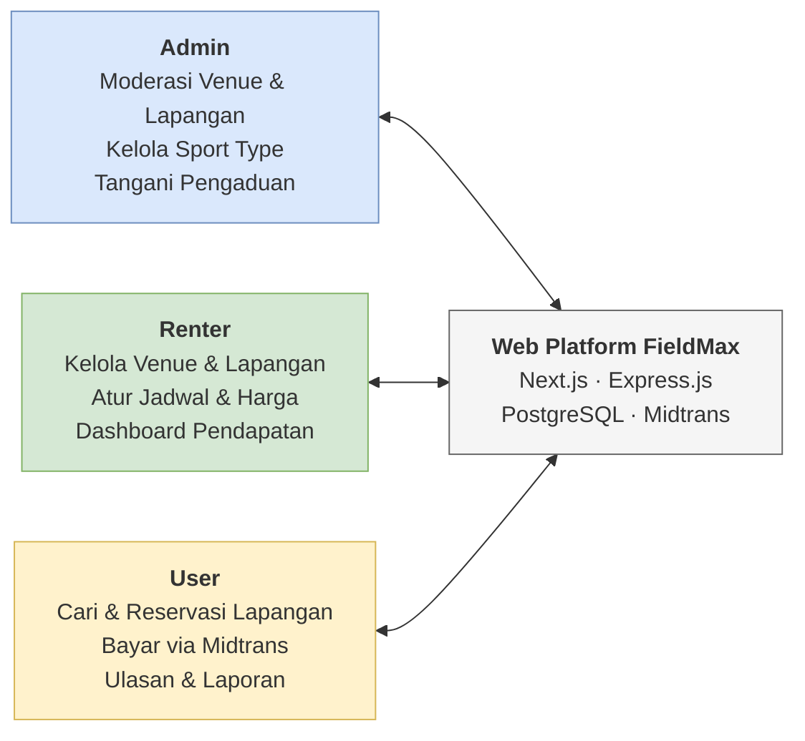
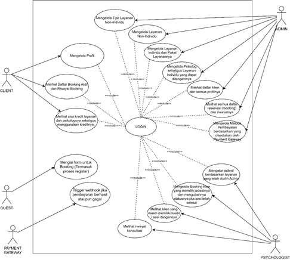

# BAB II METODE PENELITIAN ^bab-2

## 2.1 Waktu dan Lokasi Penelitian ^waktu-dan-lokasi-penelitian

Penelitian ini dilaksanakan pada bulan Juli 2025 sampai bulan November 2025.

**Tabel 4.** Waktu Penelitian ^tabel-4

| No | Tahapan Penelitian | Juli M1 | Juli M2 | Juli M3 | Juli M4 | Ags M1 | Ags M2 | Ags M3 | Ags M4 | Sep M1 | Sep M2 | Sep M3 | Sep M4 | Okt M1 | Okt M2 | Okt M3 | Okt M4 | Nov M1 | Nov M2 | Nov M3 | Nov M4 |
| :--- | :--- | :---: | :---: | :---: | :---: | :---: | :---: | :---: | :---: | :---: | :---: | :---: | :---: | :---: | :---: | :---: | :---: | :---: | :---: | :---: | :---: |
| 1 | Studi Literatur | ✓ | ✓ | ✓ | ✓ | ✓ | ✓ | | | | | | | | | | | | | | |
| 2 | Analisis Kebutuhan (*Requirements*) | | | | ✓ | ✓ | ✓ | | | | | | | | | | | | | | |
| 3 | Desain Sistem (*Design*) | | | | | | | ✓ | ✓ | ✓ | ✓ | | | | | | | | | | |
| 4 | Implementasi Sistem (*Implementation*) | | | | | | | | | | | ✓ | ✓ | ✓ | ✓ | ✓ | ✓ | | | | |
| 5 | Pengujian Sistem (*Testing*) | | | | | | | | | | | | | | | | | ✓ | ✓ | ✓ | ✓ |
| 6 | Pemeliharaan Sistem (*Maintenance*) | | | | | | | | | | | | | | | | | | | ✓ | ✓ |

## 2.2 Design Science Research ^design-science-research

Berikut ini adalah gambaran Kerangka *Information Systems Research Framework* yang digunakan dalam penelitian ini. Konsep metode penelitian ini menggunakan Design Science Research yang sering digunakan dalam Penelitian Sistem Informasi (Hevner et al., 2004). Berikut pada Gambar 3 menjelaskan kerangka penelitian sistem informasi yang digunakan pada penelitian ini.

**Gambar 3.** Kerangka Penelitian Sistem Informasi yang Digunakan Pada Penelitian Ini ^gambar-3

 

Pada aspek environment terdiri dari *People* (orang), *Organizations* (organisasi), dan *Technology* (teknologi). *People* (orang) mencakup admin, renter, dan juga user dari website ini. *Organizations* yang terlibat yaitu Platform FieldMax. Kemudian, *Technology* yang digunakan dalam penelitian adalah Visual Studio Code, Tailwind CSS, TypeScript, Next.js, Express.js, dan Figma.

Pada aspek *IS Research*, terdiri dari *Build* (membangun), dan *Evaluate* (evaluasi). Pada tahap *Build*, dilakukan perancangan dan pembangunan artefak sistem informasi berupa platform web FieldMax, meliputi perancangan use case diagram, activity diagram, ERD, desain UI/UX, serta implementasi kode program menggunakan Next.js dan Express.js. Pada tahap *Evaluate*, dilakukan pengujian fungsionalitas Sistem Reservasi dan Manajemen Layanan Penyewaan Lapangan yang bertujuan untuk menilai kinerja dan efektivitasnya.

Adapun aspek *Knowledge Base* dalam penelitian ini terdiri dari *Foundation* (dasar) dan *Methodologies* (metodologi). *Foundation* mencakup konsep SSR dan CSR. Adapun bagian *Methodologies* yang digunakan adalah Design Science Research dan model pengembangan SDLC *Waterfall*. Penerapan metode DSR ini diharapkan dapat berguna dalam meningkatkan kemudahan renter dalam melakukan booking dan pengelolaan lapangan secara efisien.

Berikut pada Gambar 4 merupakan pemetaan spesifik dari kerangka *Design Science Research* yang diterapkan dalam pengembangan Platform FieldMax, yang merinci setiap komponen *Environment*, *IS Research*, dan *Knowledge Base* sesuai konteks penelitian ini.

![[images/gambar-dsr-fieldmax.svg]]

**Gambar 4.** Pemetaan Design Science Research pada Platform FieldMax ^gambar-4

## 2.3 Metode Pengumpulan Data ^metode-pengumpulan-data

Dalam penelitian ini, tahap pengumpulan data diperlukan untuk mendukung pengembangan sistem. Pemilihan metode pengumpulan data penting karena hasil yang diperoleh akan menjadi dasar dalam proses pengembangan aplikasi. Metode pengumpulan data yang dilakukan dalam penelitian ini adalah studi literatur.

Studi literatur adalah metode pengumpulan data dengan menelaah berbagai sumber-sumber tertulis, meliputi buku, jurnal, laporan penelitian, dan lainnya. Dalam penelitian ini, penulis melakukan studi literatur dengan mencari berbagai informasi yang relevan mengenai pengembangan sistem reservasi berbasis web dan manajemen layanan fasilitas olahraga.

## 2.4 Metode Pengembangan Sistem ^metode-pengembangan-sistem

Metode pengembangan sistem atau *System Development Life Cycle* (SDLC) yang digunakan adalah *Waterfall*. Adapun tahapannya sebagai berikut:

![[images/gambar-waterfall-sdlc.svg]]

**Gambar 5.** Tahapan Metode Waterfall pada Pengembangan Platform FieldMax ^gambar-5

### 2.4.1 Requirements (Kebutuhan)

Pada tahap ini, dilakukan analisis untuk menentukan kebutuhan-kebutuhan yang harus ada. Hal ini bertujuan untuk memahami fitur-fitur yang diharapkan pada sistem yang akan digunakan di tahap selanjutnya.

### 2.4.2 Design (Desain)

Pada tahapan ini, peneliti merancang *Use Case Diagram* dan *Activity Diagram* untuk memberikan gambaran umum mengenai cara kerja sistem. Kemudian, akan dibuat sebuah *Entity Relationship Diagram* (ERD) untuk memvisualisasikan struktur data dan aliran informasi. Setelah itu, dilakukan perancangan antarmuka pengguna (*User Interface*) untuk memberikan gambaran visual yang lebih jelas mengenai tampilan sistem. Selain itu, perancangan *Database* juga dilakukan untuk menyimpan data-data yang berkaitan dengan aplikasi.

### 2.4.3 Implementation (Implementasi)

Pada tahapan ini, dimulai implementasi desain yang telah dibuat menjadi aplikasi berbasis website menggunakan teknologi Next.js dan Express.js sebagai framework utama pengembangan website. Terdapat pula Tailwind CSS sebagai framework Front-end dan TypeScript sebagai bahasa pemrograman utama. Selain itu, terdapat Figma sebagai platform yang digunakan untuk merancang *User Interface / User Experience* (UI/UX).

### 2.4.4 Testing (Pengujian)

Pada tahapan ini, peneliti melakukan pengujian dengan metode Black Box Testing untuk memastikan bahwa sistem yang telah dibangun berfungsi dengan baik. Pengujian dilakukan berdasarkan skenario fungsional yang mencakup seluruh fitur utama sistem, yaitu: registrasi dan login pengguna, pencarian dan reservasi lapangan, pembayaran melalui Midtrans, pengelolaan venue dan lapangan oleh Renter, serta moderasi oleh Admin. Setiap skenario diuji berdasarkan input dan output yang diharapkan untuk memverifikasi kesesuaian dengan kebutuhan yang telah didefinisikan pada tahap Requirements.

### 2.4.5 Maintenance (Pemeliharaan)

Pada tahapan ini, peneliti melakukan pemeliharaan pada website untuk memastikan tidak ada bug atau error yang terjadi pada website.

## 2.5 Tahapan Penelitian ^tahapan-penelitian

Tahapan pengembangan sistem ini menggunakan metode Waterfall, yang dimulai dengan tahap *Requirements* (Analisis Kebutuhan). Pada tahap ini, dilakukan analisis kebutuhan sistem yang harus ada untuk aplikasi Sistem Reservasi dan Manajemen Layanan Penyewaan Lapangan, sekaligus melakukan analisis masalah dan analisis kebutuhan sistem. Setelah itu, penelitian dilanjutkan dengan tahapan Design (Desain), yaitu melalui perancangan use case diagram, activity diagram, user interface (UI), serta perancangan database (ERD) untuk memberikan gambaran tentang bagaimana sistem akan berfungsi dan memiliki struktur data.

Tahap berikutnya adalah Implementation (Implementasi), yang merupakan perwujudan rancangan yang telah dibuat menjadi aplikasi berbasis web menggunakan teknologi Next.js dan Express.js. Setelah aplikasi dibangun, Testing (Pengujian) dilakukan dengan menggunakan metode *Black Box Testing* untuk memastikan aplikasi berfungsi dengan baik sesuai spesifikasi dan fungsionalitas. Jika sistem tidak memenuhi fungsi atau kebutuhan yang ditentukan, maka tahapan akan diulang kembali ke tahap Requirements untuk diperbaiki (disebut siklus umpan balik). Namun, jika sistem sudah berjalan sesuai dengan kebutuhan, maka penelitian dapat dianggap selesai, menghasilkan Hasil Penelitian dan Kesimpulan.

![[images/gambar-4-alur-penelitian.svg]]

**Gambar 6.** Alur Penelitian ^gambar-6

## 2.6 Analisis Pengembangan Sistem ^analisis-pengembangan-sistem

### 2.6.1 Analisis Masalah

Berdasarkan hasil studi literatur, ditemukan beberapa permasalahan yang terjadi pada model sistem reservasi dan manajemen layanan penyewaan lapangan dari Platform FieldMax. Salah satu masalah utama adalah pemesanan layanan penyewaan lapangannya yang masih manual menggunakan Google Form, yang menyebabkan pengelolaan layanan yang tersedia juga dilakukan manual, serta proses pembayarannya yang tidak saling terintegrasi. Sistem manual ini akhirnya menimbulkan inefisiensi akibat dari permasalahan tersebut.

Kemudian, terjadi penurunan efektivitas manajemen serta memperlambat proses pengambilan keputusan yang strategis. Oleh karena itu, pengembangan sebuah sistem informasi berbasis web yang terpusat dan terintegrasi, yang mampu mengelola proses booking dan manajemen layanan penyewaan lapangan, sangat diperlukan untuk mengatasi masalah-masalah tersebut. Sistem ini diharapkan dapat memberikan kemudahan bagi pelanggan dalam melakukan pemesanan layanan, sekaligus membantu pihak internal Platform FieldMax dalam pengelolaan layanan dan reservasinya.

![[images/gambar-analisis-masalah.svg]]

**Gambar 7.** Diagram Analisis Masalah Sistem Reservasi Lapangan ^gambar-7

**Gambar 8.** Sistem penggunaan web FieldMax  ^gambar-8

### 2.6.2 Analisis Kebutuhan Sistem

Dalam pembangunan web ini, dibutuhkan perangkat lunak dan perangkat keras sebagai alat yang dapat mendukung penelitian. Terdapat pula pengguna sistem (*user*) sebagai bahan analisis kebutuhan dalam perancangan sistem. Adapun kebutuhan sistem dalam penelitian ini yaitu:

#### 1. Perangkat lunak.

Perangkat lunak yang digunakan dalam merancang web ini terdiri dari:

1. Windows 11

2. Visual Studio Code (VS Code)

3. Node.js

4. Git & GitHub

5. Figma

6. Prisma ORM

7. PostgreSQL (PgAdmin)

8. Postman

9. Mermaid diagram

10. dbdiagram.io

11. Chrome

#### 2. Perangkat keras.

Selama penelitian, peneliti menggunakan Laptop Lenovo Ideapad Gaming 3 dengan spesifikasi Processor Intel core i7-12650H @ 2,30 GHz, RAM 16GB, dan SSD 512GB.

#### 3. Pengguna sistem *(user)*.

1. ***Admin,*** merupakan pengguna yang berperan sebagai moderator dalam sistem. Admin bertugas memverifikasi dan menyetujui pendaftaran profil penyedia lapangan (Renter) ke dalam wadah platform. Admin juga berwenang meninjau kelayakan dan kelengkapan data venue beserta unit spesifik lapangan (field) yang ditambahkan oleh Renter sebelum fasilitas tersebut dapat diakses oleh publik. Selain itu, Admin memiliki akses menyeluruh untuk melihat daftar semua pengguna, serta memantau seluruh riwayat transaksi pemesanan (booking) dan aliran pembayaran yang terjadi di dalam FieldMax.

2.**Renter (Pemilik/Pengelola Lapangan)*,*** merupakan mitra penyedia jasa yang menyewakan fasilitas olahraga. Renter dapat mendaftarkan venue miliknya dan menambahkan jenis-jenis lapangan secara tersendiri. Setelah mendapatkan persetujuan (approval) dari Admin, Renter berkuasa penuh untuk menentukan harga sewa, mengatur rentang waktu operasional, serta memperbarui jadwal lapangan secara mandiri. Sebagai pengguna yang mengoperasikan layanan di lapangan, Renter juga bertugas untuk mengonfirmasi kehadiran pengguna, menyewa lapangan sesuai dengan waktu pemesanan, dan merampungkan jadwal sewa pesanan (COMPLETED). Selain itu, Renter dapat melihat seluruh daftar pesanannya hari ini, mengawasi laporan status pembayaran tagihan pelanggannya, hingga memantau ikhtisar riwayat pendapatan dari lapangan yang ia kelola.

3.**User (Pengguna/Penyewa),** merupakan user akhir atau pelanggan yang menggunakan layanan sewa lapangan olahraga. Untuk menjadi User, pengguna terlebih dahulu melakukan pendaftaran akun ke dalam platform FieldMax. User diberikan kemudahan mencari letak tempat olahraga yang sesuai, mencocokkan ketersediaan jadwal, dan melakukan reservasi lapangan (booking) secara real-time untuk dirinya sendiri maupun rombongan mainnya. Proses transaksinya melibatkan payment gateway sehingga dapat langsung disahkan oleh sistem seketika itu juga setelah ia menyelesaikan tagihan. User pastinya dapat melihat jadwal lapangan yang baru saja ia pesan, melihat keseluruhan rekam jejak riwayat bermain (booking history), dan memiliki kemampuan untuk memberikan ulasan (review) terhadap kualitas fasilitas lapangan yang telah ia gunakan.

## 2.7 Perancangan Sistem ^perancangan-sistem

Dalam prosesnya, peneliti menggunakan *use case diagram* untuk merepresentasikan aktivitas yang dapat dilakukan oleh pengguna di dalam sistem. Berikut *use case diagram* untuk merepresentasikannya.

**Gambar 9.** Use Case Diagram Web Platform FieldMax ^gambar-9

 

## 2.8 Rancangan *User Interface* (UI) ^rancangan-user-interface ^rancangan-user-interface

Rancangan antarmuka pengguna (*user interface*) pada platform FieldMax dirancang untuk memberikan kemudahan bagi semua aktor dalam berinteraksi dengan sistem.

