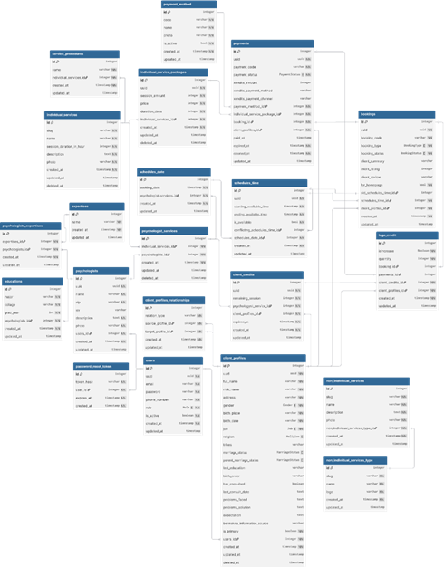

# BAB III HASIL DAN PEMBAHASAN ^bab-3

## 3.1 Implementasi Sistem ^implementasi-sistem

Setelah proses perancangan sistem diselesaikan, tahap berikutnya dalam pengembangan sistem informasi adalah mengimplementasikan hasil rancangan tersebut ke dalam bentuk sistem informasi berbasis web. Web ini dibangun menggunakan *framework* Next.js dari sisi Front End dan Express.js dari sisi Back End, yang keduanya menggunakan bahasa pemrograman TypeScript. Untuk *styling* pada sisi Front End dibantu dengan TailwindCSS. Adapun untuk pengelolaan data digunakan PostgeSQL sebagai basis data utama.

## 3.2 Implementasi Basis Data ^implementasi-basis-data

Implementasi basis data terdiri dari tiga tahapan utama yang saling berkaitan. Tahap pertama yaitu pembuatan Entity Relationship Diagram (ERD) untuk memetakan entitas, atribut, serta hubungan antar entitas sehingga diperoleh gambaran menyeluruh alur pengelolaan data. Tahap berikutnya adalah perancangan struktur tabel, yang mencakup penentuan tipe data, *primary key*, dan *foreign key* agar data dapat lebih konsisten dan terorganisir. Terakhir adalah membangun relasi antar tabel berdasarkan hubungan yang telah dirancang pada ERD, baik relasi *one-to-one*, *one-to-many*, maupun *many-to-many*. Melalui tahapan tersebut, integritas data dapat terjaga dengan baik dan basis data dapat berfungsi secara optimal untuk mendukung kinerja sistem.

### 3.2.1 Entity Relational Diagram (ERD)

Dalam penelitian ini, terdapat beberapa entitas yang digunakan untuk menggambarkan alur dari basis data. ERD yang dirancang untuk web ini mencakup berbagai entitas utama sebagai berikut:

1. **users**: Menyimpan informasi kredensial dan data akun dasar pengguna.
2.**verification_tokens**: Menyimpan token verifikasi email untuk pendaftaran akun baru.
3.**reset_tokens**: Menyimpan token reset sandi untuk fitur lupa password.
4.**user_profiles**: Menyimpan informasi profil tambahan untuk pengguna (User) maupun profil usaha untuk pemilik lapangan (Renter).
5.**sport_types**: Menyimpan kategori jenis olahraga (misalnya Futsal, Bulutangkis, Basket).
6.**venues**: Menyimpan informasi lokasi tempat olahraga (lapangan olahraga multi-tenant).
7.**venue_schedules**: Menyimpan jadwal operasional buka dan tutup dari suatu venue berdasarkan hari dalam seminggu.
8.**venue_photos**: Menyimpan foto-foto dokumentasi venue olahraga.
9.**fields**: Menyimpan detail data lapangan yang disewakan di dalam venue beserta tarif per jam.
10.**field_photos**: Menyimpan foto-foto detail lapangan olahraga.
11.**bookings**: Menyimpan data transaksi pemesanan lapangan oleh pengguna.
12.**payments**: Menyimpan informasi transaksi pembayaran booking menggunakan Midtrans Snap.
13.**reviews**: Menyimpan data ulasan dan rating lapangan setelah penyewaan selesai.
14.**sessions**: Menyimpan data sesi login aktif pengguna di database.
15.**reports**: Menyimpan laporan kendala atau keluhan dari pengguna (SCAM, TECHNICAL, PAYMENT, OTHER).
16.**report_replies**: Menyimpan balasan pesan terhadap laporan keluhan antara admin dan pengguna.

### 3.2.2 Struktur Tabel

Berikut adalah detail struktur tabel dari basis data web Platform FieldMax yang dirancang sesuai dengan Prisma schema:

Terdapat pula beberapa nilai bertipe *enum* yang dideklarasikan sebagai tipe data kolom basis data. Adapun nilai-nilainya sebagai berikut pada **Tabel 5.** Tabel daftar Enum yang digunakan beserta nilainya. ^tabel-5

| Nama Enum              | Nilai / Deskripsi                                |
| ---------------------- | ------------------------------------------------ |
|**UserRole**           | `USER`, `RENTER`, `ADMIN`                        |
|**BookingStatus**      | `PENDING`, `CONFIRMED`, `CANCELLED`, `COMPLETED` |
|**PaymentStatus**      | `PENDING`, `PAID`, `EXPIRED`, `FAILED`           |
|**VerificationStatus** | `DRAFT`, `PENDING`, `APPROVED`, `REJECTED`       |
|**ReportStatus**       | `PENDING`, `RESOLVED`                            |
|**ReportCategory**     | `SCAM`, `TECHNICAL`, `PAYMENT`, `OTHER`          |

Berikut adalah tabel-tabel penyusun basis data sistem informasi FieldMax:

#### 1. **Tabel 6.** Tabel *users* ^tabel-6
Berisi data otentikasi akun pengguna.

| Nama Field   | Tipe Field    | Keterangan              | Default    |
| ------------ | ------------- | ----------------------- | ---------- |
| id           | String (UUID) | Primary Key             | uuid()     |
| full_name    | String        | Nama lengkap pengguna   | No Default |
| email        | String        | Email unik untuk login  | No Default |
| password     | String        | Hash password akun      | No Default |
| phone_number | String        | Nomor telepon unik      | Nullable   |
| role         | UserRole      | Hak akses akun          | USER       |
| is_verified  | Boolean       | Status verifikasi email | false      |
| created_at   | DateTime      | Waktu pendaftaran       | now()      |

#### 2. **Tabel 7.** Tabel *verification_tokens* ^tabel-7
Digunakan untuk mencatat token aktivasi email.

| Nama Field | Tipe Field | Keterangan             | Default    |
| ---------- | ---------- | ---------------------- | ---------- |
| identifier | String     | Email/identitas user   | No Default |
| token      | String     | Token verifikasi unik  | No Default |
| expires    | DateTime   | Waktu kadaluarsa token | No Default |

#### 3. **Tabel 8.** Tabel *reset_tokens* ^tabel-8
Digunakan untuk mencatat token penggantian sandi.

| Nama Field | Tipe Field    | Keterangan              | Default    |
| ---------- | ------------- | ----------------------- | ---------- |
| id         | String (UUID) | Primary Key             | uuid()     |
| token      | String        | Token reset unik        | No Default |
| expires    | DateTime      | Waktu kadaluarsa        | No Default |
| user_id    | String        | Foreign Key ke users.id | No Default |
| created_at | DateTime      | Waktu pembuatan         | now()      |

#### 4. **Tabel 9.** Tabel *user_profiles* ^tabel-9
Menyimpan data profil user atau profil usaha milik renter.

| Nama Field          | Tipe Field    | Keterangan                            | Default  |
| ------------------- | ------------- | ------------------------------------- | -------- |
| user_id             | String (UUID) | Primary Key & Foreign Key ke users.id | uuid()   |
| profile_picture_url | String        | URL foto profil user                  | Nullable |
| bio                 | String        | Deskripsi singkat diri                | Nullable |
| address             | String        | Alamat lengkap user                   | Nullable |
| updated_at          | DateTime      | Waktu pembaruan profil                | now()    |
| company_description | String        | Deskripsi bisnis/usaha Renter         | Nullable |
| company_logo_url    | String        | Logo bisnis Renter                    | Nullable |
| company_name        | String        | Nama perusahaan Renter                | Nullable |
| company_website     | String        | Website bisnis Renter                 | Nullable |

#### 5. **Tabel 10.** Tabel *sport_types* ^tabel-10
Daftar jenis cabang olahraga lapangan.

| Nama Field | Tipe Field    | Keterangan                   | Default    |
| ---------- | ------------- | ---------------------------- | ---------- |
| id         | String (UUID) | Primary Key                  | uuid()     |
| name       | String        | Nama jenis olahraga (Unique) | No Default |

#### 6. **Tabel 11.** Tabel *venues* ^tabel-11
Lokasi tempat penyewaan lapangan olahraga.

| Nama Field       | Tipe Field         | Keterangan               | Default    |
| ---------------- | ------------------ | ------------------------ | ---------- |
| id               | String (UUID)      | Primary Key              | uuid()     |
| renter_id        | String             | Foreign Key ke users.id  | No Default |
| name             | String             | Nama venue olahraga      | No Default |
| address          | String             | Alamat lengkap lokasi    | No Default |
| city             | String             | Kota lokasi venue        | Nullable   |
| district         | String             | Kecamatan venue          | Nullable   |
| province         | String             | Provinsi venue           | Nullable   |
| postal_code      | String             | Kode pos venue           | Nullable   |
| description      | String             | Deskripsi detail venue   | Nullable   |
| created_at       | DateTime           | Tanggal dibuat           | now()      |
| status           | VerificationStatus | Status persetujuan admin | DRAFT      |
| rejection_reason | String             | Alasan penolakan admin   | Nullable   |

#### 7. **Tabel 12.** Tabel *venue_schedules* ^tabel-12
Jadwal buka-tutup venue olahraga.

| Nama Field  | Tipe Field    | Keterangan                                | Default    |
| ----------- | ------------- | ----------------------------------------- | ---------- |
| id          | String (UUID) | Primary Key                               | uuid()     |
| venue_id    | String        | Foreign Key ke venues.id                  | No Default |
| day_of_week | Integer       | Hari operasional (0=Minggu, 1=Senin, dst) | No Default |
| open_time   | Time(6)       | Jam operasional buka                      | No Default |
| close_time  | Time(6)       | Jam operasional tutup                     | No Default |

#### 8. **Tabel 13.** Tabel *venue_photos* ^tabel-13
Galeri foto dari lokasi venue.

| Nama Field  | Tipe Field    | Keterangan                    | Default    |
| ----------- | ------------- | ----------------------------- | ---------- |
| id          | String (UUID) | Primary Key                   | uuid()     |
| venue_id    | String        | Foreign Key ke venues.id      | No Default |
| url         | String        | Tautan gambar di ImageKit CDN | No Default |
| is_featured | Boolean       | Gambar utama venue            | false      |
| created_at  | DateTime      | Waktu unggah                  | now()      |

#### 9. **Tabel 14.** Tabel *fields* ^tabel-14
Data detail lapangan olahraga di dalam venue.

| Nama Field       | Tipe Field         | Keterangan                    | Default    |
| ---------------- | ------------------ | ----------------------------- | ---------- |
| id               | String (UUID)      | Primary Key                   | uuid()     |
| venue_id         | String             | Foreign Key ke venues.id      | No Default |
| sport_type_id    | String             | Foreign Key ke sport_types.id | No Default |
| name             | String             | Nama/nomor lapangan           | No Default |
| description      | String             | Deskripsi lapangan            | Nullable   |
| price_per_hour   | Float              | Harga sewa per jam            | No Default |
| is_closed        | Boolean            | Lapangan sedang ditutup/tidak | false      |
| status           | VerificationStatus | Status approval admin         | PENDING    |
| rejection_reason | String             | Alasan penolakan admin        | Nullable   |
| created_at       | DateTime           | Tanggal penambahan            | now()      |

#### 10. **Tabel 15.** Tabel *field_photos* ^tabel-15
Foto-foto pendukung detail lapangan.

| Nama Field  | Tipe Field    | Keterangan               | Default    |
| ----------- | ------------- | ------------------------ | ---------- |
| id          | String (UUID) | Primary Key              | uuid()     |
| field_id    | String        | Foreign Key ke fields.id | No Default |
| url         | String        | Tautan gambar di CDN     | No Default |
| is_featured | Boolean       | Foto utama lapangan      | false      |
| created_at  | DateTime      | Waktu unggah             | now()      |

#### 11. **Tabel 16.** Tabel *bookings* ^tabel-16
Data transaksi pemesanan lapangan oleh pengguna.

| Nama Field   | Tipe Field    | Keterangan               | Default    |
| ------------ | ------------- | ------------------------ | ---------- |
| id           | String (UUID) | Primary Key              | uuid()     |
| user_id      | String        | Foreign Key ke users.id  | No Default |
| field_id     | String        | Foreign Key ke fields.id | No Default |
| booking_date | Date          | Tanggal penyewaan        | No Default |
| start_time   | Time(6)       | Jam mulai sewa           | No Default |
| end_time     | Time(6)       | Jam selesai sewa         | No Default |
| total_price  | Float         | Total biaya pemesanan    | No Default |
| status       | BookingStatus | Status pesanan           | PENDING    |
| created_at   | DateTime      | Waktu pesanan dibuat     | now()      |

#### 12. **Tabel 17.** Tabel *payments* ^tabel-17
Informasi transaksi pembayaran booking lapangan via Midtrans Snap.

| Nama Field           | Tipe Field    | Keterangan                          | Default    |
| -------------------- | ------------- | ----------------------------------- | ---------- |
| id                   | String (UUID) | Primary Key                         | uuid()     |
| booking_id           | String        | Foreign Key (Unique) ke bookings.id | No Default |
| amount               | Float         | Jumlah pembayaran                   | No Default |
| status               | PaymentStatus | Status transaksi pembayaran         | PENDING    |
| snap_token           | String        | Token Midtrans Snap                 | Nullable   |
| payment_redirect_url | String        | Tautan url pembayaran Midtrans      | Nullable   |
| created_at           | DateTime      | Tanggal dibuat                      | now()      |
| updated_at           | DateTime      | Waktu pembaruan status              | updated_at |

#### 13. **Tabel 18.** Tabel *reviews* ^tabel-18
Ulasan dan rating lapangan olahraga oleh penyewa.

| Nama Field | Tipe Field    | Keterangan                          | Default    |
| ---------- | ------------- | ----------------------------------- | ---------- |
| id         | String (UUID) | Primary Key                         | uuid()     |
| rating     | Integer       | Nilai bintang (1 s/d 5)             | No Default |
| comment    | String        | Komentar atau ulasan user           | Nullable   |
| user_id    | String        | Foreign Key ke users.id             | No Default |
| field_id   | String        | Foreign Key ke fields.id            | No Default |
| booking_id | String        | Foreign Key (Unique) ke bookings.id | No Default |
| created_at | DateTime      | Tanggal ulasan dibuat               | now()      |

#### 14. **Tabel 19.** Tabel *sessions* ^tabel-19
Mencatat session pengguna untuk sistem otentikasi.

| Nama Field | Tipe Field | Keterangan               | Default    |
| ---------- | ---------- | ------------------------ | ---------- |
| id         | String     | Primary Key              | No Default |
| user_id    | String     | Foreign Key ke users.id  | No Default |
| expires_at | DateTime   | Waktu kadaluarsa session | No Default |

#### 15. **Tabel 20.** Tabel *reports* ^tabel-20
Penyimpanan keluhan/pengaduan masalah dari pengguna.

| Nama Field  | Tipe Field     | Keterangan                | Default    |
| ----------- | -------------- | ------------------------- | ---------- |
| id          | String (UUID)  | Primary Key               | uuid()     |
| user_id     | String         | Foreign Key ke users.id   | No Default |
| subject     | String         | Judul keluhan/laporan     | No Default |
| description | String         | Deskripsi detail masalah  | No Default |
| category    | ReportCategory | Jenis kategori kendala    | OTHER      |
| status      | ReportStatus   | Status penanganan keluhan | PENDING    |
| created_at  | DateTime       | Tanggal keluhan dikirim   | now()      |
| updated_at  | DateTime       | Tanggal pembaruan laporan | now()      |

#### 16. **Tabel 21.** Tabel *report_replies* ^tabel-21
Tanggapan atau obrolan penyelesaian keluhan pengguna.

| Nama Field | Tipe Field    | Keterangan                   | Default    |
| ---------- | ------------- | ---------------------------- | ---------- |
| id         | String (UUID) | Primary Key                  | uuid()     |
| report_id  | String        | Foreign Key ke reports.id    | No Default |
| sender_id  | String        | Foreign Key ke users.id      | No Default |
| message    | String        | Isi pesan tanggapan          | No Default |
| created_at | DateTime      | Tanggal pengiriman tanggapan | now()      |

### 3.2.3 Relasi Antar Tabel

Setelah perancangan, selanjutnya adalah merancang relasi antar tabel, yang berfungsi untuk menentukan keterhubungan antar tabel yang ada dalam basis data. Perancangan yang tepat diperlukan agar mengakses basis data dari sistem dapat efektif dan efisien.

**Gambar 7.** Relasi antar tabel ^gambar-7

## 3.3 Implementasi *Activity Diagram* ^implementasi-activity-diagram

### 3.3.1 *Activity Diagram Guest*
Menggambarkan alur interaksi pengguna tanpa akun (*Guest*) pada sistem informasi:
1. **Mencari dan Memfilter Venue**: Guest mengunjungi web, menginput nama kota/daerah atau memfilter jenis olahraga, kemudian sistem menampilkan daftar venue olahraga yang sesuai.
2.**Melihat Detail Venue dan Lapangan**: Guest memilih salah satu venue olahraga, sistem memproses data untuk menampilkan info alamat, jam operasional, galeri foto venue, ulasan pengguna, serta daftar lapangan olahraga beserta harganya.

### 3.3.2 *Activity Diagram User*
Menggambarkan alur aktivitas pengguna terdaftar (*User*):
1. **Pendaftaran dan Aktivasi Akun**: Mengisi form pendaftaran, menerima tautan verifikasi lewat email (VerificationToken), dan mengaktifkan akun.
2.**Melakukan Reservasi Lapangan**: Memilih lapangan, memilih tanggal dan jam sewa yang tersedia, mengirim data booking (Booking status PENDING), sistem membuat token pembayaran Midtrans Snap.
3.**Melakukan Pembayaran**: User melakukan pembayaran di portal Midtrans Snap. Begitu pembayaran diverifikasi, status pembayaran diperbarui menjadi PAID dan booking diperbarui menjadi CONFIRMED.
4.**Mengirim Ulasan (Review)**: Setelah status sewa dinyatakan selesai (COMPLETED) oleh sistem, User dapat menginput ulasan berupa rating (bintang 1-5) dan komentar pada lapangan yang telah digunakan.
5.**Melaporkan Masalah (Report)**: User dapat menulis laporan pengaduan terkait masalah sistem, transaksi pembayaran, atau indikasi penipuan.

### 3.3.3 *Activity Diagram Renter*
Menggambarkan alur aktivitas mitra pemilik lapangan (*Renter*):
1. **Mendaftarkan Venue Olahraga**: Renter menginput nama venue, alamat, kelurahan/kecamatan/kota, deskripsi, jadwal operasional mingguan, serta mengunggah galeri foto lokasi. Status awal venue adalah DRAFT.
2.**Mengelola Lapangan (Fields)**: Renter menambahkan lapangan olahraga di bawah venue miliknya, memilih jenis olahraga (SportType), mengatur harga sewa per jam, serta mengunggah foto lapangan.
3.**Melihat Dashboard & Laporan Keuangan**: Renter memantau grafik analitik total penyewaan lapangan, rincian transaksi harian, dan grafik total omzet pendapatan sewa.
4.**Mengelola Penyewaan (Bookings)**: Renter melihat daftar pemesanan masuk untuk lapangannya dan menandai jadwal sewa yang selesai.

### 3.3.4 *Activity Diagram Admin*
Menggambarkan alur operasi administrator sistem (*Admin*):
1. **Moderasi Venue dan Lapangan Baru**: Admin memeriksa data pengajuan venue/lapangan oleh renter baru, lalu memutuskan untuk menyetujui (APPROVED) atau menolak (REJECTED) disertai alasan penolakan.
2.**Mengelola Master Data Olahraga**: Admin dapat menambah, mengedit, atau menghapus jenis cabang olahraga (SportType).
3.**Mengelola Pengaduan Pengguna (Reports)**: Admin meninjau laporan keluhan pengguna, membalas laporan tersebut, dan mengubah status laporan menjadi RESOLVED setelah masalah teratasi.

## 3.4 Implementasi *UI/UX* ^implementasi-ui-ux

Implementasi antarmuka pengguna dibangun secara dinamis menggunakan Next.js 16 App Router dengan pembagian halaman sebagai berikut:

### 3.4.1 Halaman Publik (Guest)
1. **Halaman Utama (Landing Page)**: Menampilkan banner utama, pengenalan sistem FieldMax, peta fitur, kategori olahraga pilihan, testimoni, dan bagian kaki halaman.
2.**Halaman Pencarian Venue (/search)**: Menyediakan kolom pencarian lokasi dan filter kategori olahraga. Hasil pencarian ditampilkan dalam bentuk kartu venue interaktif.
3.**Halaman Detail Venue & Lapangan (/venues/[id])**: Menampilkan informasi lengkap venue, foto galeri, jadwal operasional, serta daftar lapangan olahraga dengan harga sewa.

### 3.4.2 Halaman Autentikasi
1.**Halaman Login & Register (/login, /register)**: Form masuk akun dan pendaftaran dengan validasi client-side menggunakan Zod dan React Hook Form.
2.**Halaman Lupa Password (/forgot-password, /reset-password)**: Form permintaan pengiriman tautan ganti sandi ke email dan form pengisian password baru.

### 3.4.3 Dashboard Pengguna (User / Customer)
1.**Halaman Kelola Profil (/profile)**: Mengatur data profil pribadi seperti nama lengkap, bio, alamat, nomor telepon, dan foto avatar.
2.**Halaman Riwayat Booking (/bookings)**: Menampilkan daftar pemesanan aktif dan masa lalu. Menyediakan tombol bayar jika transaksi masih PENDING, ulasan (Review) jika status selesai, dan cetak invoice.
3.**Halaman Laporan Keluhan (/reports)**: Form pengaduan masalah sistem atau pembayaran dan riwayat obrolan dukungan keluhan.

### 3.4.4 Dashboard Mitra (Renter)
1.**Halaman Dashboard (/renter/dashboard)**: Menampilkan rangkuman total lapangan aktif, pesanan masuk hari ini, ulasan terbaru, dan grafik tren pendapatan bulanan.
2.**Halaman Kelola Venue (/renter/venues)**: Rincian venue milik renter, tambah/edit info venue, kelola jadwal operasional mingguan, serta upload galeri foto lokasi.
3.**Halaman Kelola Lapangan (/renter/fields)**: CRUD data lapangan olahraga per jam sewa dan pengaturan penutupan lapangan sementara.

### 3.4.5 Dashboard Administrator (Admin)
1.**Halaman Kelola Pengguna (/admin/users)**: Menampilkan daftar pengguna (Admin, Renter, User) dengan kemampuan melakukan verifikasi data atau menonaktifkan akun.
2.**Halaman Moderasi Pengajuan (/admin/venues, /admin/fields)**: Meninjau pendaftaran venue atau lapangan baru dari renter untuk divalidasi dan diubah statusnya menjadi APPROVED atau REJECTED.
3.**Halaman Pengaduan Masalah (/admin/reports)**: Menampilkan keluhan masuk dari pengguna dan menyediakan form untuk merespon aduan.

## 3.5 Pengujian Sistem ^pengujian-sistem

### 3.5.1 *Black Box Testing*

*Black box testing* digunakan untuk menguji fungsionalitas sistem informasi FieldMax untuk memastikan input dan output berjalan sesuai dengan skenario bisnis reservasi lapangan olahraga yang dirancang.

**Tabel 22.** Pengujian Halaman Utama & Pencarian Venue ^tabel-22

| No | Deskripsi Pengujian                                                 | Hasil yang Diharapkan                                                                       | Hasil Pengujian |
| --- | ------------------------------------------------------------------- | ------------------------------------------------------------------------------------------- | --------------- |
| 1  | Pengunjung menekan opsi cabang olahraga di landing page             | Sistem menyaring dan mengarahkan ke halaman pencarian dengan filter olahraga tersebut aktif | Berhasil        |
| 2  | Pengunjung mengetik nama kota pada input pencarian dan menekan cari | Sistem menampilkan daftar venue olahraga yang berada di kota tersebut                       | Berhasil        |
| 3  | Pengunjung menekan salah satu kartu venue olahraga                  | Sistem menampilkan halaman informasi detail venue, fasilitas, foto, dan lapangan            | Berhasil        |

**Tabel 23.** Pengujian Fitur Otentikasi & Akun ^tabel-23

| No | Deskripsi Pengujian                                                  | Hasil yang Diharapkan                                                                       | Hasil Pengujian |
| --- | -------------------------------------------------------------------- | ------------------------------------------------------------------------------------------- | --------------- |
| 1  | Pengguna mendaftar dengan email yang sudah terdaftar                 | Sistem memvalidasi input dan menampilkan pesan peringatan email telah digunakan             | Berhasil        |
| 2  | Pengguna masuk (login) dengan email dan password yang sesuai         | Sistem membuat sesi login (Session) di database dan mengarahkan pengguna ke halaman beranda | Berhasil        |
| 3  | Pengguna menekan tombol "Lupa Password" dan mengirim email pemulihan | Sistem mengirim token reset (ResetToken) ke email pengguna                                  | Berhasil        |

**Tabel 24.** Skema Reservasi Lapangan & Pembayaran (User-Side) ^tabel-24

| No | Deskripsi Pengujian                                                          | Hasil yang Diharapkan                                                                                           | Hasil Pengujian |
| --- | ---------------------------------------------------------------------------- | --------------------------------------------------------------------------------------------------------------- | --------------- |
| 1  | User memilih tanggal sewa dan rentang waktu/jam sewa lapangan                | Sistem menghitung total tarif berdasarkan harga per jam dan memeriksa ketersediaan jam                          | Berhasil        |
| 2  | User menekan tombol "Bayar Sekarang"                                         | Sistem membuat data booking baru (status PENDING) dan memunculkan pop-up Midtrans Snap                          | Berhasil        |
| 3  | User menyelesaikan transaksi pembayaran pada simulasi bank transfer Midtrans | Sistem menerima webhook callback, mengubah status pembayaran menjadi PAID, dan status booking menjadi CONFIRMED | Berhasil        |

**Tabel 25.** Fitur Ulasan Lapangan & Laporan Pengaduan ^tabel-25

| No | Deskripsi Pengujian                                                            | Hasil yang Diharapkan                                                                     | Hasil Pengujian |
| --- | ------------------------------------------------------------------------------ | ----------------------------------------------------------------------------------------- | --------------- |
| 1  | User memberikan rating bintang 5 dan komentar pada pesanan berstatus COMPLETED | Ulasan tersimpan di tabel reviews dan rata-rata rating lapangan terupdate secara otomatis | Berhasil        |
| 2  | User mengirim laporan pengaduan masalah transaksi dengan kategori PAYMENT      | Laporan tersimpan di tabel reports dengan status awal PENDING                             | Berhasil        |

**Tabel 26.** Pengelolaan Venue & Lapangan (Renter-Side) ^tabel-26

| No | Deskripsi Pengujian                                                       | Hasil yang Diharapkan                                                         | Hasil Pengujian |
| --- | ------------------------------------------------------------------------- | ----------------------------------------------------------------------------- | --------------- |
| 1  | Renter mengisi formulir detail lokasi venue dan jam operasional           | Data venue disimpan di database dengan status DRAFT menunggu verifikasi admin | Berhasil        |
| 2  | Renter mengunggah foto venue olahraga                                     | Foto diproses menggunakan ImageKit SDK dan tersimpan dalam tabel venue_photos | Berhasil        |
| 3  | Renter menambahkan lapangan olahraga baru dan mengatur harga sewa per jam | Data lapangan disimpan ke tabel fields berstatus PENDING                      | Berhasil        |

**Tabel 27.** Panel Moderasi & Administrasi (Admin-Side) ^tabel-27

| No | Deskripsi Pengujian                                               | Hasil yang Diharapkan                                                                       | Hasil Pengujian |
| --- | ----------------------------------------------------------------- | ------------------------------------------------------------------------------------------- | --------------- |
| 1  | Admin membuka panel review venue baru dan menekan tombol APPROVED | Status venue berubah menjadi APPROVED dan venue dapat dicari di halaman publik              | Berhasil        |
| 2  | Admin membalas pesan keluhan transaksi pembayaran dari user       | Pesan tanggapan disimpan ke tabel report_replies dan memunculkan notifikasi ke user terkait | Berhasil        |

