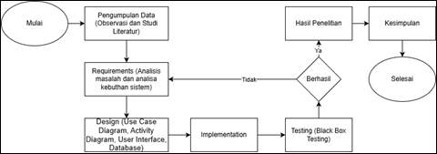
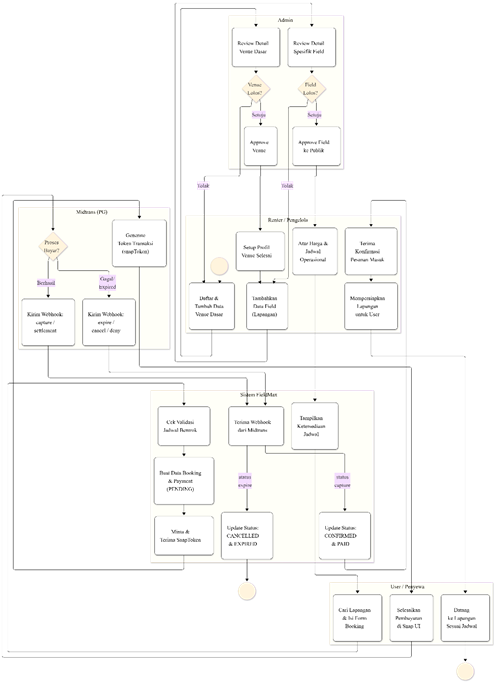

RANCANG BANGUN SISTEM INFORMASI RESERVASI
DAN FASILITAS OLAHRAGA MULTI-TENANT BERBASIS WEB

 

 

 

 

AFLAH ALIFU NA
MAPPATAJANG RAHMAN

H071211021

 

 

 

 

 

 

 

 

 

 

PROGRAM STUDI
SISTEM INFORMASI

FAKULTAS
MATEMATIKA DAN ILMU PENGETAHUAN ALAM

UNIVERSITAS
HASANUDDIN

MAKASSAR

2025

RANCANG BANGUN
SISTEM INFORMASI RESERVASI DAN FASILITAS OLAHRAGA MULTI-TENANT BERBASIS WEB

 

 

AFLAH ALIFU NA MAPPATAJANG RAHMAN

H071211012

 

 

 

Skripsi

 

 

Sebagai salah satu
syarat untuk mencapai gelar Sarjana

 

 

Program Studi Sistem Informasi 

 

 

 

Pada

 

 

 

 

 

 

 

 

 

 

PROGRAM STUDI
SISTEM INFORMASI

FAKULTAS
MATEMATIKA DAN ILMU PENGETAHUAN ALAM

UNIVERSITAS
HASANUDDIN

MAKASSAR

2025

 

# ABSTRAK ^abstrak

Minat masyarakat yang tinggi terhadap olahraga mendorong permintaan yang besar terhadap penyewaan lapangan olahraga. Namun, pengelolaan fasilitas olahraga yang masih manual sering kali menimbulkan permasalahan operasional, seperti jadwal ganda (*double booking*), kesalahan pencatatan, lambatnya penyusunan laporan keuangan, serta kesulitan pelanggan dalam memantau ketersediaan lapangan secara *real-time*. Penelitian ini bertujuan untuk merancang dan membangun platform FieldMax, sebuah *marketplace* reservasi dan manajemen penyewaan lapangan olahraga berbasis web. FieldMax dirancang menggunakan pendekatan *Design Science Research* (DSR) dan metode pengembangan perangkat lunak *Waterfall*. Sistem ini dikembangkan sebagai *full-stack TypeScript monorepo* dengan membagi arsitektur menjadi *frontend* menggunakan Next.js (App Router), *backend* menggunakan Express.js, serta PostgreSQL sebagai sistem manajemen basis data yang diakses melalui Prisma ORM. Otentikasi keamanan sistem menggunakan *session-based authentication* yang disimpan di basis data. Fitur pembayaran terintegrasi secara aman melalui *payment gateway* Midtrans Snap, penyimpanan media dikelola menggunakan ImageKit CDN, dan notifikasi sistem menggunakan Nodemailer (SMTP). Pengujian sistem dilakukan dengan metode *Black Box Testing* untuk memastikan kesesuaitas fungsionalitas bagi tiga aktor: Pengguna (User), Mitra Pengelola (Renter), dan Administrator (Admin). Hasil pengujian menunjukkan bahwa platform FieldMax dapat memfasilitasi transaksi pemesanan secara instan, mengotomatisasi pembaruan jadwal lapangan secara *real-time*, meminimalkan kesalahan pencatatan pemesanan ganda, serta menyajikan visualisasi data pendapatan bagi Mitra Pengelola. Penelitian ini membuktikan bahwa platform FieldMax berhasil mengoptimalkan efisiensi operasional pengelolaan lapangan olahraga dan memberikan kemudahan akses layanan bagi pelanggan secara digital.

**Kata Kunci:** Reservasi Lapangan, *Marketplace*, Next.js, Express.js, Midtrans, *Design Science Research*.
# ABSTRACT ^abstract

The high public interest in sports drives a significant demand for sports venue rentals. However, manual management of sports facilities often leads to operational issues, such as double bookings, record-keeping errors, delayed financial reporting, and customer difficulty in checking real-time field availability. This study aims to design and develop FieldMax, a web-based sports venue booking and management marketplace platform. FieldMax was developed using the Design Science Research (DSR) approach and the Waterfall software development life cycle (SDLC) method. The system is built as a full-stack TypeScript monorepo, separating the architecture into a Next.js (App Router) frontend, an Express.js backend, and a PostgreSQL database accessed via Prisma ORM. System security is handled using database-stored session-based authentication. Payment transactions are securely integrated via the Midtrans Snap payment gateway, media files are managed through ImageKit CDN, and system notifications are sent via Nodemailer (SMTP). System testing was conducted using the Black Box Testing method to ensure functional compatibility for three user roles: Customer (User), Venue Owner (Renter), and Administrator (Admin). The testing results demonstrate that the FieldMax platform successfully facilitates instant booking transactions, automates real-time availability updates, minimizes double-booking errors, and provides revenue data visualization for Renters. This study proves that the FieldMax platform effectively optimizes the operational efficiency of sports venue management and simplifies customer service access digitally.

**Keywords:** Venue Booking, Marketplace, Next.js, Express.js, Midtrans, Design Science Research.
# DAFTAR ISI

**Halaman**

ABSTRAK. i

ABSTRACT. ii

DAFTAR ISI iii

DAFTAR GAMBAR. v

DAFTAR TABEL. x

BAB I. PENDAHULUAN. 1

1.1 Latar Belakang. 1

1.1 Rumusan Masalah. 3

1.2 Tujuan Penlitian. 3

1.3 Batasan Masalah. 3

1.4 Manfaat Penelitian. 3

1.5 Landasan Teori 4

BAB II. METODE PENELITIAN. 13

2.1 Waktu dan Lokasi Penelitian. 13

2.2 Design Science Research. 13

2.3 Metode Pengumpulan Data. 14

2.4 Metode Pengembangan Sistem.. 15

2.5 Tahapan Penelitian. 16

2.6 Analisis Pengembangan Sistem.. 16

2.7 Perancangan Sistem.. 19

2.8 Rancangan *User Interface* (UI) 19

BAB III. HASIL DAN PEMBAHASAN. 59

3.1 Implementasi Sistem.. 59

3.2 Implementasi Basis Data. 59

3.3 Implementasi *Activity Diagram*.. 76

3.4 Implementasi *UI/UX*. 116

3.5 Pengujian Sistem.. 146

BAB IV. KESIMPULAN DAN SARAN. 164

4.1 Kesimpulan. 164

4.2 Saran. 164

DAFTAR PUSTAKA. 165

LAMPIRAN. 167

 

 

# DAFTAR GAMBAR ^daftar-gambar

Halaman

[**Gambar 1.** Kerangka *Design Science Research*](#^gambar-1)

[**Gambar 2.** Tahapan dari metode waterfall](#^gambar-2)

[**Gambar 3.** Kerangka Penelitian Sistem Informasi yang Digunakan Pada Penelitian Ini](#^gambar-3)

[**Gambar 4.** Alur Penelitian](#^gambar-4)

[**Gambar 5.** Sistem penggunaan web Platform FieldMax](#^gambar-5)

[**Gambar 6.** Use Case Diagram Web Platform FieldMax](#^gambar-6)

[**Gambar 7.** Relasi antar tabel](#^gambar-7)

# DAFTAR TABEL ^daftar-tabel

Halaman

[**Tabel 1.** Komponen *use case diagram*](#^tabel-1)

[**Tabel 2.** Komponen *activity diagram*](#^tabel-2)

[**Tabel 3.** Komponen *Entity Relationship Diagram*](#^tabel-3)

[**Tabel 4.** Waktu Penelitian](#^tabel-4)

[**Tabel 5.** Tabel daftar Enum yang digunakan beserta nilainya](#^tabel-5)

[**Tabel 6.** Tabel *users*](#^tabel-6)

[**Tabel 7.** Tabel *verification_tokens*](#^tabel-7)

[**Tabel 8.** Tabel *reset_tokens*](#^tabel-8)

[**Tabel 9.** Tabel *user_profiles*](#^tabel-9)

[**Tabel 10.** Tabel *sport_types*](#^tabel-10)

[**Tabel 11.** Tabel *venues*](#^tabel-11)

[**Tabel 12.** Tabel *venue_schedules*](#^tabel-12)

[**Tabel 13.** Tabel *venue_photos*](#^tabel-13)

[**Tabel 14.** Tabel *fields*](#^tabel-14)

[**Tabel 15.** Tabel *field_photos*](#^tabel-15)

[**Tabel 16.** Tabel *bookings*](#^tabel-16)

[**Tabel 17.** Tabel *payments*](#^tabel-17)

[**Tabel 18.** Tabel *reviews*](#^tabel-18)

[**Tabel 19.** Tabel *sessions*](#^tabel-19)

[**Tabel 20.** Tabel *reports*](#^tabel-20)

[**Tabel 21.** Tabel *report_replies*](#^tabel-21)

[**Tabel 22.** Pengujian Halaman Utama & Pencarian Venue](#^tabel-22)

[**Tabel 23.** Pengujian Fitur Otentikasi & Akun](#^tabel-23)

[**Tabel 24.** Skema Reservasi Lapangan & Pembayaran (User-Side)](#^tabel-24)

[**Tabel 25.** Fitur Ulasan Lapangan & Laporan Pengaduan](#^tabel-25)

[**Tabel 26.** Pengelolaan Venue & Lapangan (Renter-Side)](#^tabel-26)

[**Tabel 27.** Panel Moderasi & Administrasi (Admin-Side)](#^tabel-27)

# BAB I PENDAHULUAN ^bab-1 ^bab-1

## 1.1 Latar Belakang ^latar-belakang

Olahraga telah menjadi bagian penting dari gaya hidup masyarakat modern. Kesadaran akan pentingnya kesehatan mendorong peningkatan minat masyarakat terhadap aktivitas fisik, seperti futsal, badminton, basket, dan sepak bola mini. Peningkatan minat ini sejalan dengan meningkatnya permintaan akan fasilitas olahraga yang memadai. Bagi para pengelola fasilitas olahraga, hal ini merupakan peluang bisnis yang menjanjikan, namun juga menghadirkan tantangan dalam hal operasional dan manajemen pelayanan.

Saat ini, masih banyak penyedia jasa penyewaan lapangan olahraga yang menggunakan sistem konvensional atau manual dalam proses bisnisnya, seperti pencatatan pada buku agenda dan pemesanan melalui telepon atau aplikasi pesan singkat (WhatsApp). Metode ini memiliki kelemahan yang berdampak pada efisiensi operasional. Menurut penelitian Nadjamuddin (2023), penggunaan sistem manual sering menyulitkan pelanggan dalam mengetahui jadwal yang tersedia secara pasti dan membebani admin atau pengelola dalam mengolah data pemesanan. Permasalahan klasik seperti jadwal bersamaan (double booking), kesalahan pencatatan, dan lambatnya rekapitulasi laporan pendapatan menjadi kendala utama yang dihadapi oleh pengelola fasilitas olahraga (Ratama et al., 2022).

Selain itu, dari sisi pelanggan (User), ketiadaan platform terpusat membuat mereka kesulitan untuk mengakses informasi fasilitas dan melakukan pemesanan secara fleksibel. Saat ini, pelanggan menuntut kemudahan akses informasi dan transaksi yang cepat tanpa terikat waktu dan tempat. Sebagaimana dikemukakan oleh Nurhakim dkk. (2023), implementasi sistem informasi berbasis web bertujuan untuk memudahkan pemesanan secara daring, meningkatkan efisiensi operasional, serta meningkatkan kepuasan pelanggan melalui pelayanan yang lebih transparan dan responsif. Transformasi digital ini menjadi solusi strategis untuk memudahkan akses informasi antara kebutuhan pengguna akan fleksibilitas dan kebutuhan pengelola akan manajemen yang teratur.

Berdasarkan permasalahan tersebut, diperlukan adanya solusi berupa sistem informasi terintegrasi yang dapat menampung kebutuhan kedua belah pihak. Penelitian terbaru oleh Fortunata dan Cahyaningtyas (2023) menunjukkan bahwa pengembangan sistem penyewaan lapangan berbasis web terbukti memudahkan pelanggan dalam melakukan penyewaan dan membantu pemilik dalam mengelola data sewa secara lebih terstruktur.

Oleh karena itu, penelitian ini mengusulkan "Rancang Bangun Sistem Informasi Penyewaan dan Pengelolaan Lapangan Olahraga Berbasis Web". Sistem ini, yang kemudian dinamakan FieldMax, dirancang untuk memiliki fitur banyak role yang memfasilitasi Pemilik Fasilitas (Renter) dalam mengelola jadwal, lapangan, dan laporan transaksi, serta memudahkan Pelanggan (User) dalam melakukan pencarian, pengecekan ketersediaan jadwal secara real-time, dan pemesanan lapangan. Implementasi sistem ini diharapkan dapat menjadi solusi efisien untuk mengurangi kesalahan operasional dan meningkatkan kualitas layanan penyewaan fasilitas olahraga.

## 1.1 Rumusan Masalah ^rumusan-masalah

Berdasarkan latar belakang yang telah diuraikan, adapun rumusan masalah yang akan dibahas dalam penelitian ini yaitu sebagai berikut:

 
1. Bagaimana merancang dan membangun sistem informasi penyewaan lapangan olahraga berbasis web yang dapat menggantikan pencatatan manual?
 
2. Bagaimana mengatasi masalah jadwal yang konflik (double booking) dan ketidakpastian ketersediaan lapangan yang sering dialami oleh pelanggan dan pengelola?
 
3. Bagaimana menyediakan platform terintegrasi yang memudahkan pengelola (Renter) dalam manajemen data transaksi dan laporan pendapatan, serta memudahkan pelanggan (User) dalam pencarian dan pemesanan lapangan?

## 1.2 Tujuan Penlitian ^tujuan-penelitian

Tujuan yang ingin dicapai dari penelitian ini yaitu:

1. Merancang dan mengimplementasikan aplikasi berbasis web yang dapat menggantikan peran buku agenda dan komunikasi manual (WhatsApp) dalam proses pencatatan reservasi, sehingga data tersimpan secara digital, aman, dan terstruktur

2. Menyediakan fitur pengecekan jadwal ketersediaan lapangan secara real-time yang dapat diakses langsung oleh pelanggan, guna memastikan tidak ada dua pemesanan pada waktu dan lapangan yang sama.

3. Menghasilkan platform terpadu (FieldMax) yang mampu memberikan kemudahan bagi pemilik fasilitas (Renter) dalam mengelola operasional bisnis dan laporan, sekaligus memberikan kemudahan bagi pengguna (User) dalam mencari informasi lapangan dan melakukan transaksi pemesanan secara mandiri.

## 1.3 Batasan Masalah ^batasan-masalah

Dalam penelitian ini, ada beberapa batasan yang ditetapkan untuk menjaga agar fokus penelitian tetap jelas dan untuk memastikan hasil yang sesuai dengan tujuan yang diinginkan, yaitu:

 
1. Sistem ini dibangun berbasis Web (Website) menggunakan teknolog Next.js dan dapat diakses melalui browser pada perangkat desktop maupun mobile (responsif), namun tidak berupa aplikasi native (Android/iOS).
 
2. Basis data dari sistem aplikasi ini menggunakan PostgreSQL
 
3. Sistem tidak membahas manajemen keuangan/akuntansi yang mendalam (seperti neraca atau arus kas perusahaan), melainkan hanya menyediakan rekapitulasi laporan pendapatan transaksi penyewaan.

## 1.4 Manfaat Penelitian ^manfaat-penelitian

Manfaat yang didapatkan dari penelitian ini, yaitu yaitu:

1. Adanya sistem yang terintegrasi untuk proses reservasi, pembayaran, dan manajemen layanan penyewaan lapangan.

2. Makin mudahnya proses pemesanan layanan reservasi bagi calon user layanan penyewaan lapangan di Platform FieldMax.

## 1.5 Landasan Teori ^landasan-teori

### 1.5.1 Sistem Informasi Berbasis Web

Sistem informasi merupakan serangkaian kegiatan mengumpulkan, mengolah, menganalisis, serta mendistribusikan informasi yang dapat digunakan untuk mencapai tujuan tertentu, yang biasanya terdiri dari beberapa komponen di dalamnya meliputi manusia, perangkat keras, perangkat lunak, dan basis data. Dengan sistem informasi, proses komunikasi, transaksi, kegiatan operasional, manajerial, hingga pengambilan keputusan dapat menjadi lebih akurat dan tepat. Di sisi lain, web adalah kumpulan halaman yang di dalamnya terdiri dari berbagai macam bentuk informasi, seperti teks, gambar, video, dan elemen multimedia lainnya yang dapat diakses kapan saja dan di mana saja melalui jaringan internet (Rahmi et al., 2023).

Sistem informasi berbasis web, berarti sistem informasi yang dibangun diwujudkan dalam bentuk web. Adanya hal ini diharapkan dapat memberikan banyak manfaat, terutama dari segi efisiensi karena dapat mengotomatisasi pekerjaan dan memudahkan proses bisnis, yang dalam kasus ini untuk sistem reservasi lapangan olahraga dan manajemen penyedia lapangan (renter) pada platform FieldMax..

### 1.5.2 Reservasi Lapangan Olahraga

Reservasi merupakan sebuah proses pemesanan produk baik barang maupun jasa yang pada saat itu telah terdapat kesepahaman antara konsumen dengan produsen mengenai produk tersebut. Selama berlangsungnya proses reservasi biasanya ditandai dengan adanya proses tukar menukar informasi antara konsumen dan produsen atau penyedia jasa agar pemahaman akan produk dan cara pemesanannya dapat tercapai (Christanto et al., 2012). Proses reservasi ini dimungkinkan dilakukan secara daring, sehingga memungkinkan pengguna melakukan pemesanan secara fleksibel tanpa perlu datang langsung ke lokasi layanan. Selain untuk memudahkan akses bagi pengguna, sistem ini juga mendukung dari sisi internal pemilik lapangan (sebagai penyedia fasilitas), untuk pengoptimalan dari sisi tata kelola waktu dan sumber daya operasional. Penerapan reservasi secara daring pada berbagai fasilitas olahraga menunjukkan bahwa penggunaan sistem ini dapat meningkatkan efektivitas pelayanan dengan mengurangi waktu tunggu, menghindari bentrok jadwal (double booking), dan memperbaiki keseluruhan alur penyewaan.

 

Adapun sistem reservasi pada layanan olahraga tidak hanya berfungsi untuk mengatur jadwal penyewaan lapangan, tetapi juga mendukung pengelolaan data pengguna, ketersediaan fasilitas lapangan, serta rekapitulasi operasional renter. Penelitian mengenai sistem informasi reservasi layanan berbasis web menunjukkan bahwa penerapan sistem tersebut mampu meningkatkan efisiensi pelayanan, mempermudah proses pemesanan jadwal sewa, serta membantu manajemen tempat olahraga dalam mengelola operasional secara lebih sistematis dan terkontrol (Hasibuan et al., 2024). Sehingga reservasi lapangan olahraga dapat diartikan sebagai sistem pemesanan dan penyewaan secara daring di dalam domain fasilitas olahraga.

### 1.5.3 Layanan Penyewaan Lapangan di FieldMax

Platform FieldMax merupakan sebuah sistem marketplace multi-tenant yang dirancang khusus untuk memfasilitasi penyewaan lapangan olahraga di Kota Makassar. Platform ini menghubungkan pemilik venue olahraga (*Renter*) dengan masyarakat umum (*User*) yang ingin menyewa lapangan secara praktis.

Sebelum adanya platform ini, proses penyewaan fasilitas olahraga pada umumnya masih dilakukan secara manual menggunakan chat WhatsApp atau Google Form, di mana pencatatan jadwal sewa dan konfirmasi pembayaran transfer bank harus diverifikasi manual satu per satu. Alur konvensional ini membutuhkan waktu lama, tidak efisien, dan rentan terhadap kesalahan pencatatan jadwal ganda (*double booking*). Melalui FieldMax, seluruh proses dari pencarian lapangan, cek ketersediaan jadwal real-time, reservasi, hingga pembayaran terintegrasi otomatis secara online menggunakan Midtrans payment gateway.

### 1.5.4 Teknologi Pengembangan

#### 1. Next.js.

Next.js merupakan kerangka kerja (framework) berbasis pustaka (library) React.js yang mempermudah pengembangan aplikasi web modern yang mendukung Search Engine Optimization (SEO). Framework ini dirancang untuk meminimalkan masalah performa pada aplikasi yang hanya menggunakan Client-Side Rendering (CSR) ataupun Server-Side Rendering (SSR) dengan mengombinasikan keduanya. Selain SSR dan CSR, framework ini juga menyediakan beragam fitur bawaan yang lain, seperti Static Site Generation (SSG), dynamic routing, dan lain sebagainya, sehingga proses pembangunan bagian antar-muka aplikasi dapat lebih efisien (Pati & Zaki, 2025).

Dengan adanya fitur tersebut, pengembang dapat menentukan proses rendering sesuai kebutuhan, dilakukan pada saat permintaan diterima (SSR), pada saat proses build (SSG), pada saat sudah sampai di client-side (CSR) atau dengan mengombinasikannya. Oleh karena itu, Next.js menjadi salah satu pilihan krusial untuk menangani bagian Front End dari sistem ini. Kombinasi yang dibawa oleh Next.js mampu menjadikan library React.js, yang basisnya hanya pada client-side, memiliki kapabilitas optimal hingga keramahan yang baik terhadap performa SEO secara menyeluruh..

#### 2. Express.js.

Express.js merupakan salah satu framework pengembangan aplikasi sisi antarmuka (backend) Node.js yang paling populer, minimal, dan fleksibel, menyediakan serangkaian fitur tangguh untuk web maupun Application Programming Interface (API) (Nasution & Pane, 2025). Express.js berjalan di sisi server platform Node.js, memungkinkan pengembang membangun lingkungan RESTful API yang cepat, efisien, serta sangat mudah diskalakan sesuai kebutuhan fungsional user. Framework ini bekerja menggunakan arsitektur yang mengutamakan kecepatan pemrosesan dan pola pertukaran data secara aman (Azkarin et al., 2023).

#### 3. PostgreSQL.

PostgreSQL merupakan salah satu Relational Database Management System (RDBMS) sumber terbuka yang populer. PostgreSQL versi terbaru memprioritaskan fokus pada tingkatan performa, dukungan paralelisme kueri komputasi kompleks, serta relasi deployment berbasis layanan awan (cloud). Repositori PostgreSQL menyediakan ragam tipe data dari standar format SQL, tipe array, hingga ekstensi penyimpanan semantik JSON untuk fleksibilitas komprehensif terhadap basis data.

Keunggulan PostgreSQL terdapat di mekanisme implementasi Multi-Version Concurrency Control (MVCC) beserta arsitektur pengindekan berlapis. Berkat MVCC, PostgreSQL sanggup menoleransi beragam instruksi transaksi data dari pengguna platform yang berinteraksi dalam satu waktu secara bersamaan, sehingga ketersediaan akses data (availability) pada platform tetap optimal meski dalam trafik request yang tajam dan tak terprediksi dari user. Mekanisme ini menjamin operasi tabel data secara transaksional yang saling tertutup dari intervensi transaksi pihak lain (Salunke & Ouda, 2024).

#### 4. *Payment Gateway.*

Payment gateway merupakan teknologi jembatan perantara fungsional untuk memfasilitasi proses transaksi pembayaran non-tunai yang aman secara sistem antara sistem bisnis digital dengan pihak pelanggan, yang biasanya disertai sistem intelijen untuk mendeteksi penipuan siber. Saat ini, payment gateway krusial pemanfaatannya di bermacam inovasi elektronik dan digital. Dalam konteks sistem e-commerce dan reservasi layanan, sistem ini sanggup mempermudah transaksi beragam ragam metode pembayaran konvensional dari dompet kelab ke rekening bank dalam satu platform tanpa celah verifikasi palsu. Pengguna melakukan pembelajaan via platform, memilih vendor, dan selanjutnya diinisiasikan pihak pemroses (processor) hingga payment gateway bertugas meneruskan verifikasi approval penyelesaian akhir kepada sistem (Siahaan & Sianturi, 2024).

Hal tersebut tecermin nyata di dalam arsitektur penelitian ini. Payment gateway berfungsi mengurus jalur pertukaran keuangan yang diajukan oleh pengguna FieldMax untuk menyewa lapangan secara beragam rupa pembayaran digital instan. Begitu inisiasi transaksi berlangsung dan diakhiri lewat pembayaran berhasil, webhook server pembayaran akan menyampaikan status perintah agar FieldMax langsung mengubah status pesanan PENDING menjadi PAID, maupun jika melebihi tenggatnya bertransisi kepada EXPIRED/CANCELLED.

Payment gateway yang dimanfaatkan di riset sistem FieldMax adalah Midtrans. Midtrans merupakan penyedia infrastruktur payment gateway terintegrasi yang paling terkemuka di tanah air. Pilihan medium digital yang luas (mulai dari Virtual Account, QRIS, Dompet digital, GoPay, dan lainnya) memudahkan konektivitas Application Programming Interface (API) yang mulus di sisi aplikasi tanpa hambatan manual. Efisiensi luar biasa terasa pada mitigasi pengawasan riwayat pendapatan transaksi pemilik venue, pemberitahuan realisasi real-time, hingga mengikis potensi salah verifikasi dari pihak sistem manual reservasi lapangan (Hafiz et al., 2023)..

### 1.5.5 Pemodelan Sistem Berbasis UML

*Unified Modeling Language* (UML) merupakan cara pemodelan berbasis gambar untuk kebutuhan visualisasi, perumusan, pembangunan, serta pendokumentasian dari sebuah sistem (Pressman, 2010). Oleh karena itu, UML dapat dikatakan sebagai, standar penyusunan *blueprint* sistem, mulai dari pemodelan proses bisnis hingga berbagai komponen yang dibutuhkan dalam pengembangan sebuah perangkat lunak. Beberapa komponennya yang digunakan dalam penelitian ini meliputi:

#### 1. *Use Case Diagram.*

*Use Case Diagram* adalah salah satu pemodelan untuk perilaku (behavior) sistem yang akan dibuat, di mana ia menguraikan interaksi antara satu atau lebih aktor dengan sistem. Diagram ini menggambarkan urutan interaksi yang saling berkaitan antara sistem dan aktor dari perspektif pengguna (*external view*). Tujuannya adalah mendefinisikan batas-batas sistem dan mengorganisasi persyaratan fungsional, serta mengetahui fungsi apa saja yang ada di dalam sistem dan aktor yang berhak menggunakan fungsi-fungsi tersebut.

**Tabel 1.** Komponen *use case diagram* ^tabel-1

| SIMBOL | NAMA | KETERANGAN |
| :---: | :--- | :--- |
| <svg width="24" height="24" viewBox="0 0 24 24" fill="none" stroke="currentColor" stroke-width="2" stroke-linecap="round" stroke-linejoin="round"><circle cx="12" cy="7" r="4"/><path d="M19 21v-2a4 4 0 0 0-4-4H9a4 4 0 0 0-4 4v2"/></svg> | Actor | Mewakili peran orang, sistem yang lain, atau alat ketika berinteraksi dengan use case |
| <svg width="40" height="20" viewBox="0 0 40 20"><ellipse cx="20" cy="10" rx="18" ry="8" stroke="currentColor" stroke-width="2" fill="none"/></svg> | Use Case | Abstraksi dan interaksi antara sistem dan aktor |
| <svg width="40" height="20" viewBox="0 0 40 20"><line x1="2" y1="10" x2="38" y2="10" stroke="currentColor" stroke-width="2"/></svg> | Association | Abstraksi dari penghubung antara actor dengan use case |
| <svg width="40" height="20" viewBox="0 0 40 20"><line x1="2" y1="10" x2="30" y2="10" stroke="currentColor" stroke-width="2"/><polygon points="30,6 38,10 30,14" stroke="currentColor" stroke-width="2" fill="none"/></svg> | Generalization | Menunjukkan spesialisasi actor untuk dapat berpartisipasi dengan use case |
| <svg width="40" height="20" viewBox="0 0 40 20"><line x1="2" y1="10" x2="30" y2="10" stroke="currentColor" stroke-width="2" stroke-dasharray="3,3"/><polygon points="30,6 38,10 30,14" fill="currentColor"/></svg> | Include | Menunjukkan bahwa suatu use case tambahan merupakan fungsionalitas dari use case lainnya jika suatu kondisi terpenuhi |

#### 2. *Activity Diagram.*

*Activity Diagram* adalah pemodelan yang dilakukan pada suatu sistem untuk menggambarkan aktivitas sistem berjalan dan merepresentasikan aliran proses atau alur kerja (*workflow*). Diagram ini sangat mirip dengan *flowchart* karena memodelkan alur kerja dari satu aktivitas ke aktivitas lainnya atau dari aktivitas ke status, termasuk di dalamnya keputusan-keputusan yang mungkin terjadi. Diagram ini memodelkan proses bisnis dan urutan aktivitas dalam sebuah proses.

**Tabel 2.** Komponen *activity diagram* ^tabel-2

| SIMBOL | NAMA | KETERANGAN |
| :---: | :--- | :--- |
| <svg width="20" height="20" viewBox="0 0 20 20"><circle cx="10" cy="10" r="8" fill="currentColor"/></svg> | Start Point | Titik awal bagaimana objek diawali atau dibentuk |
| <svg width="20" height="20" viewBox="0 0 20 20"><circle cx="10" cy="10" r="8" stroke="currentColor" stroke-width="2" fill="none"/><circle cx="10" cy="10" r="4" fill="currentColor"/></svg> | End Point | Titik akhir objek |
| <svg width="40" height="20" viewBox="0 0 40 20"><rect x="2" y="2" width="36" height="16" rx="5" ry="5" stroke="currentColor" stroke-width="2" fill="none"/></svg> | Activities | Memperlihatkan bagaimana masing masing antarmuka kelas saling berinteraksi satu sama lain |
| <svg width="20" height="20" viewBox="0 0 20 20"><polygon points="10,2 18,10 10,18 2,10" stroke="currentColor" stroke-width="2" fill="none"/></svg> | Decision | Menggambarkan suatu Keputusan atau tindakan yang harus diambil pada kondisi tertentu |

#### 3. *Entity Relationship Diagram *(ERD)*.*

*Entity Relationship Diagram* (ERD) adalah diagram yang berbentuk notasi grafis yang merupakan salah satu alat utama dalam perancangan basis data. ERD memodelkan struktur data secara konseptual, yang mendeskripsikan hubungan antara data-data yang saling berhubungan. ERD adalah tahap dasar dalam membuat database dan merupakan teknik perancangan yang paling banyak digunakan karena semua entitas, atribut, dan relasinya harus dirancang secara lengkap dan detail.

**Tabel 3.** Komponen *Entity Relationship Diagram* ^tabel-3

| SIMBOL | NAMA | KETERANGAN |
| :---: | :--- | :--- |
| <svg width="40" height="20" viewBox="0 0 40 20"><rect x="2" y="2" width="36" height="16" stroke="currentColor" stroke-width="2" fill="none"/></svg> | Entity | Merupakan suatu simbol untuk mewakili suatu objek dengan karakteristik sama yang dilengkapi oleh atribut. |
| <svg width="40" height="20" viewBox="0 0 40 20"><ellipse cx="20" cy="10" rx="18" ry="8" stroke="currentColor" stroke-width="2" fill="none"/></svg> | Attribute | Merupakan suatu simbol yang menjelaskan suatu entitas karakteristik dan juga relasinya. |
| <svg width="30" height="20" viewBox="0 0 30 20"><polygon points="15,2 27,10 15,18 3,10" stroke="currentColor" stroke-width="2" fill="none"/></svg> | Strong Relationship | Menggambarkan hubungan beberapa entitas berdasarkan fakta pada suatu lingkungan. |
| <svg width="40" height="20" viewBox="0 0 40 20"><line x1="2" y1="10" x2="38" y2="10" stroke="currentColor" stroke-width="2"/></svg> | Connection | Menggambarkan keterkaitan antara simbol berupa garis penghubung |

 

### 1.5.6 Ruang Lingkup Penelitian Sistem Informasi

Terdapat ruang lingkup penelitian sistem informasi yang terdiri dari Environment, IS Research, dan Technology seperti yang dapat dilihat berikut.

![Design science research in information systems according to [33] | Download Scientific Diagram](images/image015.png)

**Gambar 1.** Kerangka *Design Science Research* ^gambar-1

Pada bagian *Environment* atau lingkungan, mencerminkan konteks permasalahan penelitian muncul. Lingkungan terdiri atas *people* (manusia), *organizations* (organisasi), dan *technology* (teknologi). Di dalam lingkungan terdapat tujuan, tugas, permasalahan, dan peluang yang membentuk kebutuhan bisnis organisasi. Lingkungan inilah yang mendefinisikan ruang permasalahan dan memastikan bahwa penelitian yang dilakukan memiliki relevansi praktis.

Bagian *Knowledge Base* mencakup teori, konsep, model, metode, dan lain sebagainya yang menjadi landasan ilmiah yang digunakan dalam proses penelitian. Bagian ini berfungsi sebagai sumber *rigor* ilmiah, yaitu sebagai landasan utama untuk memastikan bahwa desain dan evaluasi dilakukan secara sistematis dan dapat dipertanggungjawabkan secara akademik.

Adapun *IS Research* yang terletak di antara *Environment* dan *Knowledge Base*, merupakan fase peneliti merancang dan mengevaluasi artefak sistem informasi untuk menjawab kebutuhan bisnis yang ada. Proses ini didasarkan dari masalah yang telah diuraikan pada bagian *Environtment *dan beberapa teori penyelesaian yang diuraikan pada bagian *Knowledge Base*. Proses ini menghasilkan kontribusi ilmiah berupa artefak yang tervalidasi serta pengetahuan baru yang dapat digunakan kembali pada konteks serupa (Hevner et al., 2004).

### 1.5.7 Metode Pengembangan (*Waterfall*)

Metode waterfall merupakan salah satu metode dalam *System Development Life Cycle* (SDLC). Metode ini memiliki ciri khas bahwa setiap tahap harus diselesaikan terlebih dahulu sebelum melanjutkan ke tahap berikutnya. Dengan alur tersebut, fokus pada tiap fase dapat dimaksimalkan karena tidak ada pengerjaan paralel. Metode waterfall juga bersifat rekursif, karena setiap tahapnya dapat diulang kembali tanpa batas sampai mencapai hasil yang optimal (Heriyanti & Ishak, 2020).

**Gambar 2.** Tahapan dari metode waterfall ^gambar-2

1.***Requirement***, tahap ini merupakan tahap awal untuk menetapkan spesifikasi kebutuhan perangkat lunak. Pada fase ini, analis sistem dan analis bisnis berdiskusi untuk menentukan kebutuhan fungsional, seperti mendeskripsikan interaksi pengguna dengan sistem, maupun non-fungsional, yang meliputi reliabilitas, skalabilitas, kemudahan pengujian, standar kualitas dan lain sebagainya.

2.***Design***, tahap ini merupakan perencanaan dan perancangan solusi perangkat lunak. Pengembang dan desainer sistem menetapkan rancangan solusi yang mencakup perancangan algoritma, basis data, hingga desain antarmuka pengguna.

3.***Implementation***, fase ini merupakan tahap penulisan kode program hingga menghasilkan aplikasi yang dapat dijalankan. Pada tahap ini juga dibuat basis data dan file-file yang dibutuhkan aplikasi.

4.***Verification***, tahap pengujian atau verifikasi dan validasi, yaitu proses memastikan apakah perangkat lunak memenuhi spesifikasi dan kebutuhan awal, serta benar-benar dapat digunakan sesuai tujuan yang ditetapkan.

5.***Maintenance***, tahap pemeliharaan bertujuan memperbaiki kesalahan atau bug yang tidak ditemukan pada fase sebelumnya serta melakukan penyesuaian jika diperlukan.

### 1.5.8 *Black Box Testing*

*Black Box Testing* dalam pengembangan perangkat lunak merupakan metode pengujian yang dilakukan untuk menilai aplikasi dari sisi luar, seperti antarmuka, fungsi-fungsi yang tersedia, dan kesesuaiannya dengan kebutuhan yang telah dirancang sebelumnya. *Black Box Testing* dilakukan dari sudut pandang pengguna akhir. Metode ini tidak memerlukan penguji untuk memahami bahasa pemrograman tertentu, sehingga pengujiannya dilakukan berdasarkan perspektif pengguna. Hal itu dilakukan agar penguji dapat mengidentifikasi inkonsistensi dari kebutuhan awal. Kemudian pengembang dan penguji juga masih tetap dapat bekerja sama (Uminingsih et al., 2022).

Dalam *Black Box Testing* pengujian berfokus pada spesifikasi fungsional dari perangkat lunak, penguji dapat mendefinisikan kondisi-kondisi input dan melakukan pengujian pada fitur aplikasi. Proses pengujianya adalah mencoba program yang telah dibuat dengan memasukkan data pada setiap form yang ada atau menekan tombol untuk mengetahui aksinya sudah sesuai dengan ekspektasi atau tidak. Pengujian seperti ini diperlukan untuk mengetahui program tersebut sudah berjalan sesuai dengan yang dibutuhkan oleh perusahaan (Shadiq et al., 2021).

# BAB II METODE PENELITIAN ^bab-2

## 2.1 Waktu dan Lokasi Penelitian ^waktu-dan-lokasi-penelitian

Penelitian ini dilaksanakan pada bulan Juli 2025 sampai bulan November 2025.

**Tabel 4.** Waktu Penelitian ^tabel-4

| No | Tahapan Penelitian | Juli M1 | Juli M2 | Juli M3 | Juli M4 | Ags M1 | Ags M2 | Ags M3 | Ags M4 | Sep M1 | Sep M2 | Sep M3 | Sep M4 | Okt M1 | Okt M2 | Okt M3 | Okt M4 | Nov M1 | Nov M2 | Nov M3 | Nov M4 |
| :--- | :--- | :---: | :---: | :---: | :---: | :---: | :---: | :---: | :---: | :---: | :---: | :---: | :---: | :---: | :---: | :---: | :---: | :---: | :---: | :---: | :---: |
| 1 | Studi Literatur | ✓ | ✓ | ✓ | ✓ | ✓ | ✓ | | | | | | | | | | | | | | |
| 2 | Analisis Kebutuhan (*Requirements*) | | | | ✓ | ✓ | ✓ | | | | | | | | | | | | | | |
| 3 | Desain Sistem (*Design*) | | | | | | | ✓ | ✓ | ✓ | ✓ | | | | | | | | | | |
| 4 | Implementasi Sistem (*Implementation*) | | | | | | | | | | | ✓ | ✓ | ✓ | ✓ | ✓ | ✓ | | | | |
| 5 | Pengujian Sistem (*Testing*) | | | | | | | | | | | | | | | | | ✓ | ✓ | ✓ | ✓ |
| 6 | Pemeliharaan Sistem (*Maintenance*) | | | | | | | | | | | | | | | | | | | ✓ | ✓ |

## 2.2 Design Science Research ^design-science-research

Berikut ini adalah gambaran Kerangka *Information Systems Research Framework* yang digunakan dalam penelitian ini. Konsep metode penelitian ini menggunakan Design Science Research yang sering digunakan dalam Penelitian Sistem Informasi (Hevner et al., 2004). Berikut pada gambar 3 menjelaskan kerangka penelitian sistem informasi yang digunakan pada penelitian ini.

**Gambar 3.** Kerangka Penelitian Sistem Informasi yang Digunakan Pada Penelitian Ini ^gambar-3

 

Pada aspek environment terdiri dari *People* (orang), *Organizations* (organisasi), dan *Technology* (teknologi). *People* (orang) mencakup admin, renter, dan juga user dari website ini. *Organizations* yang terlibat yaitu Platform FieldMax. Kemudian, *Technology* yang digunakan dalam penelitian adalah Visual Studio Code, Tailwind CSS, TypeScript, Next.js, Express.js, dan Figma.

Pada aspek *IS Research*, terdiri dari *Build* (membangun), dan *Evaluate* (evaluasi). Pada tahap *Build*, dilakukan pembuatan desain website Platform FieldMax. Pada tahap *Evaluate*, dilakukan pengujian fungsionalitas Sistem Reservasi dan Manajemen Layanan Penyewaan Lapangan yang bertujuan untuk menilai kinerja dan efektivitasnya.

Adapun aspek *Knowledge Base* dalam penelitian ini terdiri dari *Foundation* (dasar) dan *Methodologies* (metodologi). *Foundation* mencakup konsep SSR dan CSR. Adapun bagian *Methodologies* yang digunakan adalah Design Science Research dan model pengembangan SDLC *Waterfall*. Penerapan metode DSR ini diharapkan dapat berguna dalam meningkatkan kemudahan renter dalam melakukan booking dan pengelolaan lapangan secara efisien.

## 2.3 Metode Pengumpulan Data ^metode-pengumpulan-data

Dalam penelitian ini, tahap pengumpulan data diperlukan untuk mendukung pengembangan sistem. Pemilihan metode pengumpulan data penting karena hasil yang diperoleh akan menjadi dasar dalam proses pengembangan aplikasi. Metode pengumpulan data yang dilakukan dalam penelitian ini adalah sebagai berikut:

### 2.3.1 Studi Literatur

Studi literatur adalah metode pengumpulan data dengan menelaah berbagai sumber-sumber tertulis, meliputi buku, jurnal, laporan penelitian, dan lainnya. Dalam penelitian ini, penulis melakukan studi literatur dengan mencari berbagai informasi yang relevan mengenai pengembangan sistem reservasi berbasis web dan manajemen layanan fasilitas olahraga.

## 2.4 Metode Pengembangan Sistem ^metode-pengembangan-sistem

Metode pengembangan sistem atau *System Development Life Cycle* (SDLC) yang digunakan adalah *Waterfall*. Adapun tahapannya sebagai berikut:

### 2.4.1 Requirements (Kebutuhan)

Pada tahap ini, dilakukan analisis untuk menentukan kebutuhan-kebutuhan yang harus ada. Hal ini bertujuan untuk memahami fitur-fitur yang diharapkan pada sistem yang akan digunakan di tahap selanjutnya.

### 2.4.2 Design (Desain)

Pada tahapan ini, peneliti merancang *Use Case Diagram* dan *Activity Diagram* untuk memberikan gambaran umum mengenai cara kerja sistem. Kemudian, akan dibuat sebuah *Entity Relationship Diagram* (ERD) untuk memvisualisasikan struktur data dan aliran informasi. Setelah itu, dilakukan perancangan antarmuka pengguna (*User Interface*) untuk memberikan gambaran visual yang lebih jelas mengenai tampilan sistem. Selain itu, perancangan *Database* juga dilakukan untuk menyimpan data-data yang berkaitan dengan aplikasi.

### 2.4.3 Implementation (Implementasi)

Pada tahapan ini, dimulai implementasi desain yang telah dibuat menjadi aplikasi berbasis website menggunakan teknologi Next.js dan Express.js sebagai framework utama pengembangan website. Terdapat pula Tailwind CSS sebagai framework Front-end dan TypeScript sebagai bahasa pemrograman utama. Selain itu, terdapat Figma sebagai platform yang digunakan untuk merancang *User Interface / User Experience* (UI/UX).

### 2.4.4 Testing (Pengujian)

Pada tahapan ini, peneliti melakukan pengujian dengan metode Black Box Testing untuk memastikan bahwa sistem yang telah dibangun berfungsi dengan baik.

### 2.4.5 Maintenance (Pemeliharaan)

Pada tahapan ini, peneliti melakukan pemeliharaan pada website untuk memastikan tidak ada bug atau error yang terjadi pada website.

## 2.5 Tahapan Penelitian ^tahapan-penelitian

Tahapan pengembangan sistem ini menggunakan metode Waterfall, yang dimulai dengan tahap *Requirements* (Analisis Kebutuhan). Pada tahap ini, dilakukan analisis kebutuhan sistem yang harus ada untuk aplikasi Sistem Reservasi dan Manajemen Layanan Penyewaan Lapangan, sekaligus melakukan analisis masalah dan analisis kebutuhan sistem. Setelah itu, penelitian dilanjutkan dengan tahapan Design (Desain), yaitu melalui perancangan use case diagram, activity diagram, user interface (UI), serta perancangan database (ERD) untuk memberikan gambaran tentang bagaimana sistem akan berfungsi dan memiliki struktur data.

Tahap berikutnya adalah Implementation (Implementasi), yang merupakan perwujudan rancangan yang telah dibuat menjadi aplikasi berbasis web menggunakan teknologi React.js dan Express.js. Setelah aplikasi dibangun, Testing (Pengujian) dilakukan dengan menggunakan metode *Black Box Testing* untuk memastikan aplikasi berfungsi dengan baik sesuai spesifikasi dan fungsionalitas. Jika sistem tidak memenuhi fungsi atau kebutuhan yang ditentukan, maka tahapan akan diulang kembali ke tahap Requirements untuk diperbaiki (disebut siklus umpan balik). Namun, jika sistem sudah berjalan sesuai dengan kebutuhan, maka penelitian dapat dianggap selesai, menghasilkan Hasil Penelitian dan Kesimpulan.

**Gambar 4.** Alur Penelitian ^gambar-4

## 2.6 Analisis Pengembangan Sistem ^analisis-pengembangan-sistem

### 2.6.1 Analisis Masalah

Berdasarkan hasil observasi dan studi literasi, ditemukan beberapa permasalahan yang terjadi pada model sistem reservasi dan manajemen layanan penyewaan lapangan dari Platform FieldMax. Salah satu masalah utama adalah pemesanan layanan penyewaan lapangannya yang masih manual menggunakan Google Form, yang menyebabkan pengelolaan layanan yang tersedia juga dilakukan manua, serta proses pembayarannya yang tidak saling terintegrasi. Sistem manual ini akhirnya menimbulkan inefisiensi akibat dari permasalahan tersebut.

Kemudian, terjadi penurunan efektivitas manajemen serta memperlambat proses pengambilan keputusan yang strategis. Oleh karena itu, pengembangan sebuah sistem informasi berbasis web yang terpusat dan terintegrasi, yang mampu mengelola proses booking dan manajemen layanan penyewaan lapangan, sangat diperlukan untuk mengatasi masalah-masalah tersebut. Sistem ini diharapkan dapat memberikan kemudahan bagi pelanggan dalam melakukan pemesanan layanan, sekaligus membantu pihak internal Platform FieldMax dalam pengelolaan layanan dan reservasinya.

**Gambar 5.** Sistem penggunaan web FieldMax  ^gambar-5

### 2.6.2 Analisis Kebutuhan Sistem

Dalam pembangunan web ini, dibutuhkan perangkat lunak dan perangkat keras sebagai alat yang dapat mendukung penelitian. Terdapat pula pengguna sistem (*user*) sebagai bahan analisis kebutuhan dalam perancangan sistem. Adapun kebutuhan sistem dalam penelitian ini yaitu:

#### 1. Perangkat lunak.

Perangkat lunak yang digunakan dalam merancang web ini terdiri dari:

1. Windows 11

2. Mermaid diagram

3. dbdiagram.io

4. Visual Studio Code (VS Code)

5. PgAdmin

6. Postman

7. Chrome

#### 2. Perangkat keras.

Selama penelitian, peneliti menggunakan Laptop Lenovo Ideapad Gaming 3 dengan spesifikasi Processor Intel core i7-12650H @ 2,30 GHz, RAM 16GB, dan SSD 512GB.

#### 3. Pengguna sistem *(user)*.

1. ***Admin,*** merupakan pengguna yang berperan sebagai moderator dalam sistem. Admin bertugas memverifikasi dan menyetujui pendaftaran profil penyedia lapangan (Renter) ke dalam wadah platform. Admin juga berwenang meninjau kelayakan dan kelengkapan data venue beserta unit spesifik lapangan (field) yang ditambahkan oleh Renter sebelum fasilitas tersebut dapat diakses oleh publik. Selain itu, Admin memiliki akses menyeluruh untuk melihat daftar semua pengguna, serta memantau seluruh riwayat transaksi pemesanan (booking) dan aliran pembayaran yang terjadi di dalam FieldMax.

2.**Renter (Pemilik/Pengelola Lapangan)*,*** merupakan mitra penyedia jasa yang menyewakan fasilitas olahraga. Renter dapat mendaftarkan venue miliknya dan menambahkan jenis-jenis lapangan secara tersendiri. Setelah mendapatkan persetujuan (approval) dari Admin, Renter berkuasa penuh untuk menentukan harga sewa, mengatur rentang waktu operasional, serta memperbarui jadwal lapangan secara mandiri. Sebagai pengguna yang mengoperasikan layanan di lapangan, Renter juga bertugas untuk mengonfirmasi kehadiran pengguna, menyewa lapangan sesuai dengan waktu pemesanan, dan merampungkan jadwal sewa pesanan (COMPLETED). Selain itu, Renter dapat melihat seluruh daftar pesanannya hari ini, mengawasi laporan status pembayaran tagihan pelanggannya, hingga memantau ikhtisar riwayat pendapatan dari lapangan yang ia kelola.

3.**User (Pengguna/Penyewa),** merupakan user akhir atau pelanggan yang menggunakan layanan sewa lapangan olahraga. Untuk menjadi User, pengguna terlebih dahulu melakukan pendaftaran akun ke dalam platform FieldMax. User diberikan kemudahan mencari letak tempat olahraga yang sesuai, mencocokkan ketersediaan jadwal, dan melakukan reservasi lapangan (booking) secara real-time untuk dirinya sendiri maupun rombongan mainnya. Proses transaksinya melibatkan payment gateway sehingga dapat langsung disahkan oleh sistem seketika itu juga setelah ia menyelesaikan tagihan. User pastinya dapat melihat jadwal lapangan yang baru saja ia pesan, melihat keseluruhan rekam jejak riwayat bermain (booking history), dan memiliki kemampuan untuk memberikan ulasan (review) terhadap kualitas fasilitas lapangan yang telah ia gunakan.

## 2.7 Perancangan Sistem ^perancangan-sistem

Dalam prosesnya, peneliti menggunakan *use case diagram* untuk merepresentasikan aktivitas yang dapat dilakukan oleh pengguna di dalam sistem. Berikut *use case diagram* untuk merepresentasikannya.

**Gambar 6.** Use Case Diagram Web Platform FieldMax ^gambar-6

 

## 2.8 Rancangan *User Interface* (UI) ^rancangan-user-interface ^rancangan-user-interface

Rancangan antarmuka pengguna (*user interface*) pada platform FieldMax dirancang untuk memberikan kemudahan bagi semua aktor dalam berinteraksi dengan sistem.

# BAB III HASIL DAN PEMBAHASAN ^bab-3

## 3.1 Implementasi Sistem ^implementasi-sistem

Setelah proses perancangan sistem diselesaikan, tahap berikutnya dalam pengembangan sistem informasi adalah mengimplementasikan hasil rancangan tersebut ke dalam bentuk sistem informasi berbasis web. Web ini dibangun menggunakan *framework* Next.js dari sisi Front End dan Express.js dari sisi Back End, yang keduanya menggunakan bahasa pemrograman TypeScript. Untuk *styling* pada sisi Front End dibantu dengan TailwindCSS. Adapun untuk pengelolaan data digunakan PostgeSQL sebagai basis data utama.

## 3.2 Implementasi Basis Data ^implementasi-basis-data

Implementasi basis data terdiri dari tiga tahapan utama yang saling berkaitan. Tahap pertama yaitu pembuatan Entity Relationship Diagram (ERD) untuk memetakan entitas, atribut, serta hubungan antar entitas sehingga diperoleh gambaran menyeluruh alur pengelolaan data. Tahap berikutnya adalah perancangan struktur tabel, yang mencakup penentuan tipe data, *primary key*, dan *foreign key* agar data dapat lebih konsisten dan terorganisir. Terakhir adalah membangun relasi antar tabel berdasarkan hubungan yang telah dirancang pada ERD, baik relasi *one-to-one*, *one-to-many*, maupun *many-to-many*. Melalui tahapan tersebut, integritas data dapat terjaga dengan baik dan basis data dapat berfungsi secara optimal untuk mendukung kinerja sistem.

### 3.2.1 Entity Relational Diagram (ERD)

Dalam penelitian ini, terdapat beberapa entitas yang digunakan untuk menggambarkan alur dari basis data. ERD yang dirancang untuk web ini mencakup berbagai entitas utama sebagai berikut:

1. **users**: Menyimpan informasi kredensial dan data akun dasar pengguna.
2.**verification_tokens**: Menyimpan token verifikasi email untuk pendaftaran akun baru.
3.**reset_tokens**: Menyimpan token reset sandi untuk fitur lupa password.
4.**user_profiles**: Menyimpan informasi profil tambahan untuk pengguna (User) maupun profil usaha untuk pemilik lapangan (Renter).
5.**sport_types**: Menyimpan kategori jenis olahraga (misalnya Futsal, Bulutangkis, Basket).
6.**venues**: Menyimpan informasi lokasi tempat olahraga (lapangan olahraga multi-tenant).
7.**venue_schedules**: Menyimpan jadwal operasional buka dan tutup dari suatu venue berdasarkan hari dalam seminggu.
8.**venue_photos**: Menyimpan foto-foto dokumentasi venue olahraga.
9.**fields**: Menyimpan detail data lapangan yang disewakan di dalam venue beserta tarif per jam.
10.**field_photos**: Menyimpan foto-foto detail lapangan olahraga.
11.**bookings**: Menyimpan data transaksi pemesanan lapangan oleh pengguna.
12.**payments**: Menyimpan informasi transaksi pembayaran booking menggunakan Midtrans Snap.
13.**reviews**: Menyimpan data ulasan dan rating lapangan setelah penyewaan selesai.
14.**sessions**: Menyimpan data sesi login aktif pengguna di database.
15.**reports**: Menyimpan laporan kendala atau keluhan dari pengguna (SCAM, TECHNICAL, PAYMENT, OTHER).
16.**report_replies**: Menyimpan balasan pesan terhadap laporan keluhan antara admin dan pengguna.

### 3.2.2 Struktur Tabel

Berikut adalah detail struktur tabel dari basis data web Platform FieldMax yang dirancang sesuai dengan Prisma schema:

Terdapat pula beberapa nilai bertipe *enum* yang dideklarasikan sebagai tipe data kolom basis data. Adapun nilai-nilainya sebagai berikut pada **Tabel 5.** Tabel daftar Enum yang digunakan beserta nilainya. ^tabel-5

| Nama Enum              | Nilai / Deskripsi                                |
| ---------------------- | ------------------------------------------------ |
|**UserRole**           | `USER`, `RENTER`, `ADMIN`                        |
|**BookingStatus**      | `PENDING`, `CONFIRMED`, `CANCELLED`, `COMPLETED` |
|**PaymentStatus**      | `PENDING`, `PAID`, `EXPIRED`, `FAILED`           |
|**VerificationStatus** | `DRAFT`, `PENDING`, `APPROVED`, `REJECTED`       |
|**ReportStatus**       | `PENDING`, `RESOLVED`                            |
|**ReportCategory**     | `SCAM`, `TECHNICAL`, `PAYMENT`, `OTHER`          |

Berikut adalah tabel-tabel penyusun basis data sistem informasi FieldMax:

#### 1. **Tabel 6.** Tabel *users* ^tabel-6
Berisi data otentikasi akun pengguna.
| Nama Field   | Tipe Field    | Keterangan              | Default    |
| ------------ | ------------- | ----------------------- | ---------- |
| id           | String (UUID) | Primary Key             | uuid()     |
| full_name    | String        | Nama lengkap pengguna   | No Default |
| email        | String        | Email unik untuk login  | No Default |
| password     | String        | Hash password akun      | No Default |
| phone_number | String        | Nomor telepon unik      | Nullable   |
| role         | UserRole      | Hak akses akun          | USER       |
| is_verified  | Boolean       | Status verifikasi email | false      |
| created_at   | DateTime      | Waktu pendaftaran       | now()      |

#### 2. **Tabel 7.** Tabel *verification_tokens* ^tabel-7
Digunakan untuk mencatat token aktivasi email.
| Nama Field | Tipe Field | Keterangan             | Default    |
| ---------- | ---------- | ---------------------- | ---------- |
| identifier | String     | Email/identitas user   | No Default |
| token      | String     | Token verifikasi unik  | No Default |
| expires    | DateTime   | Waktu kadaluarsa token | No Default |

#### 3. **Tabel 8.** Tabel *reset_tokens* ^tabel-8
Digunakan untuk mencatat token penggantian sandi.
| Nama Field | Tipe Field    | Keterangan              | Default    |
| ---------- | ------------- | ----------------------- | ---------- |
| id         | String (UUID) | Primary Key             | uuid()     |
| token      | String        | Token reset unik        | No Default |
| expires    | DateTime      | Waktu kadaluarsa        | No Default |
| user_id    | String        | Foreign Key ke users.id | No Default |
| created_at | DateTime      | Waktu pembuatan         | now()      |

#### 4. **Tabel 9.** Tabel *user_profiles* ^tabel-9
Menyimpan data profil user atau profil usaha milik renter.
| Nama Field          | Tipe Field    | Keterangan                            | Default  |
| ------------------- | ------------- | ------------------------------------- | -------- |
| user_id             | String (UUID) | Primary Key & Foreign Key ke users.id | uuid()   |
| profile_picture_url | String        | URL foto profil user                  | Nullable |
| bio                 | String        | Deskripsi singkat diri                | Nullable |
| address             | String        | Alamat lengkap user                   | Nullable |
| updated_at          | DateTime      | Waktu pembaruan profil                | now()    |
| company_description | String        | Deskripsi bisnis/usaha Renter         | Nullable |
| company_logo_url    | String        | Logo bisnis Renter                    | Nullable |
| company_name        | String        | Nama perusahaan Renter                | Nullable |
| company_website     | String        | Website bisnis Renter                 | Nullable |

#### 5. **Tabel 10.** Tabel *sport_types* ^tabel-10
Daftar jenis cabang olahraga lapangan.
| Nama Field | Tipe Field    | Keterangan                   | Default    |
| ---------- | ------------- | ---------------------------- | ---------- |
| id         | String (UUID) | Primary Key                  | uuid()     |
| name       | String        | Nama jenis olahraga (Unique) | No Default |

#### 6. **Tabel 11.** Tabel *venues* ^tabel-11
Lokasi tempat penyewaan lapangan olahraga.
| Nama Field       | Tipe Field         | Keterangan               | Default    |
| ---------------- | ------------------ | ------------------------ | ---------- |
| id               | String (UUID)      | Primary Key              | uuid()     |
| renter_id        | String             | Foreign Key ke users.id  | No Default |
| name             | String             | Nama venue olahraga      | No Default |
| address          | String             | Alamat lengkap lokasi    | No Default |
| city             | String             | Kota lokasi venue        | Nullable   |
| district         | String             | Kecamatan venue          | Nullable   |
| province         | String             | Provinsi venue           | Nullable   |
| postal_code      | String             | Kode pos venue           | Nullable   |
| description      | String             | Deskripsi detail venue   | Nullable   |
| created_at       | DateTime           | Tanggal dibuat           | now()      |
| status           | VerificationStatus | Status persetujuan admin | DRAFT      |
| rejection_reason | String             | Alasan penolakan admin   | Nullable   |

#### 7. **Tabel 12.** Tabel *venue_schedules* ^tabel-12
Jadwal buka-tutup venue olahraga.
| Nama Field  | Tipe Field    | Keterangan                                | Default    |
| ----------- | ------------- | ----------------------------------------- | ---------- |
| id          | String (UUID) | Primary Key                               | uuid()     |
| venue_id    | String        | Foreign Key ke venues.id                  | No Default |
| day_of_week | Integer       | Hari operasional (0=Minggu, 1=Senin, dst) | No Default |
| open_time   | Time(6)       | Jam operasional buka                      | No Default |
| close_time  | Time(6)       | Jam operasional tutup                     | No Default |

#### 8. **Tabel 13.** Tabel *venue_photos* ^tabel-13
Galeri foto dari lokasi venue.
| Nama Field  | Tipe Field    | Keterangan                    | Default    |
| ----------- | ------------- | ----------------------------- | ---------- |
| id          | String (UUID) | Primary Key                   | uuid()     |
| venue_id    | String        | Foreign Key ke venues.id      | No Default |
| url         | String        | Tautan gambar di ImageKit CDN | No Default |
| is_featured | Boolean       | Gambar utama venue            | false      |
| created_at  | DateTime      | Waktu unggah                  | now()      |

#### 9. **Tabel 14.** Tabel *fields* ^tabel-14
Data detail lapangan olahraga di dalam venue.
| Nama Field       | Tipe Field         | Keterangan                    | Default    |
| ---------------- | ------------------ | ----------------------------- | ---------- |
| id               | String (UUID)      | Primary Key                   | uuid()     |
| venue_id         | String             | Foreign Key ke venues.id      | No Default |
| sport_type_id    | String             | Foreign Key ke sport_types.id | No Default |
| name             | String             | Nama/nomor lapangan           | No Default |
| description      | String             | Deskripsi lapangan            | Nullable   |
| price_per_hour   | Float              | Harga sewa per jam            | No Default |
| is_closed        | Boolean            | Lapangan sedang ditutup/tidak | false      |
| status           | VerificationStatus | Status approval admin         | PENDING    |
| rejection_reason | String             | Alasan penolakan admin        | Nullable   |
| created_at       | DateTime           | Tanggal penambahan            | now()      |

#### 10. **Tabel 15.** Tabel *field_photos* ^tabel-15
Foto-foto pendukung detail lapangan.
| Nama Field  | Tipe Field    | Keterangan               | Default    |
| ----------- | ------------- | ------------------------ | ---------- |
| id          | String (UUID) | Primary Key              | uuid()     |
| field_id    | String        | Foreign Key ke fields.id | No Default |
| url         | String        | Tautan gambar di CDN     | No Default |
| is_featured | Boolean       | Foto utama lapangan      | false      |
| created_at  | DateTime      | Waktu unggah             | now()      |

#### 11. **Tabel 16.** Tabel *bookings* ^tabel-16
Data transaksi pemesanan lapangan oleh pengguna.
| Nama Field   | Tipe Field    | Keterangan               | Default    |
| ------------ | ------------- | ------------------------ | ---------- |
| id           | String (UUID) | Primary Key              | uuid()     |
| user_id      | String        | Foreign Key ke users.id  | No Default |
| field_id     | String        | Foreign Key ke fields.id | No Default |
| booking_date | Date          | Tanggal penyewaan        | No Default |
| start_time   | Time(6)       | Jam mulai sewa           | No Default |
| end_time     | Time(6)       | Jam selesai sewa         | No Default |
| total_price  | Float         | Total biaya pemesanan    | No Default |
| status       | BookingStatus | Status pesanan           | PENDING    |
| created_at   | DateTime      | Waktu pesanan dibuat     | now()      |

#### 12. **Tabel 17.** Tabel *payments* ^tabel-17
Informasi transaksi pembayaran booking lapangan via Midtrans Snap.
| Nama Field           | Tipe Field    | Keterangan                          | Default    |
| -------------------- | ------------- | ----------------------------------- | ---------- |
| id                   | String (UUID) | Primary Key                         | uuid()     |
| booking_id           | String        | Foreign Key (Unique) ke bookings.id | No Default |
| amount               | Float         | Jumlah pembayaran                   | No Default |
| status               | PaymentStatus | Status transaksi pembayaran         | PENDING    |
| snap_token           | String        | Token Midtrans Snap                 | Nullable   |
| payment_redirect_url | String        | Tautan url pembayaran Midtrans      | Nullable   |
| created_at           | DateTime      | Tanggal dibuat                      | now()      |
| updated_at           | DateTime      | Waktu pembaruan status              | updated_at |

#### 13. **Tabel 18.** Tabel *reviews* ^tabel-18
Ulasan dan rating lapangan olahraga oleh penyewa.
| Nama Field | Tipe Field    | Keterangan                          | Default    |
| ---------- | ------------- | ----------------------------------- | ---------- |
| id         | String (UUID) | Primary Key                         | uuid()     |
| rating     | Integer       | Nilai bintang (1 s/d 5)             | No Default |
| comment    | String        | Komentar atau ulasan user           | Nullable   |
| user_id    | String        | Foreign Key ke users.id             | No Default |
| field_id   | String        | Foreign Key ke fields.id            | No Default |
| booking_id | String        | Foreign Key (Unique) ke bookings.id | No Default |
| created_at | DateTime      | Tanggal ulasan dibuat               | now()      |

#### 14. **Tabel 19.** Tabel *sessions* ^tabel-19
Mencatat session pengguna untuk sistem otentikasi.
| Nama Field | Tipe Field | Keterangan               | Default    |
| ---------- | ---------- | ------------------------ | ---------- |
| id         | String     | Primary Key              | No Default |
| user_id    | String     | Foreign Key ke users.id  | No Default |
| expires_at | DateTime   | Waktu kadaluarsa session | No Default |

#### 15. **Tabel 20.** Tabel *reports* ^tabel-20
Penyimpanan keluhan/pengaduan masalah dari pengguna.
| Nama Field  | Tipe Field     | Keterangan                | Default    |
| ----------- | -------------- | ------------------------- | ---------- |
| id          | String (UUID)  | Primary Key               | uuid()     |
| user_id     | String         | Foreign Key ke users.id   | No Default |
| subject     | String         | Judul keluhan/laporan     | No Default |
| description | String         | Deskripsi detail masalah  | No Default |
| category    | ReportCategory | Jenis kategori kendala    | OTHER      |
| status      | ReportStatus   | Status penanganan keluhan | PENDING    |
| created_at  | DateTime       | Tanggal keluhan dikirim   | now()      |
| updated_at  | DateTime       | Tanggal pembaruan laporan | now()      |

#### 16. **Tabel 21.** Tabel *report_replies* ^tabel-21
Tanggapan atau obrolan penyelesaian keluhan pengguna.
| Nama Field | Tipe Field    | Keterangan                   | Default    |
| ---------- | ------------- | ---------------------------- | ---------- |
| id         | String (UUID) | Primary Key                  | uuid()     |
| report_id  | String        | Foreign Key ke reports.id    | No Default |
| sender_id  | String        | Foreign Key ke users.id      | No Default |
| message    | String        | Isi pesan tanggapan          | No Default |
| created_at | DateTime      | Tanggal pengiriman tanggapan | now()      |

### 3.2.3 Relasi Antar Tabel

Setelah perancangan, selanjutnya adalah merancang relasi antar tabel, yang berfungsi untuk menentukan keterhubungan antar tabel yang ada dalam basis data. Perancangan yang tepat diperlukan agar mengakses basis data dari sistem dapat efektif dan efisien.

**Gambar 7.** Relasi antar tabel ^gambar-7

## 3.3 Implementasi *Activity Diagram* ^implementasi-activity-diagram

### 3.3.1 *Activity Diagram Guest*
Menggambarkan alur interaksi pengguna tanpa akun (*Guest*) pada sistem informasi:
1. **Mencari dan Memfilter Venue**: Guest mengunjungi web, menginput nama kota/daerah atau memfilter jenis olahraga, kemudian sistem menampilkan daftar venue olahraga yang sesuai.
2.**Melihat Detail Venue dan Lapangan**: Guest memilih salah satu venue olahraga, sistem memproses data untuk menampilkan info alamat, jam operasional, galeri foto venue, ulasan pengguna, serta daftar lapangan olahraga beserta harganya.

### 3.3.2 *Activity Diagram User*
Menggambarkan alur aktivitas pengguna terdaftar (*User*):
1. **Pendaftaran dan Aktivasi Akun**: Mengisi form pendaftaran, menerima tautan verifikasi lewat email (VerificationToken), dan mengaktifkan akun.
2.**Melakukan Reservasi Lapangan**: Memilih lapangan, memilih tanggal dan jam sewa yang tersedia, mengirim data booking (Booking status PENDING), sistem membuat token pembayaran Midtrans Snap.
3.**Melakukan Pembayaran**: User melakukan pembayaran di portal Midtrans Snap. Begitu pembayaran diverifikasi, status pembayaran diperbarui menjadi PAID dan booking diperbarui menjadi CONFIRMED.
4.**Mengirim Ulasan (Review)**: Setelah status sewa dinyatakan selesai (COMPLETED) oleh sistem, User dapat menginput ulasan berupa rating (bintang 1-5) dan komentar pada lapangan yang telah digunakan.
5.**Melaporkan Masalah (Report)**: User dapat menulis laporan pengaduan terkait masalah sistem, transaksi pembayaran, atau indikasi penipuan.

### 3.3.3 *Activity Diagram Renter*
Menggambarkan alur aktivitas mitra pemilik lapangan (*Renter*):
1. **Mendaftarkan Venue Olahraga**: Renter menginput nama venue, alamat, kelurahan/kecamatan/kota, deskripsi, jadwal operasional mingguan, serta mengunggah galeri foto lokasi. Status awal venue adalah DRAFT.
2.**Mengelola Lapangan (Fields)**: Renter menambahkan lapangan olahraga di bawah venue miliknya, memilih jenis olahraga (SportType), mengatur harga sewa per jam, serta mengunggah foto lapangan.
3.**Melihat Dashboard & Laporan Keuangan**: Renter memantau grafik analitik total penyewaan lapangan, rincian transaksi harian, dan grafik total omzet pendapatan sewa.
4.**Mengelola Penyewaan (Bookings)**: Renter melihat daftar pemesanan masuk untuk lapangannya dan menandai jadwal sewa yang selesai.

### 3.3.4 *Activity Diagram Admin*
Menggambarkan alur operasi administrator sistem (*Admin*):
1. **Moderasi Venue dan Lapangan Baru**: Admin memeriksa data pengajuan venue/lapangan oleh renter baru, lalu memutuskan untuk menyetujui (APPROVED) atau menolak (REJECTED) disertai alasan penolakan.
2.**Mengelola Master Data Olahraga**: Admin dapat menambah, mengedit, atau menghapus jenis cabang olahraga (SportType).
3.**Mengelola Pengaduan Pengguna (Reports)**: Admin meninjau laporan keluhan pengguna, membalas laporan tersebut, dan mengubah status laporan menjadi RESOLVED setelah masalah teratasi.

## 3.4 Implementasi *UI/UX* ^implementasi-ui-ux

Implementasi antarmuka pengguna dibangun secara dinamis menggunakan Next.js 16 App Router dengan pembagian halaman sebagai berikut:

### 3.4.1 Halaman Publik (Guest)
1. **Halaman Utama (Landing Page)**: Menampilkan banner utama, pengenalan sistem FieldMax, peta fitur, kategori olahraga pilihan, testimoni, dan bagian kaki halaman.
2.**Halaman Pencarian Venue (/search)**: Menyediakan kolom pencarian lokasi dan filter kategori olahraga. Hasil pencarian ditampilkan dalam bentuk kartu venue interaktif.
3.**Halaman Detail Venue & Lapangan (/venues/[id])**: Menampilkan informasi lengkap venue, foto galeri, jadwal operasional, serta daftar lapangan olahraga dengan harga sewa.

### 3.4.2 Halaman Autentikasi
1.**Halaman Login & Register (/login, /register)**: Form masuk akun dan pendaftaran dengan validasi client-side menggunakan Zod dan React Hook Form.
2.**Halaman Lupa Password (/forgot-password, /reset-password)**: Form permintaan pengiriman tautan ganti sandi ke email dan form pengisian password baru.

### 3.4.3 Dashboard Pengguna (User / Customer)
1.**Halaman Kelola Profil (/profile)**: Mengatur data profil pribadi seperti nama lengkap, bio, alamat, nomor telepon, dan foto avatar.
2.**Halaman Riwayat Booking (/bookings)**: Menampilkan daftar pemesanan aktif dan masa lalu. Menyediakan tombol bayar jika transaksi masih PENDING, ulasan (Review) jika status selesai, dan cetak invoice.
3.**Halaman Laporan Keluhan (/reports)**: Form pengaduan masalah sistem atau pembayaran dan riwayat obrolan dukungan keluhan.

### 3.4.4 Dashboard Mitra (Renter)
1.**Halaman Dashboard (/renter/dashboard)**: Menampilkan rangkuman total lapangan aktif, pesanan masuk hari ini, ulasan terbaru, dan grafik tren pendapatan bulanan.
2.**Halaman Kelola Venue (/renter/venues)**: Rincian venue milik renter, tambah/edit info venue, kelola jadwal operasional mingguan, serta upload galeri foto lokasi.
3.**Halaman Kelola Lapangan (/renter/fields)**: CRUD data lapangan olahraga per jam sewa dan pengaturan penutupan lapangan sementara.

### 3.4.5 Dashboard Administrator (Admin)
1.**Halaman Kelola Pengguna (/admin/users)**: Menampilkan daftar pengguna (Admin, Renter, User) dengan kemampuan melakukan verifikasi data atau menonaktifkan akun.
2.**Halaman Moderasi Pengajuan (/admin/venues, /admin/fields)**: Meninjau pendaftaran venue atau lapangan baru dari renter untuk divalidasi dan diubah statusnya menjadi APPROVED atau REJECTED.
3.**Halaman Pengaduan Masalah (/admin/reports)**: Menampilkan keluhan masuk dari pengguna dan menyediakan form untuk merespon aduan.

## 3.5 Pengujian Sistem ^pengujian-sistem

### 3.5.1 *Black Box Testing*

*Black box testing* digunakan untuk menguji fungsionalitas sistem informasi FieldMax untuk memastikan input dan output berjalan sesuai dengan skenario bisnis reservasi lapangan olahraga yang dirancang.

**Tabel 22.** Pengujian Halaman Utama & Pencarian Venue ^tabel-22
| No | Deskripsi Pengujian                                                 | Hasil yang Diharapkan                                                                       | Hasil Pengujian |
| --- | ------------------------------------------------------------------- | ------------------------------------------------------------------------------------------- | --------------- |
| 1  | Pengunjung menekan opsi cabang olahraga di landing page             | Sistem menyaring dan mengarahkan ke halaman pencarian dengan filter olahraga tersebut aktif | Berhasil        |
| 2  | Pengunjung mengetik nama kota pada input pencarian dan menekan cari | Sistem menampilkan daftar venue olahraga yang berada di kota tersebut                       | Berhasil        |
| 3  | Pengunjung menekan salah satu kartu venue olahraga                  | Sistem menampilkan halaman informasi detail venue, fasilitas, foto, dan lapangan            | Berhasil        |

**Tabel 23.** Pengujian Fitur Otentikasi & Akun ^tabel-23
| No | Deskripsi Pengujian                                                  | Hasil yang Diharapkan                                                                       | Hasil Pengujian |
| --- | -------------------------------------------------------------------- | ------------------------------------------------------------------------------------------- | --------------- |
| 1  | Pengguna mendaftar dengan email yang sudah terdaftar                 | Sistem memvalidasi input dan menampilkan pesan peringatan email telah digunakan             | Berhasil        |
| 2  | Pengguna masuk (login) dengan email dan password yang sesuai         | Sistem membuat sesi login (Session) di database dan mengarahkan pengguna ke halaman beranda | Berhasil        |
| 3  | Pengguna menekan tombol "Lupa Password" dan mengirim email pemulihan | Sistem mengirim token reset (ResetToken) ke email pengguna                                  | Berhasil        |

**Tabel 24.** Skema Reservasi Lapangan & Pembayaran (User-Side) ^tabel-24
| No | Deskripsi Pengujian                                                          | Hasil yang Diharapkan                                                                                           | Hasil Pengujian |
| --- | ---------------------------------------------------------------------------- | --------------------------------------------------------------------------------------------------------------- | --------------- |
| 1  | User memilih tanggal sewa dan rentang waktu/jam sewa lapangan                | Sistem menghitung total tarif berdasarkan harga per jam dan memeriksa ketersediaan jam                          | Berhasil        |
| 2  | User menekan tombol "Bayar Sekarang"                                         | Sistem membuat data booking baru (status PENDING) dan memunculkan pop-up Midtrans Snap                          | Berhasil        |
| 3  | User menyelesaikan transaksi pembayaran pada simulasi bank transfer Midtrans | Sistem menerima webhook callback, mengubah status pembayaran menjadi PAID, dan status booking menjadi CONFIRMED | Berhasil        |

**Tabel 25.** Fitur Ulasan Lapangan & Laporan Pengaduan ^tabel-25
| No | Deskripsi Pengujian                                                            | Hasil yang Diharapkan                                                                     | Hasil Pengujian |
| --- | ------------------------------------------------------------------------------ | ----------------------------------------------------------------------------------------- | --------------- |
| 1  | User memberikan rating bintang 5 dan komentar pada pesanan berstatus COMPLETED | Ulasan tersimpan di tabel reviews dan rata-rata rating lapangan terupdate secara otomatis | Berhasil        |
| 2  | User mengirim laporan pengaduan masalah transaksi dengan kategori PAYMENT      | Laporan tersimpan di tabel reports dengan status awal PENDING                             | Berhasil        |

**Tabel 26.** Pengelolaan Venue & Lapangan (Renter-Side) ^tabel-26
| No | Deskripsi Pengujian                                                       | Hasil yang Diharapkan                                                         | Hasil Pengujian |
| --- | ------------------------------------------------------------------------- | ----------------------------------------------------------------------------- | --------------- |
| 1  | Renter mengisi formulir detail lokasi venue dan jam operasional           | Data venue disimpan di database dengan status DRAFT menunggu verifikasi admin | Berhasil        |
| 2  | Renter mengunggah foto venue olahraga                                     | Foto diproses menggunakan ImageKit SDK dan tersimpan dalam tabel venue_photos | Berhasil        |
| 3  | Renter menambahkan lapangan olahraga baru dan mengatur harga sewa per jam | Data lapangan disimpan ke tabel fields berstatus PENDING                      | Berhasil        |

**Tabel 27.** Panel Moderasi & Administrasi (Admin-Side) ^tabel-27
| No | Deskripsi Pengujian                                               | Hasil yang Diharapkan                                                                       | Hasil Pengujian |
| --- | ----------------------------------------------------------------- | ------------------------------------------------------------------------------------------- | --------------- |
| 1  | Admin membuka panel review venue baru dan menekan tombol APPROVED | Status venue berubah menjadi APPROVED dan venue dapat dicari di halaman publik              | Berhasil        |
| 2  | Admin membalas pesan keluhan transaksi pembayaran dari user       | Pesan tanggapan disimpan ke tabel report_replies dan memunculkan notifikasi ke user terkait | Berhasil        |

# BAB IV KESIMPULAN DAN SARAN ^bab-4

## 4.1 Kesimpulan ^kesimpulan

Berdasarkan penelitian yang dilakukan, dapat diambil kesimpulan sebagai berikut.

1. Perancangan dan pembangunan sistem informasi reservasi dan manajemen layanan penyewaan lapangan pada Platform FieldMax yang telah dilakukan berhasil dirancang dan diimplementasikan dengan baik sesuai dengan kebutuhan perusahaan. Sistem dibangun dengan menggunakan NextJS sebagai *framework frontend*, TailwindCSS sebagai *styling*, ExpressJS sebagai *framework backend*, dan PostgreSQL sebagai basis data. Sistem mampu mengakomodasi proses reservasi layanan dan pengelolaan layanan secara terstruktur sehingga dapat menggantikan proses yang sebelumnya masih manual. Dengan adanya sistem ini, proses operasional menjadi lebih efisien, terorganisir, dan mendukung peningkatan kualitas layanan penyewaan lapangan di Platform FieldMax.

2. Sistem informasi berbasis web ini berhasil diuji dengan menggunakan metode pengujian *black box testing*. Hasil pengujian *black box testing* menunjukkan bahwa web berjalan dengan lancar, sehingga pengguna dapat menggunakan fitur-fitur yang tersedia.

## 4.2 Saran ^saran

Penelitian ini tidak lepas dari kekurangan dan keterbatasan. Oleh karena itu, berdasarkan hasil penelitian yang telah dilakukan, peneliti mengajukan beberapa saran yang dapat menjadi pertimbangan untuk penelitian selanjutnya.

1. Penelitian berikutnya dapat menambahkan fitur pertemuan secara daring langsung melalui web.

2. Penelitian berikutnya dapat mempertimbangkan untuk membangun aplikasi berbasis *mobile.*

 

# DAFTAR PUSTAKA

Azkarin, V., Guntara, R. G., & Herdiana, O. (2023). Development of a REST API for Human Resource Information System for Employee Referral Management Domain Using the Express JS Framework and Node.js. *JSRET (Journal of Scientific, Research, Education, and Technology)*.

Christanto, W., Prasida, A. S., & Fibriani, C. (2012). Perancangan dan Implementasi Sistem Reservasi Foodcourt Berbasis Web dengan Memanfaatkan Koneksi Wifi. *Jurnal Buana Informatika*. https://doi.org/https://doi.org/10.24002/jbi.v3i1.319

Fathoni, I., & Asfiah, N. (2024). Transformasi Digital Bisnis UMKM di Indonesia Setelah Masa Pandemi. *INNOVATIVE: Journal Of Social Science Research*, 10219-10236.

Hafiz, M., Lubis, I., & Andriana, S. D. (2023). Penerapan Payment Gateway Booking Lapangan Mini Soccer. *Djtechno : Jurnal Teknologi Informasi*, 520-533. https://doi.org/10.46576/djtechno

Hasibuan, H. R., Supriatman, A., & Hidayat, C. R. (2024). Sistem Iinformasi Reservasi Penyewaan Lapangan dengan Metode Rapid Application Development. *JITET (Jurnal Informatikadan Teknik Elektro Terapan)*, 1727-1737. https://doi.org/http://dx.doi.org/10.23960/jitet.v12i3.4411

Heriyanti, F., & Ishak, A. (2020). Design of logistics information system in the finished product warehouse with the waterfall method: review literature. *IOP Conf. Ser.: Mater. Sci. Eng*.

Hevner, A. R., March, S. T., Park, J., & Ram, S. (2004). Design Science in Information Systems Research. *MIS Quarterly*, 75-106.

Nasution, T. I., & Pane, S. M. (2025). Design and Analysis of an Integrated IoT Electronic Menu Based on The MERN Stack Website. *Journal of Technomaterial Physics*, 71-79.

Pati, S., & Zaki, Y. (2025). Evaluating the Efficacy of Next.js: A Comparative Analysis with React.js on Performance, SEO, and Global Network Equity. https://doi.org/10.48550/arXiv.2502.15707

Pressman, R. S. (2010). *Software Engineering A Practitioner's Approach* (7th ed.). New York: McGraw-Hill.

Rahmi, E., Yumami, E., & Hidayasari, N. (2023). Analisis Metode Pengembangan Sistem Informasi Berbasis Website: Systematic Literature Review. *Remik: Riset dan E-Jurnal Manajemen Informatika Komputer*, 821-834.

Salunke, S. V., & Ouda, A. (2024). A Performance Benchmark for the PostgreSQL and MySQL Databases. *Future Internet*. https://doi.org/https://doi.org/10.3390/fi16100382

Shadiq, J., Safei, A., & Loly, R. W. (2021). Pengujian Aplikasi Peminjaman Kendaraan Operasional Kantor Menggunakan BlackBox Testing. *INFORMATION MANAGEMENT FOR EDUCATORS AND PROFESSIONALS*, 97-110.

Siahaan, R. A., & Sianturi, R. A. (2024). Analisis Perbandingan Payment Gateway untuk Sistem Pembayaran Berbasis Aplikasi Dengan Comparative Study. *Jurnal Teknologi Informasi dan Ilmu Komputer (JTIIK)*, 291-296.

Uminingsih, Ichsanudin, M. N., Yusuf, M., & Suraya. (2022). Pengujian Fungsional Perangkat Lunak Sistem Informasi Perpustakaan Dengan Metode Black Box Testing Bagi Pemula. *STORAGE-Jurnal Ilmiah Teknik dan Ilmu Komputer*.

# LAMPIRAN ^lampiran

 

Link video pengujian *Black Box Testing*

