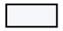

# RANCANG BANGUN SISTEM INFORMASI RESERVASI DAN FASILITAS OLAHRAGA MULTI-TENANT BERBASIS WEB

 

### **SKRIPSI**

*Diajukan sebagai salah satu syarat untuk mencapai gelar Sarjana Komputer (S.Kom.) pada Program Studi Sistem Informasi Fakultas Matematika dan Ilmu Pengetahuan Alam Universitas Hasanuddin*

 

 

**Disusun Oleh:**

### **AFLAH ALIFU NA MAPPATAJANG RAHMAN**
**NIM: H071211012**

 
 

**PROGRAM STUDI SISTEM INFORMASI**  
**FAKULTAS MATEMATIKA DAN ILMU PENGETAHUAN ALAM**  
**UNIVERSITAS HASANUDDIN**  
**MAKASSAR**  
**2025**

---

# ABSTRAK ^abstrak

Minat masyarakat yang tinggi terhadap olahraga mendorong peningkatan permintaan terhadap penyewaan sarana dan fasilitas olahraga. Namun, tata kelola operasional konvensional yang masih manual kerap memicu berbagai permasalahan krusial, seperti terjadinya jadwal ganda (*double booking*), kelalaian pencatatan, manipulasi bukti transfer pembayaran, serta ketiadaan saluran informasi ketersediaan lapangan secara *real-time*. Penelitian ini bertujuan untuk merancang dan membangun platform FieldMax, sebuah *marketplace* reservasi dan manajemen penyewaan fasilitas olahraga *multi-tenant* berbasis web, sekaligus menguji keandalan sistem dalam mengeliminasi potensi *double booking*. Pengembangan sistem menerapkan pendekatan *Design Science Research* (DSR) dan siklus hidup perangkat lunak *Waterfall*. Sistem dibangun dengan arsitektur *full-stack TypeScript monorepo*, memisahkan antarmuka pengguna berbasis Next.js (App Router) dan peladen layanan berbasis Express.js, dengan basis data relasional PostgreSQL yang diakses menggunakan Prisma ORM. Autentikasi sistem memanfaatkan *session-based authentication* tersimpan di basis data, transaksi pembayaran otomatis terintegrasi melalui *payment gateway* Midtrans Snap, penyimpanan berkas media dioptimalkan melalui ImageKit CDN, dan notifikasi email dikirimkan via SMTP Nodemailer. Evaluasi fungsionalitas dilakukan melalui metode *Black Box Testing* yang mencakup peran *User*, *Renter*, dan *Admin*. Hasil pengujian membuktikan bahwa platform FieldMax berhasil mengotomatisasi transaksi reservasi instan, memperbarui ketersediaan jadwal secara *real-time*, mengeliminasi terjadinya bentrok jadwal (*double booking*) hingga 100% valid, serta menyediakan transparansi rekapitulasi analitik pendapatan bagi mitra pengelola.

**Kata Kunci:** Reservasi Lapangan, *Marketplace Multi-Tenant*, *Double Booking*, Next.js, Express.js, Midtrans Snap, *Design Science Research*.

# ABSTRACT ^abstract

The growing public enthusiasm for sports has driven a significant increase in demand for sports facility rentals. However, conventional and manual operational management often triggers critical issues, such as double bookings, record-keeping discrepancies, payment receipt manipulation, and the lack of real-time schedule availability information. This study aims to design and develop the FieldMax platform, a web-based multi-tenant sports facility booking and management marketplace, while empirically testing the system's reliability in eliminating double-booking conflicts. The system was developed using the Design Science Research (DSR) framework and the Waterfall software development life cycle (SDLC). The system is built upon a full-stack TypeScript monorepo architecture, separating a Next.js (App Router) frontend from an Express.js backend, backed by a PostgreSQL relational database accessed through Prisma ORM. Security is managed via database-persisted session-based authentication, automated digital payment transactions are integrated through the Midtrans Snap payment gateway, media storage is optimized with ImageKit CDN, and system email notifications are delivered using SMTP Nodemailer. Functional evaluation was conducted using the Black Box Testing method covering User, Renter, and Admin roles. Testing results demonstrate that the FieldMax platform successfully automates instant booking transactions, synchronizes schedule availability in real-time, completely eliminates double bookings (100% valid test cases), and provides transparent revenue analytics for venue partners.

**Keywords:** Sports Venue Reservation, Multi-Tenant Marketplace, Double Booking Prevention, Next.js, Express.js, Midtrans Snap, Design Science Research.

---

# DAFTAR ISI ^daftar-isi

| Judul | Halaman |
|---|---|
| [ABSTRAK](#^abstrak) | i |
| [ABSTRACT](#^abstract) | ii |
| DAFTAR ISI | iii |
| [DAFTAR GAMBAR](#^daftar-gambar) | v |
| [DAFTAR TABEL](#^daftar-tabel) | x |
| [BAB I. PENDAHULUAN](#^bab-1) | 1 |
| [1.1 Latar Belakang](#^latar-belakang) | 1 |
| [1.2 Rumusan Masalah](#^rumusan-masalah) | 3 |
| [1.3 Tujuan Penelitian](#^tujuan-penelitian) | 3 |
| [1.4 Batasan Masalah](#^batasan-masalah) | 3 |
| [1.5 Manfaat Penelitian](#^manfaat-penelitian) | 3 |
| [1.6 Landasan Teori](#^landasan-teori) | 4 |
| [BAB II. METODE PENELITIAN](#^bab-2) | 13 |
| [2.1 Waktu dan Lokasi Penelitian](#^waktu-dan-lokasi-penelitian) | 13 |
| [2.2 Design Science Research](#^design-science-research) | 13 |
| [2.3 Metode Pengumpulan Data](#^metode-pengumpulan-data) | 14 |
| [2.4 Metode Pengembangan Sistem](#^metode-pengembangan-sistem) | 15 |
| [2.5 Tahapan Penelitian](#^tahapan-penelitian) | 16 |
| [2.6 Analisis Pengembangan Sistem](#^analisis-pengembangan-sistem) | 16 |
| [2.7 Perancangan Sistem](#^perancangan-sistem) | 19 |
| [2.8 Rancangan *User Interface* (UI)](#^rancangan-user-interface) | 19 |
| [BAB III. HASIL DAN PEMBAHASAN](#^bab-3) | 59 |
| [3.1 Implementasi Sistem](#^implementasi-sistem) | 59 |
| [3.2 Implementasi Basis Data](#^implementasi-basis-data) | 59 |
| [3.3 Implementasi *Activity Diagram*](#^implementasi-activity-diagram) | 76 |
| [3.4 Implementasi *UI/UX*](#^implementasi-ui-ux) | 116 |
| [3.5 Pengujian Sistem](#^pengujian-sistem) | 146 |
| [3.5.1 *Black Box Testing*](#^pengujian-sistem) | 146 |
| [3.5.2 Pembahasan Hasil Penelitian](#^pembahasan-hasil-penelitian) | 160 |
| [BAB IV. KESIMPULAN DAN SARAN](#^bab-4) | 164 |
| [4.1 Kesimpulan](#^kesimpulan) | 164 |
| [4.2 Saran](#^saran) | 164 |
| [DAFTAR PUSTAKA](#^daftar-pustaka) | 165 |
| [LAMPIRAN](#^lampiran) | 167 |

---

# DAFTAR GAMBAR ^daftar-gambar

| Gambar | Judul Gambar |
|---|---|
| [**Gambar 1.**](#^gambar-1) | Kerangka *Design Science Research* |
| [**Gambar 2.**](#^gambar-2) | Tahapan dari metode waterfall |
| [**Gambar 3.**](#^gambar-3) | Kerangka Penelitian Sistem Informasi yang Digunakan Pada Penelitian Ini |
| [**Gambar 4.**](#^gambar-4) | Pemetaan Design Science Research pada Platform FieldMax |
| [**Gambar 5.**](#^gambar-5) | Tahapan Metode Waterfall pada Pengembangan Platform FieldMax |
| [**Gambar 6.**](#^gambar-6) | Alur Penelitian |
| [**Gambar 7.**](#^gambar-7) | Diagram Analisis Masalah Sistem Reservasi Lapangan |
| [**Gambar 8.**](#^gambar-8) | Activity Diagram Proses Reservasi Lapangan di FieldMax |
| [**Gambar 9.**](#^gambar-9) | Use Case Diagram Web Platform FieldMax |
| [**Gambar 9a.**](#^gambar-9a) | ERD Web Platform FieldMax |
| [**Gambar 10.**](#^gambar-10) | Relasi antar tabel |
| [**Gambar 11.**](#^gambar-11-label) | Activity Diagram Cari & Filter Lapangan |
| [**Gambar 12.**](#^gambar-12-label) | Activity Diagram Lihat Detail Venue & Lapangan |
| [**Gambar 13.**](#^gambar-13-label) | Activity Diagram Registrasi Akun |
| [**Gambar 14.**](#^gambar-14-label) | Activity Diagram Login Akun |
| [**Gambar 15.**](#^gambar-15-label) | Activity Diagram Reservasi Lapangan |
| [**Gambar 16.**](#^gambar-16-label) | Activity Diagram Lakukan Pembayaran |
| [**Gambar 17.**](#^gambar-17-label) | Activity Diagram Lihat Riwayat Pemesanan |
| [**Gambar 18.**](#^gambar-18-label) | Activity Diagram Beri Ulasan |
| [**Gambar 19.**](#^gambar-19-label) | Activity Diagram Buat Pengaduan User |
| [**Gambar 20.**](#^gambar-20-label) | Activity Diagram Kelola Venue |
| [**Gambar 21.**](#^gambar-21-label) | Activity Diagram Kelola Lapangan |
| [**Gambar 22.**](#^gambar-22-label) | Activity Diagram Ajukan Verifikasi Venue & Lapangan |
| [**Gambar 23.**](#^gambar-23-label) | Activity Diagram Kelola Pemesanan Renter |
| [**Gambar 24.**](#^gambar-24-label) | Activity Diagram Lihat Pendapatan Renter |
| [**Gambar 25.**](#^gambar-25-label) | Activity Diagram Buat Pengaduan Renter |
| [**Gambar 26.**](#^gambar-26-label) | Activity Diagram Lihat Dashboard Admin |
| [**Gambar 27.**](#^gambar-27-label) | Activity Diagram Kelola Data Pengguna |
| [**Gambar 28.**](#^gambar-28-label) | Activity Diagram Kelola Sport Type |
| [**Gambar 29.**](#^gambar-29-label) | Activity Diagram Moderasi Venue & Lapangan |
| [**Gambar 30.**](#^gambar-30-label) | Activity Diagram Pantau Pemesanan & Pembayaran |
| [**Gambar 31.**](#^gambar-31-label) | Activity Diagram Kelola Pengaduan Admin |
| [**Gambar 32.**](#^gambar-32) | Halaman Utama (*Landing Page*) |
| [**Gambar 33.**](#^gambar-33) | Halaman Pencarian Venue |
| [**Gambar 34.**](#^gambar-34) | Halaman Daftar Venue |
| [**Gambar 35.**](#^gambar-35) | Halaman Detail Venue |
| [**Gambar 36.**](#^gambar-36) | Halaman Daftar Lapangan |
| [**Gambar 37.**](#^gambar-37) | Halaman Detail Lapangan |
| [**Gambar 38.**](#^gambar-38) | Halaman Login |
| [**Gambar 39.**](#^gambar-39) | Halaman Registrasi |
| [**Gambar 40.**](#^gambar-40) | Halaman Verifikasi Email |
| [**Gambar 41.**](#^gambar-41) | Halaman Lupa Password |
| [**Gambar 42.**](#^gambar-42) | Halaman Reset Password |
| [**Gambar 43.**](#^gambar-43) | Halaman Profil Pengguna |
| [**Gambar 44.**](#^gambar-44) | Halaman Riwayat Booking Pengguna |
| [**Gambar 45.**](#^gambar-45) | Halaman Detail Booking Pengguna |
| [**Gambar 46.**](#^gambar-46) | Halaman Laporan Keluhan Pengguna |
| [**Gambar 47.**](#^gambar-47) | Halaman Detail Laporan Pengguna |
| [**Gambar 48.**](#^gambar-48) | Halaman Dashboard Renter |
| [**Gambar 49.**](#^gambar-49) | Halaman Kelola Venue Renter |
| [**Gambar 50.**](#^gambar-50) | Halaman Detail Venue Renter |
| [**Gambar 51.**](#^gambar-51) | Halaman Kelola Lapangan Renter |
| [**Gambar 52.**](#^gambar-52) | Halaman Edit Lapangan Renter |
| [**Gambar 53.**](#^gambar-53) | Halaman Kelola Booking Renter |
| [**Gambar 54.**](#^gambar-54) | Halaman Pendapatan Renter |
| [**Gambar 55.**](#^gambar-55) | Halaman Laporan Pengaduan Renter |
| [**Gambar 56.**](#^gambar-56) | Halaman Detail Laporan Renter |
| [**Gambar 57.**](#^gambar-57) | Halaman Dashboard Admin |
| [**Gambar 58.**](#^gambar-58) | Halaman Kelola Pengguna Admin |
| [**Gambar 59.**](#^gambar-59) | Halaman Moderasi Venue Admin |
| [**Gambar 60.**](#^gambar-60) | Halaman Edit Venue Admin |
| [**Gambar 61.**](#^gambar-61) | Halaman Moderasi Lapangan Admin |
| [**Gambar 62.**](#^gambar-62) | Halaman Edit Lapangan Admin |
| [**Gambar 63.**](#^gambar-63) | Halaman Kelola Sport Type Admin |
| [**Gambar 64.**](#^gambar-64) | Halaman Kelola Booking Admin |
| [**Gambar 65.**](#^gambar-65) | Halaman Detail Booking Admin |
| [**Gambar 66.**](#^gambar-66) | Halaman Daftar Laporan Admin |
| [**Gambar 67.**](#^gambar-67) | Halaman Detail Laporan Admin |

---

# DAFTAR TABEL ^daftar-tabel

| Tabel | Judul Tabel |
|---|---|
| [**Tabel 1.**](#^tabel-1) | Komponen *use case diagram* |
| [**Tabel 2.**](#^tabel-2) | Komponen *activity diagram* |
| [**Tabel 3.**](#^tabel-3) | Komponen *Entity Relationship Diagram* |
| [**Tabel 4.**](#^tabel-4) | Waktu Penelitian |
| [**Tabel 4a.**](#^tabel-4a) | Definisi Aktor Sistem Informasi FieldMax |
| [**Tabel 5.**](#^tabel-5) | Tabel daftar Enum yang digunakan beserta nilainya |
| [**Tabel 6.**](#^tabel-6) | Tabel *users* |
| [**Tabel 7.**](#^tabel-7) | Tabel *verification_tokens* |
| [**Tabel 8.**](#^tabel-8) | Tabel *reset_tokens* |
| [**Tabel 9.**](#^tabel-9) | Tabel *user_profiles* |
| [**Tabel 10.**](#^tabel-10) | Tabel *sport_types* |
| [**Tabel 11.**](#^tabel-11) | Tabel *venues* |
| [**Tabel 12.**](#^tabel-12) | Tabel *venue_schedules* |
| [**Tabel 13.**](#^tabel-13) | Tabel *venue_photos* |
| [**Tabel 14.**](#^tabel-14) | Tabel *fields* |
| [**Tabel 15.**](#^tabel-15) | Tabel *field_photos* |
| [**Tabel 16.**](#^tabel-16) | Tabel *bookings* |
| [**Tabel 17.**](#^tabel-17) | Tabel *payments* |
| [**Tabel 18.**](#^tabel-18) | Tabel *reviews* |
| [**Tabel 19.**](#^tabel-19) | Tabel *sessions* |
| [**Tabel 20.**](#^tabel-20) | Tabel *reports* |
| [**Tabel 21.**](#^tabel-21) | Tabel *report_replies* |
| [**Tabel 22.**](#^tabel-22) | Pengujian Halaman Utama & Pencarian Venue |
| [**Tabel 23.**](#^tabel-23) | Pengujian Fitur Otentikasi & Akun |
| [**Tabel 24.**](#^tabel-24) | Skema Reservasi Lapangan & Pembayaran (User-Side) |
| [**Tabel 25.**](#^tabel-25) | Fitur Ulasan Lapangan & Laporan Pengaduan |
| [**Tabel 26.**](#^tabel-26) | Pengelolaan Venue & Lapangan (Renter-Side) |
| [**Tabel 27.**](#^tabel-27) | Panel Moderasi & Administrasi (Admin-Side) |

---

# BAB I PENDAHULUAN ^bab-1

## 1.1 Latar Belakang ^latar-belakang

Olahraga telah menjadi bagian tak terpisahkan dari gaya hidup masyarakat modern. Meningkatnya kesadaran akan pentingnya kesehatan dan kebugaran mendorong lonjakan minat masyarakat terhadap berbagai aktivitas fisik dan olahraga kelompok, seperti futsal, bulu tangkis (*badminton*), bola basket, dan sepak bola mini (*mini soccer*). Peningkatan tren ini sejalan dengan melonjaknya permintaan terhadap ketersediaan fasilitas dan penyewaan lapangan olahraga yang representatif. Bagi para pemilik dan penyedia sarana olahraga, kondisi ini membuka peluang bisnis yang menjanjikan, namun sekaligus menghadirkan tantangan signifikan dalam tata kelola operasional dan mutu pelayanan pelanggan.

Hingga saat ini, sebagian besar penyedia jasa penyewaan lapangan olahraga masih mengandalkan mekanisme konvensional atau manual dalam menjalankan proses bisnisnya, seperti pencatatan pada buku agenda harian serta komunikasi reservasi melalui panggilan telepon atau aplikasi pesan instan WhatsApp. Pola kerja manual ini memiliki berbagai kelemahan mendasar yang berdampak langsung pada penurunan efisiensi operasional. Menurut penelitian Nadjamuddin (2023) serta Swastika dan Khasanah (2017), sistem manual menyulitkan pelanggan dalam memastikan ketersediaan jadwal dan membebani pengelola dalam mengolah data pemesanan yang menumpuk. Permasalahan klasik seperti jadwal ganda (*double booking*), kesalahan pencatatan waktu sewa, lambatnya rekapitulasi laporan pendapatan, serta ketidakefisienan waktu operasional menjadi kendala utama yang kerap dihadapi oleh pengelola fasilitas olahraga (Pramono et al., 2025; Ratama et al., 2022). Secara teknis, ketiadaan mekanisme kendali konkurensi (*concurrency control*) pada sistem pemesanan konvensional menjadi penyebab utama terjadinya konflik jadwal ketika beberapa calon penyewa memperebutkan slot jam sewa yang sama secara bersamaan (Saputra, 2018).

Selain masalah penjadwalan, alur pembayaran pada sistem konvensional umumnya masih mengandalkan transfer bank manual dengan bukti transfer berupa gambar atau struk. Pola transaksi ini memperlambat proses konfirmasi karena pengelola harus memeriksa mutasi rekening secara manual satu per satu, sekaligus membuka celah manipulasi bukti transfer palsu (*fraudulent transfer receipt*) (Hafiz et al., 2023). Sebagaimana ditegaskan oleh Ramadan dan Arifin (2025) serta Siahaan dan Sianturi (2024), integrasi teknologi transaksi digital otomatis (*payment gateway*) menjadi komponen krusial untuk mengotomatisasi konfirmasi pembayaran secara instan, mengunci slot waktu sewa secara *real-time*, dan mengeliminasi ketergantungan pada verifikasi manual pengelola.

Dari perspektif kebutuhan pasar dan penelitian terdahulu, sebagian besar pengembangan sistem informasi reservasi olahraga yang telah ada hanya berfokus pada satu fasilitas tertentu (*single-tenant / single-venue*) (Fortunata & Cahyaningtyas, 2023; Nurhakim et al., 2023). Pendekatan *single-venue* tersebut memiliki keterbatasan, yaitu memicu fragmentasi layanan di mana pelanggan harus mengakses banyak aplikasi berbeda untuk membandingkan fasilitas, harga, dan ketersediaan jadwal. Di sisi lain, pemilik sarana olahraga skala kecil dan menengah menghadapi kendala biaya investasi yang tinggi apabila harus membangun sistem aplikasi digital secara mandiri. Oleh karena itu, penerapan konsep *marketplace multi-tenant* menjadi solusi strategis yang efektif karena mampu mempertemukan banyak penyedia lapangan (*Renter*) dengan masyarakat luas (*User*) dalam satu wadah terpusat berbasis pencarian cabang olahraga, harga, dan lokasi (Anwar et al., 2020; Sidiarta, 2018).

Berdasarkan latar belakang permasalahan dan kesenjangan (*gap*) penelitian tersebut, penelitian ini mengusulkan **"Rancang Bangun Sistem Informasi Reservasi dan Fasilitas Olahraga Multi-Tenant Berbasis Web"** yang dinamakan **FieldMax**. Platform FieldMax dirancang dengan arsitektur modern berbasis *full-stack TypeScript monorepo* yang mengintegrasikan tiga peran pengguna (*User*, *Renter*, dan *Admin*). Platform ini memfasilitasi Pemilik Fasilitas (*Renter*) dalam mengelola jadwal operasional, data lapangan, galeri fasilitas, dan visualisasi laporan pendapatan, sekaligus memberikan kemudahan bagi Pelanggan (*User*) untuk mengecek ketersediaan jadwal secara *real-time*, melakukan pemesanan instan, serta menyelesaikan pembayaran digital otomatis melalui *payment gateway* Midtrans Snap. Implementasi sistem ini diharapkan menjadi solusi komprehensif untuk mengeliminasi masalah *double booking*, mencegah kecurangan bukti transaksi, meningkatkan efisiensi operasional pengelola, dan memberikan pengalaman reservasi digital yang praktis bagi masyarakat.

## 1.2 Rumusan Masalah ^rumusan-masalah

Berdasarkan latar belakang yang telah diuraikan, rumusan masalah dalam penelitian ini adalah sebagai berikut:

1. Bagaimana merancang dan membangun sistem informasi reservasi dan fasilitas olahraga *multi-tenant* berbasis web (FieldMax) yang mampu mengotomatisasi proses bisnis penyewaan lapangan, memfasilitasi transaksi secara digital, serta menyediakan layanan terpadu bagi pengelola fasilitas dan pelanggan?
2. Bagaimana menguji dan membuktikan keandalan sistem informasi FieldMax menggunakan metode *Black Box Testing* dalam mengeliminasi terjadinya bentrok jadwal (*double booking*) pada proses reservasi lapangan?

## 1.3 Tujuan Penelitian ^tujuan-penelitian

Tujuan yang ingin dicapai dalam penelitian ini adalah:

1. Merancang dan mengimplementasikan sistem informasi reservasi dan fasilitas olahraga *multi-tenant* berbasis web (FieldMax) guna mendigitalisasi pengelolaan sarana olahraga, mempermudah proses transaksi pemesanan secara mandiri, dan menyediakan platform terpadu bagi seluruh pengguna sistem (*User*, *Renter*, dan *Admin*).
2. Menguji dan membuktikan secara empiris keandalan sistem informasi FieldMax menggunakan metode *Black Box Testing* dalam mencegah dan mengeliminasi terjadinya pemesanan ganda (*double booking*) pada slot waktu dan lapangan yang sama.

## 1.4 Batasan Masalah ^batasan-masalah

Untuk menjaga fokus penelitian agar terarah dan sesuai dengan sasaran yang ditetapkan, batasan masalah dalam penelitian ini mencakup:

1. Sistem dibangun berbasis web responsif menggunakan *framework* Next.js (App Router) pada sisi antarmuka (*frontend*) dan Express.js pada sisi layanan peladen (*backend*), yang dapat diakses melalui peramban (*browser*) desktop maupun perangkat bergerak (*mobile*).
2. Pengelolaan dan persistensi data menggunakan sistem manajemen basis data relasional PostgreSQL yang diakses menggunakan Prisma *Object-Relational Mapping* (ORM).
3. Transaksi pembayaran terintegrasi secara daring menggunakan *payment gateway* Midtrans Snap pada lingkungan *sandbox/production* yang mendukung metode pembayaran digital Indonesia (QRIS, *Virtual Account*, dan *e-Wallet*).
4. Pengelolaan dan penyimpanan berkas media (foto profil, foto venue, dan foto lapangan) menggunakan layanan pihak ketiga ImageKit *Content Delivery Network* (CDN).
5. Sistem otentikasi pengguna menggunakan mekanisme *session-based authentication* yang disimpan langsung di dalam basis data (tanpa *JSON Web Token* / JWT).
6. Sistem tidak mencakup pengelolaan akuntansi keuangan mendalam (seperti neraca, jurnal umum, atau buku besar), melainkan berfokus pada rekapitulasi transaksi sewa, status pembayaran, dan total pendapatan operasional lapangan.
7. Pengujian sistem dibatasi pada evaluasi fungsionalitas perangkat lunak menggunakan metode *Black Box Testing* untuk memverifikasi kesesuaian alur bisnis dan keandalan pencegahan *double booking*, serta tidak mencakup pengujian keamanan penetrasi mendalam (*penetration testing*) maupun uji beban masif (*stress testing*).

## 1.5 Manfaat Penelitian ^manfaat-penelitian

Hasil dari penelitian ini diharapkan dapat memberikan manfaat baik secara teoretis maupun praktis:

1. **Manfaat Teoretis**:
   Menjadi referensi akademik dalam penerapan metode *Design Science Research* (DSR) dan siklus pengembangan *Waterfall* pada perancangan sistem informasi *multi-tenant* dan *marketplace* reservasi berbasis web dengan arsitektur *full-stack TypeScript monorepo*.

2. **Manfaat Praktis**:
   - **Bagi Pelanggan (*User*)**: Memperoleh kemudahan dalam mencari informasi venue olahraga, memantau ketersediaan lapangan secara akurat dan *real-time*, serta melakukan pemesanan dan pembayaran digital secara mandiri dan fleksibel tanpa batasan waktu.
   - **Bagi Pemilik Fasilitas (*Renter*)**: Meningkatkan efisiensi tata kelola operasional sarana olahraga, mengeliminasi kesalahan pencatatan jadwal ganda (*double booking*), mempermudah pemantauan rekapitulasi pendapatan secara transparan, serta memperluas jangkauan promosi fasilitas olahraga kepada masyarakat luas.
   - **Bagi Administrator (*Admin*)**: Mempermudah proses moderasi, verifikasi kelayakan mitra pengelola/venue baru, serta penanganan keluhan dan laporan pengguna secara terpusat.
   - **Bagi Peneliti**: Menerapkan dan menguji integrasi teknologi rekayasa web modern (Next.js, Express.js, PostgreSQL, Prisma ORM, Midtrans Snap, dan ImageKit CDN) dalam memecahkan masalah riil di industri layanan olahraga.

## 1.6 Landasan Teori ^landasan-teori

### 1.6.1 Sistem Informasi Berbasis Web

Sistem informasi merupakan keterpaduan komponen yang terdiri atas manusia, perangkat keras (*hardware*), perangkat lunak (*software*), jaringan komunikasi, dan sumber data yang saling berinteraksi untuk mengumpulkan, mengolah, menyimpan, serta mendistribusikan informasi guna mendukung pengambilan keputusan, koordinasi, dan kendali dalam suatu organisasi (O'Brien & Marakas, 2011). Melalui sistem informasi, proses bisnis operasional dan transaksi dapat berjalan secara lebih cepat, tepat, dan transparan.

Di era digital, sistem informasi berbasis web (*web-based information system*) menjadi solusi dominan karena mengombinasikan kekuatan basis data terpusat dengan fleksibilitas antarmuka web yang dapat diakses secara luas melalui jaringan internet menggunakan peramban (*browser*) tanpa memerlukan instalasi aplikasi lokal yang rumit (Rahmi et al., 2023). Pada platform FieldMax, sistem informasi berbasis web difungsikan sebagai media penghubung interaktif yang mengotomatisasi proses bisnis reservasi lapangan dan manajemen fasilitas olahraga bagi seluruh pihak yang terlibat.

### 1.6.2 Reservasi Lapangan Olahraga

Reservasi merupakan proses perikatan awal antara konsumen dan penyedia jasa mengenai pemanfaatan suatu produk atau fasilitas pada waktu tertentu di masa mendatang (Christanto et al., 2012). Selama proses reservasi berlangsung, terjadi pertukaran informasi terstruktur antara konsumen mengenai kebutuhan spesifik (seperti pilihan lapangan, tanggal sewa, dan rentang jam main) dengan penyedia jasa mengenai ketersediaan jadwal serta tarif yang berlaku.

Penerapan reservasi secara daring (*online reservation*) terbukti mampu meminimalkan friksi operasional, seperti antrean panjang, ketidakpastian ketersediaan lapangan, dan risiko bentrok jadwal (*double booking*). Penelitian Hasibuan et al. (2024) menunjukkan bahwa sistem informasi reservasi olahraga berbasis web berhasil meningkatkan efisiensi operasional pengelola tempat olahraga secara sistematis dan terkontrol, sekaligus memberikan kepastian konfirmasi instan bagi pelanggan.

### 1.6.3 Layanan Penyewaan Lapangan di FieldMax

Platform FieldMax dikembangkan sebagai platform *marketplace multi-tenant* yang dirancang khusus untuk memfasilitasi ekosistem penyewaan lapangan olahraga. Platform ini membagi hak akses ke dalam tiga tingkatan peran (*role*):
1. **User (Pelanggan)**: Masyarakat umum yang memanfaatkan platform untuk menjelajahi katalog venue/lapangan, memfilter berdasarkan cabang olahraga atau harga, mengecek jadwal kosong secara *real-time*, membuat reservasi, melakukan pembayaran daring, serta memberikan ulasan (*review*) pasca bermain.
2. **Renter (Mitra Pengelola)**: Pemilik atau pengelola sarana olahraga yang memiliki hak mengelola profil venue, mendaftarkan lapangan, mengatur jadwal jam operasional (*VenueSchedule*), menetapkan tarif per jam, memantau kalender booking, serta melihat statistik pendapatan.
3. **Admin (Administrator)**: Pengelola platform FieldMax yang bertugas memverifikasi kelayakan akun *Renter* dan venue baru, mengawasi kepatuhan operasional, serta menangani tiket laporan permasalahan (*Report*) dari pengguna.

Melalui arsitektur ini, FieldMax mentransformasi alur reservasi konvensional (yang sebelumnya mengandalkan percakapan manual WhatsApp dan transfer bank manual) menjadi proses yang terintegrasi secara otomatis dari awal hingga akhir (*end-to-end*).

### 1.6.4 Teknologi Pengembangan

#### 1. Next.js

Next.js merupakan kerangka kerja (*framework*) berbasis React.js yang digunakan untuk membangun antarmuka web modern dengan performa tinggi dan ramah terhadap *Search Engine Optimization* (SEO). Next.js memadukan keunggulan *Server-Side Rendering* (SSR), *Static Site Generation* (SSG), serta *Client-Side Rendering* (CSR) melalui arsitektur terbarunya, yaitu *App Router* dan *React Server Components* (Pati & Zaki, 2025). Pemanfaatan Next.js pada sisi *frontend* FieldMax memungkinkan rendering halaman dinamis yang cepat, pembagian rute modular (*file-system based routing*), dan pengelolaan status aplikasi yang efisien dengan TanStack React Query.

#### 2. Express.js

Express.js adalah kerangka kerja sisi peladen (*backend framework*) berbasis Node.js yang bersifat minimalis, cepat, dan fleksibel (Nasution & Pane, 2025). Express.js memfasilitasi pembuatan *Application Programming Interface* (RESTful API) yang kokoh, dilengkapi mekanisme *middleware* untuk penanganan otentikasi sesi, validasi skema data permintaan menggunakan Zod, serta pengendalian galat terpusat (*centralized error handling*) (Azkarin et al., 2023).

#### 3. PostgreSQL dan Prisma ORM

PostgreSQL merupakan sistem manajemen basis data relasional (*Relational Database Management System* / RDBMS) sumber terbuka tingkat lanjut yang andal dalam menangani transaksi data kompleks. PostgreSQL mengimplementasikan mekanisme *Multi-Version Concurrency Control* (MVCC), yang memastikan konsistensi dan integritas data ketika banyak pengguna melakukan transaksi secara bersamaan (*concurrency*) tanpa saling mengunci tabel secara berlebihan (Salunke & Ouda, 2024).

Untuk menjembatani komunikasi antara kode TypeScript dan basis data PostgreSQL, digunakan **Prisma ORM**. Prisma menyediakan *type-safe database client*, pengelolaan skema basis data terpadu, dan sistem migrasi otomatis (*Prisma Migrate*) yang meminimalkan kesalahan penulisan kueri SQL manual.

#### 4. *Payment Gateway* Midtrans Snap

*Payment gateway* adalah layanan perantara otorisasi pembayaran elektronik yang menghubungkan sistem aplikasi perdagangan digital (*e-commerce*) dengan berbagai institusi finansial dan bank secara aman (Siahaan & Sianturi, 2024). Pada platform FieldMax, integrasi pembayaran digital memanfaatkan layanan **Midtrans Snap**.

Midtrans memfasilitasi berbagai kanal pembayaran lokal di Indonesia, termasuk *Virtual Account* (BCA, Mandiri, BNI, BRI, Permata), QRIS (GoPay, ShopeePay, OVO, Dana), dan *e-Wallet*. Melalui mekanisme *Snap Token* dan notifikasi *HTTP Webhook*, server FieldMax dapat mendeteksi perubahan status pembayaran secara instan, sehingga status pemesanan (*Booking*) dapat diperbarui secara otomatis dari status `PENDING` menjadi `CONFIRMED`/`PAID` tanpa memerlukan verifikasi manual bukti struk pembayaran oleh pengelola (Hafiz et al., 2023).

#### 5. ImageKit CDN dan Nodemailer

Pengelolaan media foto (seperti foto profil pengguna, foto fasilitas venue, dan foto lapangan) dioptimalkan menggunakan **ImageKit**, sebuah layanan *Content Delivery Network* (CDN) berbasis komputasi awan yang menyediakan penyimpanan berkas terpusat dan optimasi resolusi gambar otomatis sesuai perangkat pengguna. Sedangkan untuk kebutuhan komunikasi notifikasi sistem, digunakan pustaka **Nodemailer** yang terhubung dengan protokol SMTP (*Simple Mail Transfer Protocol*) guna mengirimkan tautan verifikasi alamat email serta token pemulihan kata sandi (*password reset*).

### 1.6.5 Pemodelan Sistem Berbasis UML

*Unified Modeling Language* (UML) merupakan standar bahasa visual untuk menspesifikasikan, memvisualisasikan, membangun, dan mendokumentasikan artefak dari suatu sistem perangkat lunak (Pressman, 2010). Pemodelan berorientasi objek ini mempermudah pemahaman arsitektur dan alur kerja sistem. Diagram UML yang digunakan dalam penelitian ini meliputi:

#### 1. *Use Case Diagram*

*Use Case Diagram* menggambarkan interaksi fungsional antara satu atau lebih aktor eksternal dengan sistem dari sudut pandang perilaku (*behavioral view*). Diagram ini mendefinisikan batasan sistem dan hak akses fungsionalitas bagi masing-masing pengguna.

**Tabel 1.** Komponen *Use Case Diagram* ^tabel-1

| SIMBOL | NAMA | KETERANGAN |
| :---: | :--- | :--- |
|  | *Actor* | Mewakili peran pengguna, sistem lain, atau perangkat luar yang berinteraksi dengan sistem |
|  | *Use Case* | Deskripsi urutan aksi yang dilakukan sistem untuk menghasilkan nilai terukur bagi aktor |
|  | *Association* | Garis penghubung komunikasi antara aktor dengan *use case* yang bersangkutan |
|  | *Generalization* | Relasi hierarki pewarisan sifat atau perilaku dari *use case* umum ke khusus |
|  | *Include* | Relasi keharusan di mana eksekusi *use case* sumber mutlak menyertakan fungsionalitas *use case* target |

#### 2. *Activity Diagram*

*Activity Diagram* memodelkan alur kerja (*workflow*) dari suatu proses bisnis atau urutan eksekusi logika sistem dari suatu aktivitas ke aktivitas lainnya, termasuk percabangan kondisi (*decision*) dan titik awal/akhir proses.

**Tabel 2.** Komponen *Activity Diagram* ^tabel-2

| SIMBOL | NAMA | KETERANGAN |
| :---: | :--- | :--- |
|  | *Initial Node (Start Point)* | Menandai titik awal dimulainya suatu aliran aktivitas |
|  | *Activity Final Node (End Point)* | Menandai titik akhir penyelesaian seluruh aliran aktivitas |
|  | *Action / Activity* | Menunjukkan pekerjaan atau tindakan komputasi yang sedang dilakukan dalam alur proses |
|  | *Decision Node* | Titik percabangan logika untuk menentukan arah alur berdasarkan evaluasi kondisi boolean tertentu |

#### 3. *Entity Relationship Diagram* (ERD)

*Entity Relationship Diagram* (ERD) adalah notasi grafis yang digunakan untuk memodelkan struktur konseptual dan relasional dari suatu basis data. ERD mendefinisikan entitas objek, atribut-atribut pembentuknya, kunci utama (*primary key*), kunci asing (*foreign key*), serta derajat kardinalitas hubungan antar-entitas (1:1, 1:N, M:N).

**Tabel 3.** Komponen *Entity Relationship Diagram* ^tabel-3

| SIMBOL | NAMA | KETERANGAN |
| :---: | :--- | :--- |
|  | *Entity* | Objek data riil atau konseptual yang memiliki karakteristik tersendiri dalam basis data |
|  | *Attribute* | Properti atau karakteristik spesifik yang mendeskripsikan suatu entitas |
|  | *Relationship* | Keterhubungan logis antara dua entitas atau lebih di dalam sistem basis data |
|  | *Connector Line* | Garis penghubung yang mengaitkan entitas dengan atribut maupun relasinya |

### 1.6.6 Ruang Lingkup Penelitian Sistem Informasi (*Design Science Research*)

Kerangka kerja *Design Science Research* (DSR) dalam bidang Sistem Informasi berfokus pada penciptaan dan evaluasi artefak teknologi informasi yang inovatif untuk memecahkan permasalahan manajerial dan organisasi yang nyata (Hevner et al., 2004).

![Design science research in information systems according to [33] | Download Scientific Diagram](images/image015.png)

**Gambar 1.** Kerangka *Design Science Research* ^gambar-1

Berdasarkan Gambar 1, kerangka DSR terdiri atas tiga domain utama:
1. **Environment (Lingkungan)**: Merupakan ruang permasalahan (*problem space*) yang mencakup interaksi antara manusia (*People*), organisasi (*Organizations*), dan teknologi (*Technology*). Lingkungan ini mendefinisikan sasaran bisnis, kendala operasional, dan peluang transformasi digital dari sistem yang diteliti.
2. **Knowledge Base (Basis Pengetahuan)**: Merupakan landasan ilmiah (*foundations*) dan metodologi (*methodologies*) yang menjamin keketatan (*rigor*) akademis penelitian. Meliputi teori sistem informasi, pola arsitektur perangkat lunak, paradigma basis data, dan metode pengujian standar.
3. **IS Research (Riset Sistem Informasi)**: Siklus iteratif yang menghubungkan ruang permasalahan dan basis pengetahuan melalui dua aktivitas inti: pembangunan artefak (*Build*) dan evaluasi performa artefak (*Evaluate*) guna menghasilkan kontribusi keilmuan yang dapat dipertanggungjawabkan.

### 1.6.7 Metode Pengembangan Perangkat Lunak (*Waterfall*)

Metode *Waterfall* merupakan model klasik dalam *Software Development Life Cycle* (SDLC) yang menerapkan pendekatan sekuensial dan linier dalam rekayasa perangkat lunak (Pressman, 2010). Setiap fase pengembangan harus diselesaikan dan diverifikasi secara menyeluruh sebelum melangkah ke fase berikutnya guna memastikan kejelasan spesifikasi dan pengendalian kualitas artefak secara ketat.

**Gambar 2.** Tahapan Metode *Waterfall* ^gambar-2

Tahapan dalam model *Waterfall* meliputi:
1. ***Requirement Analysis***: Mengidentifikasi dan menganalisis seluruh kebutuhan fungsional dan non-fungsional sistem melalui observasi proses bisnis dan studi literatur.
2. ***System Design***: Merancang arsitektur sistem perangkat lunak, diagram alir proses (UML), struktur basis data (ERD), serta desain antarmuka pengguna (*User Interface* / UI).
3. ***Implementation***: Mengonversi rancangan desain ke dalam bentuk baris kode program (*coding*) fungsional menggunakan bahasa pemrograman TypeScript, Next.js, Express.js, dan skema Prisma ORM.
4. ***Testing / Verification***: Menguji seluruh fungsionalitas dan integrasi modul sistem untuk memastikan kesesuaian dengan kebutuhan yang telah didefinisikan sebelumnya.
5. ***Maintenance***: Memperbaiki kendala teknis atau galat (*bug*) yang terdeteksi serta melakukan pembaruan berkala untuk menjaga keandalan sistem.

### 1.6.8 *Black Box Testing*

*Black Box Testing* (pengujian kotak hitam) merupakan teknik pengujian perangkat lunak yang berfokus pada evaluasi spesifikasi fungsional sistem tanpa memerlukan pengetahuan terhadap struktur kode internal atau algoritma logika program (Pressman, 2010; Uminingsih et al., 2022). Pengujian dilakukan dari sudut pandang pengguna akhir (*end-user*) dengan memberikan serangkaian nilai masukan (*input*) pada form antarmuka sistem dan memverifikasi apakah keluaran (*output*) serta perubahan status data yang dihasilkan telah sesuai dengan skenario hasil yang diharapkan (*expected results*) (Shadiq et al., 2021).

---

# BAB II METODE PENELITIAN ^bab-2

## 2.1 Waktu dan Lokasi Penelitian ^waktu-dan-lokasi-penelitian

Penelitian ini dilaksanakan pada bulan Juli 2025 sampai dengan bulan November 2025 yang bertempat di Kota Makassar, Sulawesi Selatan.

**Tabel 4.** Waktu dan Jadwal Pelaksanaan Penelitian ^tabel-4

| No | Tahapan Penelitian | Juli 2025 | Agustus 2025 | September 2025 | Oktober 2025 | November 2025 |
| :---: | :--- | :---: | :---: | :---: | :---: | :---: |
| 1 | Studi Literatur | ✓ | ✓ | | | |
| 2 | Analisis Kebutuhan (*Requirements*) | | ✓ | | | |
| 3 | Desain Sistem (*Design*) | | ✓ | ✓ | | |
| 4 | Implementasi Sistem (*Implementation*) | | | ✓ | ✓ | |
| 5 | Pengujian Sistem (*Testing*) | | | | ✓ | ✓ |
| 6 | Pemeliharaan & Dokumentasi (*Maintenance*) | | | | | ✓ |

## 2.2 *Design Science Research* ^design-science-research

Penelitian ini mengadopsi kerangka kerja *Design Science Research* (DSR) yang dikemukakan oleh Hevner et al. (2004). Kerangka DSR bertujuan memecahkan permasalahan praktis organisasi melalui penciptaan dan evaluasi artefak teknologi informasi inovatif. Gambar 3 mengilustrasikan kerangka penelitian sistem informasi yang diterapkan pada riset ini.

**Gambar 3.** Kerangka Penelitian Sistem Informasi yang Digunakan Pada Penelitian Ini ^gambar-3

Penjelasan dari ketiga domain utama kerangka DSR pada penelitian ini meliputi:
1. **Aspek *Environment* (Lingkungan)**: Terdiri atas *People* (pengguna akhir, mitra pemilik lapangan/renter, dan administrator), *Organizations* (ekosistem bisnis penyedia sarana olahraga FieldMax), serta *Technology* (perangkat keras pengembang, arsitektur *cloud*, dan infrastruktur peramban web modern).
2. **Aspek *IS Research* (Riset Sistem Informasi)**: Terdiri atas siklus *Build* (pembangunan artefak sistem informasi berupa web FieldMax yang mencakup perancangan UML, ERD, antarmuka Figma, serta implementasi *full-stack TypeScript*) dan *Evaluate* (pengujian fungsionalitas dan integrasi modul menggunakan metode *Black Box Testing* untuk menilai efektivitas serta kinerja sistem).
3. **Aspek *Knowledge Base* (Basis Pengetahuan)**: Terdiri atas *Foundations* (teori rekayasa web, arsitektur RESTful API, paradigma *session-based auth*, dan integrasi *payment gateway*) serta *Methodologies* (penerapan metodologi DSR dan model proses rekayasa perangkat lunak *Waterfall*).

Gambar 4 menunjukkan pemetaan spesifik dari kerangka *Design Science Research* yang diterapkan secara langsung dalam konteks pengembangan Platform FieldMax.

![[images/gambar-dsr-fieldmax.svg]]

**Gambar 4.** Pemetaan *Design Science Research* pada Platform FieldMax ^gambar-4

## 2.3 Metode Pengumpulan Data ^metode-pengumpulan-data

Tahap pengumpulan data dilakukan untuk mengidentifikasi kebutuhan bisnis, kendala operasional, dan parameter fungsional yang harus diakomodasi oleh sistem. Metode pengumpulan data yang diterapkan dalam penelitian ini adalah **Studi Literatur (*Literature Review*)**.

Studi literatur dilakukan secara komprehensif dengan menelaah berbagai sumber rujukan ilmiah tertulis, mencakup:
1. **Jurnal Ilmiah Nasional dan Internasional Terakreditasi**: Mengkaji penelitian terdahulu terkait sistem informasi reservasi sarana olahraga, isu konkurensi dan bentrok jadwal (*double booking*), implementasi arsitektur platform *multi-tenant / marketplace*, serta integrasi *payment gateway*.
2. **Buku Teks Rekayasa Perangkat Lunak & Sistem Informasi**: Mengkaji teori dasar pemodelan sistem (*Unified Modeling Language* / UML), siklus hidup pengembangan perangkat lunak (*Waterfall SDLC*), kerangka kerja *Design Science Research* (DSR), serta metodologi pengujian *Black Box Testing*.
3. **Dokumentasi Teknis Resmi (*Official Technical Documentation*)**: Mengkaji spesifikasi teknis dan standar implementasi dari teknologi yang digunakan, meliputi Next.js (App Router), Express.js, PostgreSQL, Prisma ORM, Midtrans API, dan ImageKit SDK.

Informasi dan sintesis yang diperoleh dari studi literatur ini menjadi landasan teoretis yang kokoh dalam memetakan kesenjangan penelitian (*research gap*) serta merumuskan arsitektur sistem informasi FieldMax.

## 2.4 Metode Pengembangan Sistem ^metode-pengembangan-sistem

Pengembangan platform FieldMax menerapkan metode rekayasa perangkat lunak *Waterfall* dalam *System Development Life Cycle* (SDLC). Model ini dipilih karena tahapan kerjanya yang terstruktur, sekuensial, dan sistematis, sehingga memudahkan pengendalian kualitas pada setiap fase.

![[images/gambar-waterfall-sdlc.svg]]

**Gambar 5.** Tahapan Metode *Waterfall* pada Pengembangan Platform FieldMax ^gambar-5

Tahapan *Waterfall* yang dilaksanakan mencakup:

### 2.4.1 Requirements (Analisis Kebutuhan)
Pada tahap ini, dilakukan elisitasi dan analisis mendalam untuk merumuskan spesifikasi kebutuhan fungsional dan non-fungsional sistem berdasarkan kendala proses bisnis reservasi manual yang ditemukan pada literatur.

### 2.4.2 Design (Perancangan Sistem)
Pada tahap ini, dirancang arsitektur perangkat lunak yang mencakup diagram perilaku sistem (*Use Case Diagram* dan *Activity Diagram*), struktur relasional basis data (*Entity Relationship Diagram* / ERD), serta rancangan visual antarmuka pengguna (*User Interface* / UI) menggunakan Figma.

### 2.4.3 Implementation (Implementasi / Pengkodean)
Pada tahap ini, rancangan desain diwujudkan ke dalam kode program fungsional menggunakan Next.js (App Router) pada sisi antarmuka, Express.js pada sisi peladen, Prisma ORM sebagai lapisan akses data PostgreSQL, dan Tailwind CSS untuk tata letak antarmuka responsif.

### 2.4.4 Testing (Pengujian Sistem)
Pada tahap ini, dilakukan pengujian perangkat lunak menggunakan metode *Black Box Testing*. Pengujian difokuskan secara khusus pada **pembuktian empiris bahwa sistem informasi FieldMax berhasil mengeliminasi terjadinya jadwal ganda (*double booking*)**, yaitu dengan memvalidasi bahwa sistem secara konsisten menolak setiap upaya pemesanan yang bertabrakan pada slot waktu dan unit lapangan yang sama, serta memverifikasi integritas status penguncian jadwal selama transaksi berlangsung.

### 2.4.5 Maintenance (Pemeliharaan Sistem)
Pada tahap ini, dilakukan pemeliharaan sistem berupa koreksi *bug*, optimasi performa kueri basis data, serta penyesuaian konfigurasi lingkungan *production* agar sistem tetap beroperasi secara andal.

## 2.5 Tahapan Penelitian ^tahapan-penelitian

Secara keseluruhan, alur pelaksanaan penelitian dirancang secara sistematis dengan menggabungkan prinsip DSR dan tahapan sekuensial *Waterfall*. Alur penelitian disajikan pada Gambar 6.

![[images/gambar-4-alur-penelitian.svg]]

**Gambar 6.** Alur Penelitian ^gambar-6

Penelitian diawali dari tahap identifikasi masalah dan analisis kebutuhan (*Requirements*), dilanjutkan dengan perancangan arsitektur, pemodelan UML, ERD, dan antarmuka (*Design*). Selanjutnya, dilakukan pengkodean program (*Implementation*) dan pengujian kesesuaian fungsional (*Testing*). Apabila ditemukan ketidaksesuaian fungsional pada tahap pengujian, dilakukan proses evaluasi dan penyesuaian kembali sebelum ditarik kesimpulan akhir.

## 2.6 Analisis Pengembangan Sistem ^analisis-pengembangan-sistem

### 2.6.1 Analisis Masalah

Berdasarkan hasil sintesis studi literatur terhadap berbagai penelitian proses bisnis operasional penyewaan sarana olahraga konvensional, dirumuskan 10 permasalahan utama yang menjadi justifikasi pengembangan platform FieldMax:

1. **Pencatatan Reservasi Masih Manual**: Penggunaan buku agenda atau pesan singkat WhatsApp menyulitkan pencatatan terpusat dan rawan terselip.
2. **Proses Pembayaran Tidak Terintegrasi**: Konfirmasi pembayaran transfer manual memerlukan verifikasi bukti transfer satu per satu oleh pengelola, yang memakan waktu dan berisiko manipulasi bukti bayar.
3. **Pengelolaan Data Sarana Tidak Terpusat**: Mitra pemilik lapangan (*Renter*) tidak memiliki dasbor mandiri untuk memperbarui jadwal, harga, atau foto lapangan secara instan.
4. **Ketiadaan Mekanisme Moderasi Venue**: Tidak ada proses peninjauan kelayakan dan validasi identitas venue olahraga sebelum dipublikasikan kepada masyarakat.
5. **Ketiadaan Dasbor Analitik Pendapatan**: Pemilik venue kesulitan merekap total omzet dan tren okupansi lapangan secara akurat dan otomatis.
6. **Sulitnya Pencarian dan Pengecekan Jadwal *Real-Time***: Pelanggan tidak dapat memantau ketersediaan slot jam kosong secara langsung tanpa harus menanyakan pihak pengelola terlebih dahulu.
7. **Ketiadaan Sistem Otentikasi dan Manajemen Pengguna Terpadu**: Tidak tersedianya akun terverifikasi yang mengikat riwayat transaksi pengguna.
8. **Ketiadaan Riwayat Transaksi dan Ulasan (*Review*)**: Pengguna tidak dapat memantau riwayat pemesanan masa lalu maupun memberikan penilaian kepuasan kualitas fasilitas.
9. **Ketiadaan Saluran Pengaduan Resmi**: Penanganan kendala teknis atau komplain operasional tidak tercatat dan terdokumentasi secara tertib.
10. **Ketiadaan Panel Kontrol Terpadu bagi Administrator**: Pengelola platform tidak memiliki alat terpusat untuk memoderasi data pengguna, transaksi, dan kategori cabang olahraga.

![[images/gambar-analisis-masalah.svg]]

**Gambar 7.** Diagram Analisis Masalah Sistem Reservasi Lapangan ^gambar-7

![[images/gambar-booking-flow.drawio]]

**Gambar 8.** *Activity Diagram* Proses Reservasi Lapangan di FieldMax ^gambar-8

### 2.6.2 Analisis Kebutuhan Sistem

Berdasarkan analisis permasalahan di atas, dirumuskan kebutuhan fungsional bagi ketiga peran pengguna, kebutuhan perangkat lunak, perangkat keras, dan profil pengguna sistem.

#### 1. Kebutuhan Fungsional

**a. Kebutuhan Fungsional Admin:**
1. Admin dapat meninjau, menyetujui (*approve*), atau menolak (*reject*) pengajuan pendaftaran venue dan unit lapangan dari Renter disertai alasan penolakan.
2. Admin dapat melihat, memfilter, dan mengelola seluruh data pengguna yang terdaftar di platform.
3. Admin dapat memantau seluruh riwayat transaksi pemesanan (*booking*) dan aliran pembayaran secara menyeluruh.
4. Admin dapat mengelola data referensi cabang olahraga (*Sport Types*), meliputi penambahan, pengubahan, dan penghapusan kategori.
5. Admin dapat meninjau, membalas melalui utas pesan, dan menyelesaikan tiket pengaduan (*Report*) dari User maupun Renter.
6. Admin memiliki dasbor analitik ringkasan yang menampilkan metrik pertumbuhan platform secara keseluruhan.

**b. Kebutuhan Fungsional Renter:**
1. Renter dapat mendaftarkan venue baru beserta informasi alamat, deskripsi, tautan lokasi, dan jadwal jam operasional harian (*VenueSchedule*).
2. Renter dapat mendaftarkan unit lapangan di bawah venue miliknya, memilih cabang olahraga, menetapkan harga sewa per jam, serta mengatur status buka/tutup sementara.
3. Renter dapat mengunggah dan mengelola galeri foto fasilitas venue dan lapangan melalui integrasi ImageKit CDN.
4. Renter dapat mengajukan venue dan unit lapangan kepada Admin untuk proses moderasi dan verifikasi kelayakan publikasi.
5. Renter dapat memantau daftar pemesanan masuk secara *real-time*, memverifikasi kehadiran penyewa, dan menyelesaikan status sewa.
6. Renter dapat menganalisis grafik rekapitulasi pendapatan kotor dan tren okupansi lapangan melalui dasbor pendapatan (*Revenue*).
7. Renter dapat membuat tiket laporan pengaduan kepada Admin jika mendapati kendala teknis atau operasional.

**c. Kebutuhan Fungsional User:**
1. User dapat melakukan pendaftaran akun, verifikasi email melalui kode OTP/token, masuk (*login*), dan pemulihan kata sandi (*forgot/reset password*).
2. User dapat mencari dan memfilter lapangan olahraga berdasarkan nama, cabang olahraga, lokasi kota/daerah, dan rentang harga.
3. User dapat melihat rincian detail venue dan lapangan, fasilitas pendukung, galeri foto, jadwal operasional, serta ulasan dari pengguna lain.
4. User dapat melakukan reservasi lapangan dengan memilih tanggal dan slot jam sewa yang tersedia secara *real-time*.
5. User dapat menyelesaikan pembayaran digital secara instan melalui Midtrans Snap (*QRIS*, *Virtual Account*, dan *e-Wallet*).
6. User dapat melihat riwayat daftar pemesanan (*My Bookings*) beserta rincian status pembayaran dan kode reservasi.
7. User dapat memberikan ulasan (*review*) dan penilaian bintang (rating 1–5) terhadap lapangan yang telah selesai disewa.
8. User dapat mengajukan laporan keluhan atau kendala transaksi (*Report*) kepada Admin dan memantau respons balasannya.

#### 2. Kebutuhan Perangkat Lunak

Perangkat lunak yang digunakan dalam proses perancangan, implementasi, dan pengujian sistem meliputi:
1. **Visual Studio Code**: Lingkungan pengembangan terintegrasi (*IDE*) utama.
2. **Node.js (v20+) & pnpm (v10)**: *Runtime* JavaScript/TypeScript dan manajer paket *monorepo*.
3. **Git & GitHub**: Sistem kendali versi (*version control system*) dan repositori kode.
4. **Figma**: Perancangan purwarupa antarmuka pengguna (*UI/UX design*).
5. **PostgreSQL & Prisma ORM**: Sistem basis data relasional dan generator kueri *type-safe*.
6. **Midtrans *Sandbox***: Lingkungan pengujian simulasi transaksi pembayaran digital.
7. **Postman**: Pengujian dan verifikasi *endpoint* RESTful API *backend*.

#### 3. Kebutuhan Perangkat Keras

Pengembangan dan pengujian sistem dilakukan menggunakan laptop dengan spesifikasi:
- **Model**: Lenovo LOQ 15IRX9
- **Prosesor**: Intel® Core™ i5-12450HX @ 2.40 GHz (8 Cores, 12 Threads)
- **Memori (RAM)**: 28 GB DDR5
- **Penyimpanan**: 512 GB NVMe PCIe SSD
- **Sistem Operasi**: Microsoft Windows 11 Home 64-bit

#### 4. Profil Pengguna Sistem

1. **Admin (Administrator)**: Berperan sebagai pengawas dan moderator sentral yang memastikan kepatuhan standar kualitas venue, mengelola data master, serta menjaga kelancaran operasional platform.
2. **Renter (Mitra Pemilik/Pengelola Lapangan)**: Pihak penyedia sarana fisik olahraga yang memanfaatkan FieldMax untuk mendigitalkan jadwal sewa, memasarkan lapangan, dan mengotomatisasi pencatatan keuangan.
3. **User (Pelanggan/Penyewa)**: Komunitas atau perorangan pecinta olahraga yang membutuhkan sarana pencarian lapangan yang cepat, transparan, dan dapat dipesan secara instan.

## 2.7 Perancangan Sistem ^perancangan-sistem

Perancangan sistem dimodelkan menggunakan *Unified Modeling Language* (UML) yang mencakup *Use Case Diagram* untuk memetakan batasan fungsional serta hak akses dari setiap peran aktor.

![[images/gambar-use-case-diagram.drawio]]

**Gambar 9.** *Use Case Diagram* Platform Web FieldMax ^gambar-9

Diagram pada Gambar 9 menggambarkan pembagian 22 *use case* yang terdistribusi ke dalam tiga peran aktor: Admin, Renter, dan User. Definisi peran dan batasan hak akses dari masing-masing aktor dijelaskan pada Tabel 4a.

**Tabel 4a.** Definisi Aktor Sistem Informasi FieldMax ^tabel-4a

| No | Aktor | Deskripsi Peran & Hak Akses |
|:---:|:---|:---|
| 1 | **User** | Pelanggan/penyewa yang memanfaatkan platform untuk mencari fasilitas olahraga, mengecek jadwal *real-time*, melakukan pemesanan dan pembayaran digital, melihat riwayat sewa, memberikan ulasan, serta mengajukan pengaduan. |
| 2 | **Renter** | Mitra pemilik atau pengelola sarana olahraga yang memiliki hak mengelola profil venue, mendaftarkan unit lapangan, mengatur jadwal jam operasional harian, memantau pesanan masuk, dan melihat analitik pendapatan. |
| 3 | **Admin** | Administrator platform yang memiliki hak tertinggi untuk memoderasi legalitas venue dan unit lapangan baru, mengelola data master cabang olahraga, mengawasi seluruh transaksi pemesanan, serta menanggapi tiket pengaduan. |

### 2.7.1 *Use Case* Admin
1. **Login**: Melakukan autentikasi ke panel administrasi sistem.
2. **Kelola Data Pengguna**: Melihat, mencari, memfilter status, dan mengelola akun pengguna (*User* & *Renter*).
3. **Kelola Sport Type**: Menambah, mengubah, dan menghapus master data cabang olahraga.
4. **Moderasi Venue dan Lapangan**: Meninjau pengajuan sarana olahraga baru dari Renter, kemudian menyetujui (*approve*) atau menolak (*reject*) disertai catatan perbaikan.
5. **Pantau Pemesanan dan Pembayaran**: Memantau seluruh rekapitulasi data transaksi booking dan status pembayaran Midtrans.
6. **Kelola Pengaduan**: Meninjau laporan permasalahan, mengirimkan balasan solusi, dan mengubah status laporan menjadi selesai (*resolved*).
7. **Lihat Dashboard Admin**: Memantau grafik statistik pertumbuhan metrik sistem.

### 2.7.2 *Use Case* Renter
1. **Daftar dan Login**: Mendaftarkan akun mitra bisnis dan masuk ke panel Renter.
2. **Kelola Venue**: Mendaftarkan data venue, jam operasional, alamat, dan foto fasilitas.
3. **Kelola Lapangan**: Menambahkan unit lapangan, memilih cabang olahraga, dan menetapkan tarif per jam.
4. **Ajukan Venue dan Lapangan**: Mengirimkan permohonan publikasi venue/lapangan kepada Admin untuk diverifikasi.
5. **Kelola Pemesanan**: Memantau pemesanan masuk, memverifikasi kedatangan pelanggan, dan menyelesaikan status sewa.
6. **Lihat Pendapatan**: Memantau grafik rekapitulasi omzet dan analitik pemesanan.
7. **Buat Pengaduan**: Mengirimkan tiket keluhan atau pertanyaan kepada Admin.

### 2.7.3 *Use Case* User
1. **Daftar dan Login**: Mendaftarkan akun penyewa, memverifikasi email, dan masuk ke platform.
2. **Cari dan Filter Lapangan**: Menjelajahi katalog lapangan dengan filter cabang olahraga, lokasi, dan harga.
3. **Lihat Detail Venue dan Lapangan**: Memeriksa deskripsi fasilitas, galeri foto, ulasan pengguna, dan kalender ketersediaan.
4. **Reservasi Lapangan**: Memilih tanggal dan slot jam sewa kosong secara *real-time*.
5. **Lakukan Pembayaran**: Menyelesaikan tagihan melalui Midtrans Snap (*QRIS*, *Virtual Account*, *e-Wallet*).
6. **Lihat Riwayat Pemesanan**: Memantau daftar booking aktif maupun riwayat masa lalu.
7. **Beri Ulasan**: Memberikan rating bintang (1–5) dan komentar ulasan terhadap lapangan yang telah disewa.
8. **Buat Pengaduan**: Mengirimkan tiket kendala pembayaran atau fasilitas kepada Admin.

## 2.8 Rancangan *User Interface* (UI) ^rancangan-user-interface

Rancangan antarmuka pengguna (*User Interface*) dirancang menggunakan Figma dengan pendekatan desain yang bersih, intuitif, dan responsif. Desain UI dikelompokkan ke dalam lima kelompok utama:

### 2.8.1 Halaman Autentikasi (*Auth*) ^halaman-autentikasi

#### 1. Halaman *Login*
Berfungsi sebagai pintu masuk pengguna terdaftar menggunakan email dan kata sandi. *(Menjawab Masalah Poin 7)*.

![[figma/Auth/Login.jpg]]

**Gambar 10.** Halaman *Login* ^gambar-10

#### 2. Halaman *Register User*
Berfungsi untuk mendaftarkan akun baru bagi calon pelanggan penyewa lapangan. *(Menjawab Masalah Poin 7)*.

![[figma/Auth/Register User.jpg]]

**Gambar 11.** Halaman *Register User* ^gambar-11

#### 3. Halaman *Register Renter*
Berfungsi untuk mendaftarkan akun mitra pengelola fasilitas olahraga. *(Menjawab Masalah Poin 7)*.

![[figma/Auth/Register Renter.jpg]]

**Gambar 12.** Halaman *Register Renter* ^gambar-12

#### 4. Halaman *Forgot Password*
Berfungsi untuk menginisiasi pemulihan akun bagi pengguna yang melupakan kata sandi. *(Menjawab Masalah Poin 7)*.

![[figma/Auth/Forgot Password.jpg]]

**Gambar 13.** Halaman *Forgot Password* ^gambar-13

#### 5. Halaman *Reset Password*
Berfungsi untuk menetapkan kata sandi baru pasca verifikasi token email. *(Menjawab Masalah Poin 7)*.

![[figma/Auth/Reset Password.jpg]]

**Gambar 14.** Halaman *Reset Password* ^gambar-14

#### 6. Halaman *Verify Email*
Berfungsi untuk memasukkan token verifikasi email guna mengaktifkan akun pengguna baru. *(Menjawab Masalah Poin 7)*.

![[figma/Auth/Verify Email.jpg]]

**Gambar 15.** Halaman *Verify Email* ^gambar-15

### 2.8.2 Halaman Publik ^halaman-publik

#### 7. Halaman *Home*
Menampilkan pengenalan platform, *banner* statistik, rekomendasi venue/lapangan unggulan, dan kolom pencarian cepat. *(Menjawab Masalah Poin 1 dan 6)*.

![[figma/Public/Home.jpg]]

**Gambar 16.** Halaman *Home* ^gambar-16

#### 8. Halaman *Search*
Menyajikan katalog pencarian lapangan dilengkapi filter cabang olahraga, kisaran harga, dan lokasi. *(Menjawab Masalah Poin 1 dan 6)*.

![[figma/Public/Search.jpg]]

**Gambar 17.** Halaman *Search* ^gambar-17

#### 9. Halaman *Venue Detail*
Menampilkan profil lengkap sarana venue, alamat, jam operasional, dan daftar unit lapangan yang tersedia. *(Menjawab Masalah Poin 6)*.

![[figma/Public/Venue Detail.jpg]]

**Gambar 18.** Halaman *Venue Detail* ^gambar-18

#### 10. Halaman *Field Detail*
Menampilkan rincian spesifik satu unit lapangan, tarif sewa per jam, kalender ketersediaan jadwal, formulir reservasi *real-time*, dan ulasan pengguna. *(Menjawab Masalah Poin 1 dan 2)*.

![[figma/Public/Field Detail.jpg]]

**Gambar 19.** Halaman *Field Detail* ^gambar-19

#### 11. Halaman *About*
Menyajikan informasi profil, visi, dan misi platform FieldMax.

![[figma/Public/About.jpg]]

**Gambar 20.** Halaman *About* ^gambar-20

#### 12. Halaman *Pricing*
Menjelaskan struktur biaya layanan dan skema kerja sama bagi mitra Renter.

![[figma/Public/Pricing.jpg]]

**Gambar 21.** Halaman *Pricing* ^gambar-21

#### 13. Halaman FAQ
Menyajikan daftar pertanyaan umum seputar alur reservasi, pembayaran, dan ketentuan sewa.

![[figma/Public/Faq.jpg]]

**Gambar 22.** Halaman FAQ ^gambar-22

#### 14. Halaman *Privacy Policy*
Menjelaskan kebijakan perlindungan dan pengelolaan data pribadi pengguna.

![[figma/Public/Privacy Policy.jpg]]

**Gambar 23.** Halaman *Privacy Policy* ^gambar-23

#### 15. Halaman *Terms of Service*
Menyajikan syarat dan ketentuan hukum penggunaan platform FieldMax.

![[figma/Public/Terms of Service.jpg]]

**Gambar 24.** Halaman *Terms of Service* ^gambar-24

#### 16. Halaman *Renter Profile*
Menampilkan profil publik mitra Renter beserta daftar seluruh venue yang dikelolanya.

![[figma/Public/Renter Profile.jpg]]

**Gambar 25.** Halaman *Renter Profile* ^gambar-25

#### 17. Halaman *Error*
Halaman penanganan kondisi galat sistem (*fallback page*) dengan navigasi kembali ke beranda.

![[figma/Public/Error.jpg]]

**Gambar 26.** Halaman *Error* ^gambar-26

### 2.8.3 Halaman *User* (Penyewa) ^halaman-user

#### 18. Halaman *My Bookings*
Menampilkan daftar seluruh riwayat reservasi yang telah dibuat oleh pelanggan. *(Menjawab Masalah Poin 8)*.

![[figma/User/My Bookings.jpg]]

**Gambar 27.** Halaman *My Bookings* ^gambar-27

#### 19. Halaman *Booking Detail*
Menampilkan rincian satu transaksi reservasi, kode booking, instruksi pembayaran Midtrans, serta formulir pemberian ulasan. *(Menjawab Masalah Poin 2 dan 8)*.

![[figma/User/Booking Detail.jpg]]

**Gambar 28.** Halaman *Booking Detail* ^gambar-28

#### 20. Halaman *Profile*
Memfasilitasi pengguna untuk memperbarui data pribadi, foto profil, dan informasi kontak. *(Menjawab Masalah Poin 7)*.

![[figma/User/Profile.jpg]]

**Gambar 29.** Halaman *Profile* ^gambar-29

#### 21. Halaman *Report*
Menampilkan riwayat laporan kendala pengguna serta formulir pembuatan tiket baru. *(Menjawab Masalah Poin 9)*.

![[figma/User/Report.jpg]]

**Gambar 30.** Halaman *Report* ^gambar-30

#### 22. Halaman *Report Detail*
Menampilkan rincian tiket pengaduan beserta riwayat utas pesan tanggapan dari Admin. *(Menjawab Masalah Poin 9)*.

![[figma/User/Report Detail.jpg]]

**Gambar 31.** Halaman *Report* Detail ^gambar-31

### 2.8.4 Halaman *Renter* (Pemilik Lapangan) ^halaman-renter

#### 23. Halaman *Dashboard Renter*
Menampilkan ringkasan metrik performa bisnis, grafik omzet harian/bulanan, dan aktivitas booking terbaru. *(Menjawab Masalah Poin 3 dan 5)*.

![[figma/Renter/Dashboard.jpg]]

**Gambar 32.** Halaman *Dashboard Renter* ^gambar-32

#### 24. Halaman *Venues*
Menampilkan daftar venue milik Renter serta tombol penambahan venue baru. *(Menjawab Masalah Poin 3)*.

![[figma/Renter/Venues.jpg]]

**Gambar 33.** Halaman *Venues* ^gambar-33

#### 25. Halaman *Venue Detail*
Menampilkan informasi rincian venue, pengaturan jam operasional, galeri foto, dan daftar lapangan di dalamnya. *(Menjawab Masalah Poin 3)*.

![[figma/Renter/Venue Detail.jpg]]

**Gambar 34.** Halaman *Venue Detail* ^gambar-34

#### 26. Halaman *Fields*
Menampilkan daftar seluruh unit lapangan yang dikelola di bawah akun Renter. *(Menjawab Masalah Poin 3)*.

![[figma/Renter/Fields.jpg]]

**Gambar 35.** Halaman *Fields* ^gambar-35

#### 27. Halaman *Field Detail*
Menampilkan formulir pengaturan tarif sewa, status operasional, dan galeri foto lapangan. *(Menjawab Masalah Poin 3)*.

![[figma/Renter/Field Detail.jpg]]

**Gambar 36.** Halaman *Field Detail* ^gambar-36

#### 28. Halaman *Revenue*
Menyajikan visualisasi analitik pendapatan kotor Renter secara terperinci per venue dan periode waktu. *(Menjawab Masalah Poin 5)*.

![[figma/Renter/Revenue.jpg]]

**Gambar 37.** Halaman *Revenue* ^gambar-37

#### 29. Halaman *Reports*
Menampilkan daftar tiket pengaduan yang diajukan Renter kepada pihak Admin. *(Menjawab Masalah Poin 9)*.

![[figma/Renter/Reports.jpg]]

**Gambar 38.** Halaman *Reports* ^gambar-38

#### 30. Halaman *Report Detail*
Menampilkan detail komunikasi tiket kendala antara Renter dan Admin. *(Menjawab Masalah Poin 9)*.

![[figma/Renter/Report Detail.jpg]]

**Gambar 39.** Halaman *Report* Detail ^gambar-39

### 2.8.5 Halaman *Admin* ^halaman-admin

#### 31. Halaman *Dashboard Admin*
Menampilkan statistik sistem secara menyeluruh, total pengguna aktif, permohonan venue yang menunggu moderasi (*pending approval*), dan total volume transaksi. *(Menjawab Masalah Poin 4 dan 10)*.

![[figma/Admin/Dashboard.jpg]]

**Gambar 40.** Halaman *Dashboard Admin* ^gambar-40

#### 32. Halaman *Booking*
Menampilkan rekapitulasi seluruh transaksi pemesanan lintas venue yang terjadi di dalam platform. *(Menjawab Masalah Poin 4 dan 10)*.

![[figma/Admin/Booking.jpg]]

**Gambar 41.** Halaman *Booking* ^gambar-41

#### 33. Halaman *Booking Detail*
Menampilkan rincian lengkap transaksi pemesanan, data penyewa, identitas venue/lapangan, dan status pembayaran Midtrans. *(Menjawab Masalah Poin 4 dan 10)*.

![[figma/Admin/Booking Detail.jpg]]

**Gambar 42.** Halaman *Booking Detail* ^gambar-42

#### 34. Halaman *Users*
Menyajikan tabel manajemen akun pengguna terdaftar dengan fitur pencarian, filter peran (*role*), dan aksi pengelolaan status akun. *(Menjawab Masalah Poin 10)*.

![[figma/Admin/Users.jpg]]

**Gambar 43.** Halaman *Users* ^gambar-43

#### 35. Halaman *Sport Types*
Menyajikan antarmuka pengelolaan data master cabang olahraga (tambah, ubah, hapus). *(Menjawab Masalah Poin 10)*.

![[figma/Admin/Sport Types.jpg]]

**Gambar 44.** Halaman *Sport Types* ^gambar-44

---

# BAB III HASIL DAN PEMBAHASAN ^bab-3

## 3.1 Implementasi Sistem ^implementasi-sistem

Setelah tahapan analisis dan perancangan sistem diselesaikan, langkah selanjutnya dalam rekayasa perangkat lunak adalah mengimplementasikan rancangan arsitektur dan spesifikasi kebutuhan ke dalam bentuk sistem informasi berbasis web yang fungsional. Platform FieldMax diimplementasikan menggunakan arsitektur *monorepo* *full-stack TypeScript* yang mengintegrasikan lapisan antarmuka pengguna (*frontend*), lapisan logika bisnis dan API (*backend*), serta lapisan pengelolaan data (*database*).

Implementasi sistem ini dibangun dengan spesifikasi teknologi sebagai berikut:
1. **Lapisan *Front-End***: Dibangun menggunakan *framework* Next.js 16 berbasis React 19 dan TypeScript dengan paradigma *App Router*. Penataan antarmuka memanfaatkan Tailwind CSS v4 untuk *utility styling* dan komponen shadcn/ui untuk konsistensi pengalaman visual (*UI/UX*). Komunikasi data ke peladen memanfaatkan pustaka Axios yang dibungkus dengan *custom hook* TanStack React Query untuk manajemen *state* dan *caching* asinkron yang efisien.
2. **Lapisan *Back-End***: Dibangun menggunakan *framework* Express.js 5 berbasis Node.js dan TypeScript. Arsitektur *backend* menerapkan pola *Three-Tier Layered Architecture* yang memisahkan antara rute (*routes*), pengontrol (*controllers*), dan layanan logika bisnis (*services*). Autentikasi dikelola secara aman menggunakan mekanisme *session-based auth* dengan *cookie HttpOnly*, dan validasi skema masukan data diimplementasikan menggunakan pustaka Zod.
3. **Lapisan *Database & ORM***: Menggunakan sistem basis data relasional PostgreSQL versi 16 yang dikelola melalui Prisma ORM. Skema basis data didefinisikan secara deklaratif pada berkas `schema.prisma` dengan kunci utama berbasis UUID untuk menjamin keunikan data lintas tabel.
4. **Layanan Pihak Ketiga (*Third-Party Services*)**: 
   - **Midtrans Snap API**: *Payment gateway* resmi Indonesia untuk pemrosesan pembayaran digital otomatis (GoPay, QRIS, Virtual Account Bank) dengan verifikasi *webhook callback*.
   - **ImageKit CDN**: Layanan penyimpanan awan (*cloud storage*) dan pengoptimalan gambar fasilitas olahraga secara *real-time*.
   - **SMTP Nodemailer**: Layanan pengiriman surat elektronik untuk pengiriman token verifikasi email dan tautan pemulihan kata sandi.

## 3.2 Implementasi Basis Data ^implementasi-basis-data

Implementasi basis data terdiri dari tiga tahapan utama yang saling berkaitan. Tahap pertama yaitu pembuatan Entity Relationship Diagram (ERD) untuk memetakan entitas, atribut, serta hubungan antar entitas sehingga diperoleh gambaran menyeluruh alur pengelolaan data. Tahap berikutnya adalah perancangan struktur tabel, yang mencakup penentuan tipe data, *primary key*, dan *foreign key* agar data dapat lebih konsisten dan terorganisir. Terakhir adalah membangun relasi antar tabel berdasarkan hubungan yang telah dirancang pada ERD, baik relasi *one-to-one*, *one-to-many*, maupun *many-to-many*. Melalui tahapan tersebut, integritas data dapat terjaga dengan baik dan basis data dapat berfungsi secara optimal untuk mendukung kinerja sistem.

### 3.2.1 *Entity Relationship Diagram* (ERD)

Berikut adalah rancangan *Entity Relationship Diagram* (ERD) yang digunakan untuk memetakan entitas, atribut, dan hubungan antar entitas pada sistem:

![[images/gambar-erd-fieldmax.drawio]]

**Gambar 9a.** ERD Web Platform FieldMax ^gambar-9a

Dalam penelitian ini, terdapat beberapa entitas yang digunakan untuk menggambarkan alur dari basis data. ERD yang dirancang untuk web ini mencakup berbagai entitas utama sebagai berikut:

1. **users**: Menyimpan informasi kredensial dan data akun dasar pengguna.
2. **verification_tokens**: Menyimpan token verifikasi email untuk pendaftaran akun baru.
3. **reset_tokens**: Menyimpan token reset sandi untuk fitur lupa password.
4. **user_profiles**: Menyimpan informasi profil tambahan untuk pengguna (User) maupun profil usaha untuk pemilik lapangan (Renter).
5. **sport_types**: Menyimpan kategori jenis olahraga (misalnya Futsal, Bulutangkis, Basket).
6. **venues**: Menyimpan informasi lokasi tempat olahraga (lapangan olahraga multi-tenant).
7. **venue_schedules**: Menyimpan jadwal operasional buka dan tutup dari suatu venue berdasarkan hari dalam seminggu.
8. **venue_photos**: Menyimpan foto-foto dokumentasi venue olahraga.
9. **fields**: Menyimpan detail data lapangan yang disewakan di dalam venue beserta tarif per jam.
10. **field_photos**: Menyimpan foto-foto detail lapangan olahraga.
11. **bookings**: Menyimpan data transaksi pemesanan lapangan oleh pengguna.
12. **payments**: Menyimpan informasi transaksi pembayaran booking menggunakan Midtrans Snap.
13. **reviews**: Menyimpan data ulasan dan rating lapangan setelah penyewaan selesai.
14. **sessions**: Menyimpan data sesi login aktif pengguna di *database*.
15. **reports**: Menyimpan laporan kendala atau keluhan dari pengguna (SCAM, TECHNICAL, PAYMENT, OTHER).
16. **report_replies**: Menyimpan balasan pesan terhadap laporan keluhan antara admin dan pengguna.

### 3.2.2 Struktur Tabel

Sebelum membahas struktur tabel secara rinci, terdapat beberapa nilai bertipe *enum* yang dideklarasikan sebagai tipe data kolom basis data. Enum ini berfungsi untuk membatasi nilai yang dapat dimasukkan ke dalam suatu kolom sehingga menjaga konsistensi dan validitas data. Enam enum didefinisikan dalam sistem ini: `UserRole` untuk membedakan tingkat hak akses pengguna, `BookingStatus` untuk melacak siklus hidup pemesanan, `PaymentStatus` untuk memantau status transaksi pembayaran, `VerificationStatus` untuk mengelola alur persetujuan venue dan lapangan, `ReportStatus` untuk menandai progres penanganan pengaduan, dan `ReportCategory` untuk mengklasifikasikan jenis pengaduan yang dilaporkan. Adapun daftar enum beserta nilai-nilainya disajikan pada Tabel 5.

**Tabel 5.** Tabel daftar Enum yang digunakan beserta nilainya. ^tabel-5

| Nama Enum              | Nilai / Deskripsi                                |
| ---------------------- | ------------------------------------------------ |
|**UserRole**           | `USER`, `RENTER`, `ADMIN`                        |
|**BookingStatus**      | `PENDING`, `CONFIRMED`, `CANCELLED`, `COMPLETED` |
|**PaymentStatus**      | `PENDING`, `PAID`, `EXPIRED`, `FAILED`           |
|**VerificationStatus** | `DRAFT`, `PENDING`, `APPROVED`, `REJECTED`       |
|**ReportStatus**       | `PENDING`, `RESOLVED`                            |
|**ReportCategory**     | `SCAM`, `TECHNICAL`, `PAYMENT`, `OTHER`          |

Berikut adalah rincian struktur tabel dan kamus data dari basis data sistem informasi FieldMax yang dirancang sesuai dengan skema Prisma ORM:

#### 1. Tabel *users*
Tabel 6 (*users*) merupakan tabel utama yang menyimpan data autentikasi dan identitas seluruh pengguna platform FieldMax. Setiap pengguna memiliki *primary key* bertipe UUID yang dihasilkan secara otomatis melalui fungsi `uuid()`, memastikan setiap akun mendapat identitas unik yang tidak dapat ditebak. Kolom `email` memiliki constraint *unique* sehingga tidak ada dua akun yang dapat menggunakan alamat email yang sama, sementara kolom `password` menyimpan *hash* kata sandi yang dienkripsi menggunakan algoritma bcrypt untuk menjaga keamanan kredensial. Kolom `role` bertipe enum `UserRole` dengan tiga nilai (USER, RENTER, ADMIN) berfungsi sebagai mekanisme otorisasi yang menentukan halaman dan fitur apa saja yang dapat diakses oleh masing-masing pengguna. Kolom `is_verified` bertindak sebagai penanda bahwa email pengguna telah diverifikasi melalui kode aktivasi enam digit yang dikirimkan melalui layanan SMTP Nodemailer.

**Tabel 6.** *users* ^tabel-6

| Nama Field   | Tipe Field    | Keterangan              | Default    |
| ------------ | ------------- | ----------------------- | ---------- |
| id           | String (UUID) | Primary Key             | uuid()     |
| full_name    | String        | Nama lengkap pengguna   | No Default |
| email        | String        | Email unik untuk login  | No Default |
| password     | String        | Hash password akun      | No Default |
| phone_number | String        | Nomor telepon unik      | Nullable   |
| role         | UserRole      | Hak akses akun          | USER       |
| is_verified  | Boolean       | Status verifikasi email | false      |
| created_at   | DateTime      | Waktu pendaftaran       | now()      |

#### 2. Tabel *verification_tokens*
Tabel 7 (*verification_tokens*) digunakan untuk menyimpan token verifikasi email yang dikirimkan kepada pengguna setelah proses pendaftaran akun. Tabel ini memiliki *composite unique constraint* pada kombinasi kolom `identifier` dan `token`, yang memastikan bahwa setiap pasangan email dan token bersifat unik. Kolom `identifier` menyimpan alamat email pengguna yang mendaftar, sedangkan kolom `token` menyimpan kode verifikasi enam digit yang dihasilkan secara acak. Setiap token memiliki masa berlaku yang ditentukan oleh kolom `expires`, dengan durasi default selama 15 menit sejak token dibuat. Setelah pengguna berhasil memverifikasi emailnya, token akan dihapus dari tabel ini untuk mencegah penggunaan ulang.

**Tabel 7.** *verification_tokens* ^tabel-7

| Nama Field | Tipe Field | Keterangan             | Default    |
| ---------- | ---------- | ---------------------- | ---------- |
| identifier | String     | Email/identitas user   | No Default |
| token      | String     | Token verifikasi unik  | No Default |
| expires    | DateTime   | Waktu kedaluwarsa token | No Default |

#### 3. Tabel *reset_tokens*
Tabel 8 (*reset_tokens*) berfungsi menyimpan token yang digunakan dalam proses pengaturan ulang kata sandi (*reset password*). Setiap token dihasilkan secara acak menggunakan fungsi `randomBytes` dari modul *crypto* Node.js dan dikirimkan ke email pengguna dalam bentuk tautan pemulihan. Kolom `user_id` merupakan *foreign key* yang merujuk ke tabel *users* dengan aturan *onDelete: Cascade*, yang berarti token akan otomatis terhapus jika akun pengguna yang bersangkutan dihapus. Sebelum token baru dibuat, sistem terlebih dahulu menghapus seluruh token lama milik pengguna tersebut melalui operasi `deleteMany` untuk mencegah penumpukan token kedaluwarsa. Token memiliki masa berlaku satu jam sebagaimana ditentukan pada kolom `expires`.

**Tabel 8.** *reset_tokens* ^tabel-8

| Nama Field | Tipe Field    | Keterangan              | Default    |
| ---------- | ------------- | ----------------------- | ---------- |
| id         | String (UUID) | Primary Key             | uuid()     |
| token      | String        | Token reset unik        | No Default |
| expires    | DateTime      | Waktu kedaluwarsa        | No Default |
| user_id    | String        | Foreign Key ke users.id | No Default |
| created_at | DateTime      | Waktu pembuatan         | now()      |

#### 4. Tabel *user_profiles*
Tabel 9 (*user_profiles*) menyimpan data profil tambahan untuk setiap pengguna, baik sebagai individu (User) maupun sebagai badan usaha (Renter). Tabel ini menggunakan `user_id` sebagai *primary key* sekaligus *foreign key* yang merujuk ke tabel *users* dengan relasi *one-to-one*, artinya setiap pengguna maksimal memiliki satu profil. Untuk pengguna dengan peran Renter, tersedia kolom-kolom khusus seperti `company_name`, `company_description`, `company_logo_url`, dan `company_website` yang digunakan untuk menampilkan informasi bisnis kepada calon penyewa di halaman profil publik. Kolom `profile_picture_url` menyimpan tautan gambar yang diunggah ke ImageKit, sedangkan kolom `bio` dan `address` menyimpan informasi pribadi pengguna. Kolom `updated_at` mencatat waktu terakhir profil diperbarui.

**Tabel 9.** *user_profiles* ^tabel-9

| Nama Field          | Tipe Field    | Keterangan                            | Default  |
| ------------------- | ------------- | ------------------------------------- | -------- |
| user_id             | String (UUID) | Primary Key & Foreign Key ke users.id | uuid()   |
| profile_picture_url | String        | URL foto profil user                  | Nullable |
| bio                 | String        | Deskripsi singkat diri                | Nullable |
| address             | String        | Alamat lengkap user                   | Nullable |
| updated_at          | DateTime      | Waktu pembaruan profil                | now()    |
| company_description | String        | Deskripsi bisnis/usaha Renter         | Nullable |
| company_logo_url    | String        | Logo bisnis Renter                    | Nullable |
| company_name        | String        | Nama perusahaan Renter                | Nullable |
| company_website     | String        | Website bisnis Renter                 | Nullable |

#### 5. Tabel *sport_types*
Tabel 10 (*sport_types*) merupakan tabel referensi (*master data*) yang menyimpan daftar jenis cabang olahraga yang tersedia di platform FieldMax. Tabel ini memiliki struktur yang sederhana dengan hanya dua kolom: `id` sebagai *primary key* UUID dan `name` sebagai nama jenis olahraga yang bersifat *unique*. Keunikan nama memastikan tidak ada duplikasi kategori olahraga dalam sistem. Data dalam tabel ini digunakan di seluruh platform, mulai dari filter pencarian lapangan di halaman publik, pemilihan kategori saat Renter menambahkan lapangan baru, hingga pengelolaan data oleh Admin. Admin memiliki kewenangan penuh untuk menambah, mengedit, atau menghapus jenis olahraga melalui halaman Sport Types di dashboard admin.

**Tabel 10.** *sport_types* ^tabel-10

| Nama Field | Tipe Field    | Keterangan                   | Default    |
| ---------- | ------------- | ---------------------------- | ---------- |
| id         | String (UUID) | Primary Key                  | uuid()     |
| name       | String        | Nama jenis olahraga (Unique) | No Default |

#### 6. Tabel *venues*
Tabel 11 (*venues*) menyimpan data lokasi tempat olahraga yang didaftarkan oleh Renter. Setiap venue terhubung ke satu Renter melalui *foreign key* `renter_id` yang merujuk ke tabel *users*, membentuk relasi *one-to-many* di mana satu Renter dapat memiliki banyak venue. Informasi alamat venue disimpan secara hierarkis melalui kolom `address`, `city`, `district`, `province`, dan `postal_code` untuk mendukung fitur pencarian berbasis lokasi. Kolom `status` bertipe enum `VerificationStatus` mengontrol visibilitas venue melalui alur persetujuan: DRAFT (masih dalam penyusunan), PENDING (menunggu tinjauan admin), APPROVED (telah disetujui dan tampil di halaman publik), dan REJECTED (ditolak). Apabila venue ditolak, admin wajib mengisi kolom `rejection_reason` sebagai umpan balik kepada Renter.

**Tabel 11.** *venues* ^tabel-11

| Nama Field       | Tipe Field         | Keterangan               | Default    |
| ---------------- | ------------------ | ------------------------ | ---------- |
| id               | String (UUID)      | Primary Key              | uuid()     |
| renter_id        | String             | Foreign Key ke users.id  | No Default |
| name             | String             | Nama venue olahraga      | No Default |
| address          | String             | Alamat lengkap lokasi    | No Default |
| city             | String             | Kota lokasi venue        | Nullable   |
| district         | String             | Kecamatan venue          | Nullable   |
| province         | String             | Provinsi venue           | Nullable   |
| postal_code      | String             | Kode pos venue           | Nullable   |
| description      | String             | Deskripsi detail venue   | Nullable   |
| created_at       | DateTime           | Tanggal dibuat           | now()      |
| status           | VerificationStatus | Status persetujuan admin | DRAFT      |
| rejection_reason | String             | Alasan penolakan admin   | Nullable   |

#### 7. Tabel *venue_schedules*
Tabel 12 (*venue_schedules*) menyimpan jadwal operasional harian untuk setiap venue yang terdaftar. Tabel ini menggunakan *foreign key* `venue_id` yang merujuk ke tabel *venues* dengan aturan *onDelete: Cascade*, sehingga jadwal akan otomatis terhapus jika venue induknya dihapus. Kolom `day_of_week` bertipe integer menyimpan hari dalam seminggu (0 untuk Minggu hingga 6 untuk Sabtu), sementara `open_time` dan `close_time` bertipe `Time(6)` menyimpan jam buka dan tutup dengan presisi hingga mikrodetik. Renter dapat mengatur jadwal yang berbeda untuk setiap hari, misalnya jam operasional lebih panjang di akhir pekan. Data jadwal ini digunakan oleh sistem untuk memvalidasi ketersediaan slot waktu saat pengguna melakukan reservasi lapangan.

**Tabel 12.** *venue_schedules* ^tabel-12

| Nama Field  | Tipe Field    | Keterangan                                | Default    |
| ----------- | ------------- | ----------------------------------------- | ---------- |
| id          | String (UUID) | Primary Key                               | uuid()     |
| venue_id    | String        | Foreign Key ke venues.id                  | No Default |
| day_of_week | Integer       | Hari operasional (0=Minggu, 1=Senin, dst) | No Default |
| open_time   | Time(6)       | Jam operasional buka                      | No Default |
| close_time  | Time(6)       | Jam operasional tutup                     | No Default |

#### 8. Tabel *venue_photos*
Tabel 13 (*venue_photos*) menyimpan data galeri foto untuk setiap venue yang terdaftar di platform. Setiap foto terhubung ke venue melalui *foreign key* `venue_id`, membentuk relasi *one-to-many* di mana satu venue dapat memiliki banyak foto. Kolom `url` menyimpan tautan gambar yang di-*hosting* di ImageKit CDN, yang diunggah melalui API unggahan dengan batas maksimal lima foto per permintaan. Kolom `is_featured` bertipe boolean memungkinkan Renter atau Admin menandai satu foto sebagai foto utama yang akan ditampilkan sebagai sampul di kartu venue. Foto-foto venue menjadi syarat wajib dalam proses pengajuan venue — Renter harus mengunggah minimal dua foto sebelum venue dapat diajukan ke admin untuk ditinjau.

**Tabel 13.** *venue_photos* ^tabel-13

| Nama Field  | Tipe Field    | Keterangan                    | Default    |
| ----------- | ------------- | ----------------------------- | ---------- |
| id          | String (UUID) | Primary Key                   | uuid()     |
| venue_id    | String        | Foreign Key ke venues.id      | No Default |
| url         | String        | Tautan gambar di ImageKit CDN | No Default |
| is_featured | Boolean       | Gambar utama venue            | false      |
| created_at  | DateTime      | Waktu unggah                  | now()      |

#### 9. Tabel *fields*
Tabel 14 (*fields*) menyimpan data detail setiap lapangan olahraga yang disewakan di dalam suatu venue. Setiap lapangan terhubung ke satu venue melalui `venue_id` dan ke satu jenis olahraga melalui `sport_type_id`, membentuk struktur hierarkis venue → lapangan → jenis olahraga. Kolom `price_per_hour` menentukan tarif sewa per jam yang ditetapkan oleh Renter dan digunakan oleh sistem untuk menghitung total biaya pemesanan. Kolom `is_closed` merupakan sakelar (*toggle*) yang memungkinkan Renter menutup sementara lapangan untuk pemeliharaan tanpa menghapusnya. Serupa dengan venue, lapangan juga melalui alur persetujuan admin melalui kolom `status` bertipe `VerificationStatus`, dengan nilai awal PENDING. Admin dapat menolak lapangan dengan mengisi `rejection_reason` sebagai alasan penolakan.

**Tabel 14.** *fields* ^tabel-14

| Nama Field       | Tipe Field         | Keterangan                    | Default    |
| ---------------- | ------------------ | ----------------------------- | ---------- |
| id               | String (UUID)      | Primary Key                   | uuid()     |
| venue_id         | String             | Foreign Key ke venues.id      | No Default |
| sport_type_id    | String             | Foreign Key ke sport_types.id | No Default |
| name             | String             | Nama/nomor lapangan           | No Default |
| description      | String             | Deskripsi lapangan            | Nullable   |
| price_per_hour   | Float              | Harga sewa per jam            | No Default |
| is_closed        | Boolean            | Lapangan sedang ditutup/tidak | false      |
| status           | VerificationStatus | Status approval admin         | PENDING    |
| rejection_reason | String             | Alasan penolakan admin        | Nullable   |
| created_at       | DateTime           | Tanggal penambahan            | now()      |

#### 10. Tabel *field_photos*
Tabel 15 (*field_photos*) menyimpan galeri foto untuk setiap lapangan olahraga yang terdaftar. Struktur tabel ini serupa dengan *venue_photos*, menggunakan `field_id` sebagai *foreign key* yang merujuk ke tabel *fields*. Foto-foto diunggah melalui layanan ImageKit dan disimpan sebagai tautan URL pada kolom `url`. Kolom `is_featured` menandai foto utama yang ditampilkan sebagai sampul di kartu lapangan pada halaman pencarian dan detail. Keberadaan foto lapangan membantu calon penyewa menilai kondisi dan fasilitas lapangan sebelum memutuskan untuk melakukan reservasi. Proses unggah foto lapangan diatur melalui middleware `canManageField` yang memastikan hanya Renter pemilik atau Admin yang dapat mengelola foto.

**Tabel 15.** *field_photos* ^tabel-15

| Nama Field  | Tipe Field    | Keterangan               | Default    |
| ----------- | ------------- | ------------------------ | ---------- |
| id          | String (UUID) | Primary Key              | uuid()     |
| field_id    | String        | Foreign Key ke fields.id | No Default |
| url         | String        | Tautan gambar di CDN     | No Default |
| is_featured | Boolean       | Foto utama lapangan      | false      |
| created_at  | DateTime      | Waktu unggah             | now()      |

#### 11. Tabel *bookings*
Tabel 16 (*bookings*) merupakan tabel inti dari proses bisnis platform FieldMax yang menyimpan seluruh data transaksi pemesanan lapangan. Setiap pemesanan menghubungkan satu pengguna (`user_id`) dengan satu lapangan (`field_id`) pada tanggal dan rentang waktu tertentu. Kolom `booking_date` menyimpan tanggal pemesanan, sementara `start_time` dan `end_time` bertipe `Time(6)` menandai jam mulai dan selesai sewa. Sistem secara otomatis menghitung `total_price` berdasarkan durasi sewa dikalikan dengan `price_per_hour` dari lapangan yang dipesan. Kolom `status` bertipe enum `BookingStatus` melacak siklus hidup pemesanan: PENDING (menunggu pembayaran), CONFIRMED (pembayaran berhasil), CANCELLED (dibatalkan), dan COMPLETED (sewa telah selesai). Cron job yang berjalan setiap jam akan otomatis mengubah status CONFIRMED menjadi COMPLETED ketika waktu sewa telah lewat.

**Tabel 16.** *bookings* ^tabel-16

| Nama Field   | Tipe Field    | Keterangan               | Default    |
| ------------ | ------------- | ------------------------ | ---------- |
| id           | String (UUID) | Primary Key              | uuid()     |
| user_id      | String        | Foreign Key ke users.id  | No Default |
| field_id     | String        | Foreign Key ke fields.id | No Default |
| booking_date | Date          | Tanggal penyewaan        | No Default |
| start_time   | Time(6)       | Jam mulai sewa           | No Default |
| end_time     | Time(6)       | Jam selesai sewa         | No Default |
| total_price  | Float         | Total biaya pemesanan    | No Default |
| status       | BookingStatus | Status pesanan           | PENDING    |
| created_at   | DateTime      | Waktu pesanan dibuat     | now()      |

#### 12. Tabel *payments*
Tabel 17 (*payments*) menyimpan informasi transaksi pembayaran yang terintegrasi dengan *payment gateway* Midtrans Snap. Setiap pembayaran memiliki relasi *one-to-one* dengan tabel *bookings* melalui *foreign key* `booking_id` yang bersifat *unique*, memastikan satu pemesanan hanya memiliki satu catatan pembayaran. Kolom `amount` mencatat jumlah pembayaran yang harus diselesaikan, sementara `snap_token` menyimpan token yang dihasilkan oleh Midtrans Snap API untuk memunculkan pop-up pembayaran di sisi klien. Kolom `status` bertipe enum `PaymentStatus` melacak status pembayaran melalui empat tahap: PENDING (menunggu pembayaran), PAID (pembayaran berhasil), EXPIRED (token kedaluwarsa), dan FAILED (pembayaran gagal). Perubahan status pembayaran dipicu oleh notifikasi webhook yang dikirimkan Midtrans ke endpoint `/api/payments/midtrans-notification` pada server FieldMax.

**Tabel 17.** *payments* ^tabel-17

| Nama Field           | Tipe Field    | Keterangan                          | Default    |
| -------------------- | ------------- | ----------------------------------- | ---------- |
| id                   | String (UUID) | Primary Key                         | uuid()     |
| booking_id           | String        | Foreign Key (Unique) ke bookings.id | No Default |
| amount               | Float         | Jumlah pembayaran                   | No Default |
| status               | PaymentStatus | Status transaksi pembayaran         | PENDING    |
| snap_token           | String        | Token Midtrans Snap                 | Nullable   |
| payment_redirect_url | String        | Tautan url pembayaran Midtrans      | Nullable   |
| created_at           | DateTime      | Tanggal dibuat                      | now()      |
| updated_at           | DateTime      | Waktu pembaruan status              | otomatis  |

#### 13. Tabel *reviews*
Tabel 18 (*reviews*) menyimpan data ulasan dan penilaian yang diberikan oleh pengguna setelah menyelesaikan penyewaan lapangan. Setiap ulasan terikat pada satu pemesanan melalui `booking_id` yang bersifat *unique*, sehingga satu pemesanan hanya dapat memiliki satu ulasan (relasi *one-to-one*). Kolom `rating` bertipe integer menyimpan nilai bintang dari 1 hingga 5, sementara `comment` menyimpan teks ulasan yang bersifat opsional. Ulasan juga terhubung ke pengguna (`user_id`) dan lapangan (`field_id`) untuk mendukung agregasi data — sistem secara otomatis menghitung rata-rata rating per lapangan menggunakan fungsi `groupBy` Prisma. Ulasan hanya dapat dibuat jika status pemesanan telah COMPLETED atau CONFIRMED dengan waktu sewa yang telah lewat, sebagaimana divalidasi di lapisan *service*.

**Tabel 18.** *reviews* ^tabel-18

| Nama Field | Tipe Field    | Keterangan                          | Default    |
| ---------- | ------------- | ----------------------------------- | ---------- |
| id         | String (UUID) | Primary Key                         | uuid()     |
| rating     | Integer       | Nilai bintang (1 s/d 5)             | No Default |
| comment    | String        | Komentar atau ulasan user           | Nullable   |
| user_id    | String        | Foreign Key ke users.id             | No Default |
| field_id   | String        | Foreign Key ke fields.id            | No Default |
| booking_id | String        | Foreign Key (Unique) ke bookings.id | No Default |
| created_at | DateTime      | Tanggal ulasan dibuat               | now()      |

#### 14. Tabel *sessions*
Tabel 19 (*sessions*) menyimpan data sesi login aktif pengguna sebagai bagian dari sistem autentikasi berbasis sesi (*session-based authentication*). Berbeda dengan pendekatan JWT yang menyimpan token di sisi klien, sistem FieldMax menyimpan ID sesi sebagai *HttpOnly cookie* di peramban pengguna dan memvalidasinya terhadap tabel ini di setiap permintaan yang memerlukan autentikasi. Kolom `id` berfungsi sebagai *primary key* yang nilainya dihasilkan menggunakan `randomBytes(32)` dari modul *crypto*, menghasilkan string heksadesimal sepanjang 64 karakter yang sulit ditebak. Kolom `expires_at` menentukan masa berlaku sesi dengan durasi default 24 jam. *Middleware* `authMiddleware` pada setiap rute yang dilindungi akan memeriksa keberadaan dan validitas sesi sebelum mengizinkan akses.

**Tabel 19.** *sessions* ^tabel-19

| Nama Field | Tipe Field | Keterangan               | Default    |
| ---------- | ---------- | ------------------------ | ---------- |
| id         | String     | Primary Key              | No Default |
| user_id    | String     | Foreign Key ke users.id  | No Default |
| expires_at | DateTime   | Waktu kedaluwarsa session | No Default |

#### 15. Tabel *reports*
Tabel 20 (*reports*) menyimpan data pengaduan atau keluhan yang diajukan oleh pengguna maupun Renter kepada admin platform. Setiap laporan terhubung ke pengguna pelapor melalui `user_id` dan memiliki `subject` sebagai judul serta `description` sebagai uraian detail masalah. Kolom `category` bertipe enum `ReportCategory` mengklasifikasikan laporan ke dalam empat kategori: SCAM (penipuan), TECHNICAL (masalah teknis), PAYMENT (masalah pembayaran), dan OTHER (lainnya), yang membantu admin dalam memprioritaskan dan mengelola pengaduan. Kolom `status` bertipe `ReportStatus` menandai apakah laporan masih PENDING atau sudah RESOLVED. Laporan yang telah diselesaikan dapat ditandai sebagai RESOLVED oleh admin, namun pengguna dan admin tetap dapat melanjutkan percakapan melalui tabel *report_replies*.

**Tabel 20.** *reports* ^tabel-20

| Nama Field  | Tipe Field     | Keterangan                | Default    |
| ----------- | -------------- | ------------------------- | ---------- |
| id          | String (UUID)  | Primary Key               | uuid()     |
| user_id     | String         | Foreign Key ke users.id   | No Default |
| subject     | String         | Judul keluhan/laporan     | No Default |
| description | String         | Deskripsi detail masalah  | No Default |
| category    | ReportCategory | Jenis kategori kendala    | OTHER      |
| status      | ReportStatus   | Status penanganan keluhan | PENDING    |
| created_at  | DateTime       | Tanggal keluhan dikirim   | now()      |
| updated_at  | DateTime       | Tanggal pembaruan laporan | now()      |

#### 16. Tabel *report_replies*
Tabel 21 (*report_replies*) menyimpan riwayat percakapan antara pengguna (atau Renter) dengan admin dalam konteks penanganan suatu laporan pengaduan. Setiap balasan terhubung ke laporan induk melalui `report_id` (relasi *one-to-many*, satu laporan dapat memiliki banyak balasan) dan ke pengirim melalui `sender_id`. Kolom `message` menyimpan isi pesan teks, sementara `created_at` mencatat waktu pengiriman untuk mengurutkan balasan secara kronologis. Sistem membatasi hak balasan berdasarkan peran: pengguna hanya dapat membalas laporannya sendiri, admin dapat membalas laporan siapa pun, dan pengguna tidak dapat membalas laporan yang telah berstatus RESOLVED. Fitur ini menyediakan saluran komunikasi dua arah yang terdokumentasi antara pengguna dan admin tanpa perlu meninggalkan platform.

**Tabel 21.** *report_replies* ^tabel-21

| Nama Field | Tipe Field    | Keterangan                   | Default    |
| ---------- | ------------- | ---------------------------- | ---------- |
| id         | String (UUID) | Primary Key                  | uuid()     |
| report_id  | String        | Foreign Key ke reports.id    | No Default |
| sender_id  | String        | Foreign Key ke users.id      | No Default |
| message    | String        | Isi pesan tanggapan          | No Default |
| created_at | DateTime      | Tanggal pengiriman tanggapan | now()      |

### 3.2.3 Relasi Antar Tabel

Setelah perancangan, selanjutnya adalah merancang relasi antar tabel, yang berfungsi untuk menentukan keterhubungan antar tabel yang ada dalam basis data. Perancangan yang tepat diperlukan agar mengakses basis data dari sistem dapat efektif dan efisien.

![[images/gambar-relasi-tabel.drawio]]

**Gambar 10.** Relasi antar tabel ^gambar-10

## 3.3 Implementasi *Activity Diagram* ^implementasi-activity-diagram

*Activity diagram* menggambarkan alur kerja, aktivitas, atau proses bisnis yang terjadi di dalam sistem untuk setiap *use case* yang telah dirancang sebelumnya. Pada bagian ini, alur aktivitas dijabarkan secara terpisah untuk masing-masing *use case* dengan menggunakan pembagian kolom *Client* (aktor) dan *System* (aplikasi) untuk memperjelas batas interaksi.

### 3.3.1 *Activity Diagram* Aktor *Guest* (Pengunjung Umum) ^gambar-11

#### 1. Cari & Filter Lapangan (`uc-cari`)
Menggambarkan alur aktivitas saat pengunjung mencari lapangan olahraga berdasarkan kota/daerah atau filter kategori olahraga dan kisaran harga sewa:

![[images/drawio/gambar-activity-cari.drawio]]

**Gambar 11.** *Activity Diagram* Cari & Filter Lapangan ^gambar-11-label

#### 2. Lihat Detail Venue & Lapangan (`uc-detail`)
Menggambarkan alur aktivitas saat pengunjung memilih salah satu tempat olahraga untuk melihat detail jam operasional, galeri foto, ulasan, serta daftar lapangan yang disewakan:

![[images/drawio/gambar-activity-detail.drawio]]

**Gambar 12.** *Activity Diagram* Lihat Detail Venue & Lapangan ^gambar-12-label

### 3.3.2 *Activity Diagram* Aktor *User* (Penyewa Terdaftar) ^gambar-12

#### 3. Registrasi Akun (`uc-daftar`)
Menggambarkan proses pendaftaran akun baru oleh calon User hingga aktivasi melalui kode OTP verifikasi email:

![[images/drawio/gambar-activity-daftar.drawio]]

**Gambar 13.** *Activity Diagram* Registrasi Akun ^gambar-13-label

#### 4. Login Akun (`uc-login`)
Menggambarkan alur masuk ke dalam sistem menggunakan akun terdaftar untuk memperoleh otorisasi sesi login:

![[images/drawio/gambar-activity-login.drawio]]

**Gambar 14.** *Activity Diagram* Login Akun ^gambar-14-label

#### 5. Reservasi Lapangan (`uc-reservasi`)
Menggambarkan alur pemesanan lapangan oleh User dengan memilih tanggal, durasi sewa, dan meminta snap_token pembayaran dari Midtrans Snap API:

![[images/drawio/gambar-activity-reservasi.drawio]]

**Gambar 15.** *Activity Diagram* Reservasi Lapangan ^gambar-15-label

#### 6. Lakukan Pembayaran (`uc-bayar`)
Menggambarkan proses penyelesaian pembayaran di portal Midtrans Snap hingga status booking terkonfirmasi secara otomatis:

![[images/drawio/gambar-activity-bayar.drawio]]

**Gambar 16.** *Activity Diagram* Lakukan Pembayaran ^gambar-16-label

#### 7. Lihat Riwayat Pemesanan (`uc-riwayat`)
Menggambarkan alur saat User mengakses log riwayat transaksi penyewaan yang pernah dilakukan sebelumnya:

![[images/drawio/gambar-activity-riwayat.drawio]]

**Gambar 17.** *Activity Diagram* Lihat Riwayat Pemesanan ^gambar-17-label

#### 8. Beri Ulasan (`uc-ulasan`)
Menggambarkan alur pemberian rating bintang dan teks komentar oleh User terhadap unit lapangan yang telah selesai disewa:

![[images/drawio/gambar-activity-ulasan.drawio]]

**Gambar 18.** *Activity Diagram* Beri Ulasan ^gambar-18-label

#### 9. Buat Pengaduan User (`uc-pengaduan-user`)
Menggambarkan proses pelaporan kendala teknis atau pengaduan masalah pembayaran oleh User:

![[images/drawio/gambar-activity-pengaduan-user.drawio]]

**Gambar 19.** *Activity Diagram* Buat Pengaduan User ^gambar-19-label

### 3.3.3 *Activity Diagram* Aktor *Renter* (Pemilik Lapangan) ^gambar-13

#### 10. Kelola Venue (`uc-kelola-venue`)
Menggambarkan alur pengisian detail venue, jam operasional harian, serta galeri foto lokasi oleh Renter:

![[images/drawio/gambar-activity-kelola-venue.drawio]]

**Gambar 20.** *Activity Diagram* Kelola Venue ^gambar-20-label

#### 11. Kelola Lapangan (`uc-kelola-lapangan`)
Menggambarkan alur penambahan data unit lapangan olahraga, penentuan tarif per jam sewa, serta pengaturan penutupan sementara lapangan:

![[images/drawio/gambar-activity-kelola-lapangan.drawio]]

**Gambar 21.** *Activity Diagram* Kelola Lapangan ^gambar-21-label

#### 12. Ajukan Venue & Lapangan (`uc-ajukan`)
Menggambarkan alur pengajuan verifikasi venue atau lapangan yang masih berstatus DRAFT/REJECTED ke antrean peninjauan Admin:

![[images/drawio/gambar-activity-ajukan.drawio]]

**Gambar 22.** *Activity Diagram* Ajukan Verifikasi Venue & Lapangan ^gambar-22-label

#### 13. Kelola Pemesanan Renter (`uc-kelola-pemesanan-renter`)
Menggambarkan alur pemantauan pesanan masuk dan penyelesaian masa sewa lapangan penyewa oleh Renter di lokasi:

![[images/drawio/gambar-activity-kelola-pemesanan-renter.drawio]]

**Gambar 23.** *Activity Diagram* Kelola Pemesanan Renter ^gambar-23-label

#### 14. Lihat Pendapatan Renter (`uc-pendapatan`)
Menggambarkan alur saat Renter mengakses visualisasi grafik tren omzet harian/bulanan hasil penyewaan lapangan:

![[images/drawio/gambar-activity-pendapatan.drawio]]

**Gambar 24.** *Activity Diagram* Lihat Pendapatan Renter ^gambar-24-label

#### 15. Buat Pengaduan Renter (`uc-pengaduan-renter`)
Menggambarkan alur pengiriman tiket keluhan Renter terkait kendala operasional usaha atau dashboard ke Admin:

![[images/drawio/gambar-activity-pengaduan-renter.drawio]]

**Gambar 25.** *Activity Diagram* Buat Pengaduan Renter ^gambar-25-label

### 3.3.4 *Activity Diagram* Aktor *Admin* (Administrator Sistem) ^gambar-14

#### 16. Lihat Dashboard Admin (`uc-dashboard-admin`)
Menggambarkan alur saat Admin memantau data ringkasan agregat pengguna, venue, dan omzet transaksi di platform:

![[images/drawio/gambar-activity-dashboard-admin.drawio]]

**Gambar 26.** *Activity Diagram* Lihat Dashboard Admin ^gambar-26-label

#### 17. Kelola Data Pengguna (`uc-kelola-user`)
Menggambarkan alur penangguhan akses akun pengguna (suspend) dan verifikasi profil bisnis Renter oleh Admin:

![[images/drawio/gambar-activity-kelola-user.drawio]]

**Gambar 27.** *Activity Diagram* Kelola Data Pengguna ^gambar-27-label

#### 18. Kelola Sport Type (`uc-sport-type`)
Menggambarkan alur manajemen master data jenis cabang olahraga (tambah/edit/hapus kategori) oleh Admin:

![[images/drawio/gambar-activity-sport-type.drawio]]

**Gambar 28.** *Activity Diagram* Kelola Sport Type ^gambar-28-label

#### 19. Moderasi Venue & Lapangan (`uc-moderasi`)
Menggambarkan alur pemeriksaan kelayakan pengajuan tempat olahraga dari Renter hingga pemberian status APPROVED atau REJECTED:

![[images/drawio/gambar-activity-moderasi.drawio]]

**Gambar 29.** *Activity Diagram* Moderasi Venue & Lapangan ^gambar-29-label

#### 20. Pantau Pemesanan & Pembayaran (`uc-pantau`)
Menggambarkan alur pengawasan *real-time* log reservasi dan status aliran dana transaksi penyewaan di platform:

![[images/drawio/gambar-activity-pantau.drawio]]

**Gambar 30.** *Activity Diagram* Pantau Pemesanan & Pembayaran ^gambar-30-label

#### 21. Kelola Pengaduan Admin (`uc-pengaduan-admin`)
Menggambarkan alur penanganan tiket aduan masuk, penulisan pesan respon, dan penutupan tiket laporan setelah teratasi:

![[images/drawio/gambar-activity-pengaduan-admin.drawio]]

**Gambar 31.** *Activity Diagram* Kelola Pengaduan Admin ^gambar-31-label

## 3.4 Implementasi *UI/UX* ^implementasi-ui-ux

Implementasi antarmuka pengguna dibangun secara dinamis menggunakan Next.js 16 App Router dengan pembagian halaman sebagai berikut:

### 3.4.1 Halaman Publik (Guest)

#### 1. Halaman Utama (*Landing Page*)
Halaman utama menampilkan banner hero dengan tagline FieldMax, pengenalan fitur unggulan platform, daftar kategori olahraga yang dapat diklik sebagai filter pencarian, testimoni pengguna, serta bagian kaki halaman dengan tautan navigasi.

![[halaman-utama.png]]

**Gambar 32.** Halaman Utama (*Landing Page*) ^gambar-32

#### 2. Halaman Pencarian Venue (`/search`)
Halaman pencarian menyediakan kolom input lokasi kota dan filter kategori jenis olahraga. Hasil pencarian ditampilkan dalam bentuk kartu venue interaktif yang menampilkan nama, lokasi, harga mulai, dan foto utama venue.

![[halaman-pencarian.png]]

**Gambar 33.** Halaman Pencarian Venue ^gambar-33

#### 3. Halaman Daftar Venue (`/venues`)
Halaman daftar venue menampilkan seluruh venue olahraga yang telah disetujui (*APPROVED*) oleh admin dalam format kartu. Setiap kartu memuat foto utama, nama venue, lokasi kota, dan kisaran harga lapangan per jam.

![[halaman-daftar-venue.png]]

**Gambar 34.** Halaman Daftar Venue ^gambar-34

#### 4. Halaman Detail Venue (`/venues/[id]`)
Halaman detail venue menampilkan informasi lengkap venue meliputi foto galeri, deskripsi, jadwal operasional harian, serta daftar lapangan olahraga yang tersedia beserta harga sewanya.

![[halaman-detail-venue.png]]

**Gambar 35.** Halaman Detail Venue ^gambar-35

#### 5. Halaman Daftar Lapangan (`/fields`)
Halaman daftar lapangan menampilkan semua lapangan olahraga yang tersedia di seluruh venue, dilengkapi dengan filter berdasarkan jenis olahraga dan rentang harga.

![[halaman-daftar-lapangan.png]]

**Gambar 36.** Halaman Daftar Lapangan ^gambar-36

#### 6. Halaman Detail Lapangan (`/fields/[id]`)
Halaman detail lapangan menampilkan informasi spesifik satu lapangan, mencakup foto galeri, deskripsi, harga per jam, ulasan pengguna, serta kalender pemilihan tanggal dan jam sewa untuk memulai proses reservasi.

![[halaman-detail-lapangan.png]]

**Gambar 37.** Halaman Detail Lapangan ^gambar-37

### 3.4.2 Halaman Autentikasi

#### 7. Halaman Login (`/login`)
Halaman login menyediakan form masuk akun dengan validasi *client-side* menggunakan Zod dan React *Hook* Form. Terdapat pula tautan menuju halaman pendaftaran bagi pengguna baru dan tautan lupa password.

![[halaman-login.png]]

**Gambar 38.** Halaman *Login* ^gambar-38

#### 8. Halaman Registrasi (`/register`)
Halaman registrasi menyediakan form pendaftaran akun baru yang mencakup input nama lengkap, email, kata sandi, konfirmasi kata sandi, dan pilihan peran akun (User atau Renter). Validasi dilakukan secara *real-time* di sisi klien.

![[halaman-register.png]]

**Gambar 39.** Halaman Registrasi ^gambar-39

#### 9. Halaman Verifikasi Email (`/verify-email`)
Halaman ini ditampilkan setelah pengguna berhasil mendaftar, menginformasikan bahwa kode OTP verifikasi enam digit telah dikirim ke alamat email yang didaftarkan dan meminta pengguna untuk mengisinya.

![[halaman-verifikasi-email.png]]

**Gambar 40.** Halaman Verifikasi Email ^gambar-40

#### 10. Halaman Lupa Password (`/forgot-password`)
Halaman lupa password menyediakan form input email untuk meminta pengiriman tautan pemulihan kata sandi. Sistem akan mengirimkan token reset ke email pengguna yang terdaftar melalui layanan SMTP Nodemailer.

![[halaman-lupa-password.png]]

**Gambar 41.** Halaman Lupa Password ^gambar-41

#### 11. Halaman Reset Password (`/reset-password`)
Halaman reset password menampilkan form pengisian kata sandi baru yang diakses melalui tautan pemulihan di email. Pengguna diminta mengisi kata sandi baru dan konfirmasinya sebelum disimpan ke basis data.

![[halaman-reset-password.png]]

**Gambar 42.** Halaman *Reset Password* ^gambar-42

### 3.4.3 Dashboard Pengguna (User / Customer)

#### 12. Halaman Kelola Profil (`/profile`)
Halaman profil memungkinkan pengguna mengatur data diri seperti nama lengkap, bio, alamat, nomor telepon, dan foto avatar. Foto profil diunggah ke *cloud* ImageKit CDN dan disimpan sebagai URL.

![[halaman-profil-user.png]]

**Gambar 43.** Halaman Profil Pengguna ^gambar-43

#### 13. Halaman Riwayat Booking (`/bookings`)
Halaman riwayat booking menampilkan daftar seluruh pemesanan lapangan yang pernah dilakukan pengguna. Setiap kartu booking menampilkan status transaksi beserta tombol aksi kontekstual: **Bayar** untuk transaksi PENDING, **Beri Ulasan** untuk transaksi COMPLETED, dan **Unduh Invoice** untuk semua transaksi.

![[halaman-riwayat-booking.png]]

**Gambar 44.** Halaman Riwayat Booking Pengguna ^gambar-44

#### 14. Halaman Detail Booking (`/bookings/[id]`)
Halaman detail booking menampilkan ringkasan lengkap satu transaksi pemesanan, mencakup informasi lapangan, tanggal dan jam sewa, total biaya, status pembayaran, dan riwayat status pemesanan.

![[halaman-detail-booking-user.png]]

**Gambar 45.** Halaman Detail Booking Pengguna ^gambar-45

#### 15. Halaman Laporan Keluhan (`/reports`)
Halaman laporan keluhan menyediakan form pengaduan masalah (kategori SCAM, TECHNICAL, PAYMENT, atau OTHER) serta menampilkan daftar riwayat laporan yang pernah diajukan beserta status penanganannya.

![[halaman-laporan-user.png]]

**Gambar 46.** Halaman Laporan Keluhan Pengguna ^gambar-46

#### 16. Halaman Detail Laporan (`/reports/[id]`)
Halaman detail laporan menampilkan rincian satu pengaduan beserta thread percakapan dua arah antara pengguna dan admin. Pengguna dapat melanjutkan percakapan selama laporan masih berstatus PENDING.

![[halaman-detail-laporan-user.png]]

**Gambar 47.** Halaman Detail Laporan Pengguna ^gambar-47

### 3.4.4 Dashboard Mitra (Renter)

#### 17. Halaman Dashboard Renter (`/renter/dashboard`)
Halaman dashboard mitra menampilkan rangkuman statistik bisnis harian: total lapangan aktif, jumlah pesanan masuk hari ini, ulasan terbaru dari penyewa, dan grafik tren pendapatan bulanan.

![[halaman-dashboard-renter.png]]

**Gambar 48.** Halaman *Dashboard Renter* ^gambar-48

#### 18. Halaman Kelola Venue (`/renter/venues`)
Halaman kelola venue menampilkan daftar seluruh venue milik renter. Renter dapat menambahkan venue baru, mengedit informasi venue, mengatur jadwal operasional mingguan, mengunggah galeri foto, serta mengajukan venue ke admin untuk mendapatkan persetujuan.

![[halaman-kelola-venue-renter.png]]

**Gambar 49.** Halaman Kelola Venue Renter ^gambar-49

#### 19. Halaman Detail Venue Renter (`/renter/venues/[id]`)
Halaman detail venue di sisi renter menampilkan pratinjau tampilan venue beserta ringkasan statistik seperti total lapangan, total booking, dan status persetujuan venue dari admin.

![[halaman-detail-venue-renter.png]]

**Gambar 50.** Halaman Detail Venue Renter ^gambar-50

#### 20. Halaman Kelola Lapangan (`/renter/fields`)
Halaman kelola lapangan menampilkan daftar seluruh lapangan olahraga milik renter lintas venue. Renter dapat menambahkan lapangan baru, mengatur harga per jam, mengunggah foto, menutup lapangan sementara (*is_closed*), dan mengajukan lapangan ke admin.

![[halaman-kelola-lapangan-renter.png]]

**Gambar 51.** Halaman Kelola Lapangan Renter ^gambar-51

#### 21. Halaman Edit Lapangan (`/renter/fields/[id]/edit`)
Halaman edit lapangan menyediakan form lengkap untuk memperbarui informasi lapangan seperti nama, deskripsi, jenis olahraga, harga per jam, serta pengelolaan galeri foto lapangan.

![[halaman-edit-lapangan-renter.png]]

**Gambar 52.** Halaman Edit Lapangan Renter ^gambar-52

#### 22. Halaman Kelola Booking Renter (`/renter/bookings`)
Halaman kelola booking menampilkan seluruh daftar pemesanan yang masuk untuk semua lapangan milik renter. Renter dapat memantau status pesanan, mengkonfirmasi kehadiran penyewa, serta menandai sesi sewa sebagai selesai (COMPLETED).

![[halaman-kelola-booking-renter.png]]

**Gambar 53.** Halaman Kelola Booking Renter ^gambar-53

#### 23. Halaman Pendapatan (`/renter/revenue`)
Halaman pendapatan menampilkan visualisasi grafik analitik tren omzet harian dan bulanan, total transaksi terkonfirmasi, serta rincian pendapatan per lapangan yang dikelola.

![[halaman-pendapatan-renter.png]]

**Gambar 54.** Halaman Pendapatan Renter ^gambar-54

#### 24. Halaman Laporan Pengaduan Renter (`/renter/reports`)
Halaman laporan pengaduan renter menampilkan daftar keluhan yang pernah diajukan oleh renter kepada admin, beserta status penanganannya (PENDING atau RESOLVED).

![[halaman-laporan-renter.png]]

**Gambar 55.** Halaman Laporan Pengaduan Renter ^gambar-55

#### 25. Halaman Detail Laporan Renter (`/renter/reports/[id]`)
Halaman detail laporan pengaduan renter menampilkan rincian satu tiket keluhan beserta thread percakapan dua arah antara renter dan admin platform.

![[halaman-detail-laporan-renter.png]]

**Gambar 56.** Halaman Detail Laporan Renter ^gambar-56

### 3.4.5 Dashboard Administrator (Admin)

#### 26. Halaman Dashboard Admin (`/admin/dashboard`)
Halaman dashboard administrator menampilkan ringkasan statistik platform secara keseluruhan, mencakup total pengguna terdaftar, total venue, total lapangan aktif, dan total transaksi yang berjalan di platform FieldMax.

![[halaman-dashboard-admin.png]]

**Gambar 57.** Halaman *Dashboard Admin* ^gambar-57

#### 27. Halaman Kelola Pengguna (`/admin/users`)
Halaman kelola pengguna menampilkan daftar seluruh akun yang terdaftar di platform, baik User, Renter, maupun Admin. Administrator dapat melihat detail profil, memverifikasi data bisnis Renter, atau menonaktifkan akun yang melanggar kebijakan.

![[halaman-kelola-pengguna-admin.png]]

**Gambar 58.** Halaman Kelola Pengguna Admin ^gambar-58

#### 28. Halaman Moderasi Venue (`/admin/venues`)
Halaman moderasi venue menampilkan daftar venue yang sedang menunggu peninjauan (status PENDING). Admin dapat mengubah status venue menjadi APPROVED agar tampil di halaman publik, atau REJECTED dengan menyertakan alasan penolakan sebagai umpan balik bagi renter.

![[halaman-moderasi-venue-admin.png]]

**Gambar 59.** Halaman Moderasi Venue Admin ^gambar-59

#### 29. Halaman Edit Venue Admin (`/admin/venues/[id]/edit`)
Halaman edit venue di sisi admin memungkinkan administrator memperbarui informasi venue, mengubah status verifikasi, serta mengisi alasan penolakan apabila venue tidak memenuhi syarat platform.

![[halaman-edit-venue-admin.png]]

**Gambar 60.** Halaman Edit Venue Admin ^gambar-60

#### 30. Halaman Moderasi Lapangan (`/admin/fields`)
Halaman moderasi lapangan menampilkan daftar lapangan yang diajukan oleh renter dan memerlukan peninjauan admin. Admin dapat menyetujui atau menolak lapangan dengan mekanisme yang sama seperti moderasi venue.

![[halaman-moderasi-lapangan-admin.png]]

**Gambar 61.** Halaman Moderasi Lapangan Admin ^gambar-61

#### 31. Halaman Edit Lapangan Admin (`/admin/fields/[id]/edit`)
Halaman edit lapangan di sisi admin memungkinkan administrator memperbarui data lapangan, mengubah status verifikasi, serta memberikan keterangan penolakan kepada renter apabila lapangan tidak disetujui.

![[halaman-edit-lapangan-admin.png]]

**Gambar 62.** Halaman Edit Lapangan Admin ^gambar-62

#### 32. Halaman Kelola Sport Type (`/admin/sport-types`)
Halaman kelola sport type merupakan panel manajemen data master jenis cabang olahraga. Administrator dapat menambahkan kategori olahraga baru, mengedit nama kategori yang ada, atau menghapus kategori yang tidak lagi digunakan.

![[halaman-sport-type-admin.png]]

**Gambar 63.** Halaman Kelola Sport Type Admin ^gambar-63

#### 33. Halaman Kelola Booking Admin (`/admin/bookings`)
Halaman kelola booking admin menampilkan seluruh riwayat transaksi pemesanan yang terjadi di platform FieldMax, beserta informasi status booking dan status pembayaran dari setiap transaksi.

![[halaman-kelola-booking-admin.png]]

**Gambar 64.** Halaman Kelola Booking Admin ^gambar-64

#### 34. Halaman Detail Booking Admin (`/admin/bookings/[id]`)
Halaman detail booking admin menampilkan informasi lengkap satu transaksi pemesanan, termasuk data penyewa, lapangan yang dipesan, waktu sewa, total biaya, serta status pembayaran yang terintegrasi dengan Midtrans.

![[halaman-detail-booking-admin.png]]

**Gambar 65.** Halaman Detail Booking Admin ^gambar-65

#### 35. Halaman Pengaduan Masalah Admin (`/admin/reports`)
Halaman pengaduan masalah menampilkan seluruh tiket keluhan yang masuk dari pengguna dan renter, dikelompokkan berdasarkan status (PENDING atau RESOLVED). Admin dapat menelusuri dan menangani setiap laporan yang masuk.

![[halaman-laporan-admin.png]]

**Gambar 66.** Halaman Daftar Laporan Admin ^gambar-66

#### 36. Halaman Detail Laporan Admin (`/admin/reports/[id]`)
Halaman detail laporan admin menampilkan rincian tiket pengaduan beserta thread percakapan dua arah. Admin dapat membalas pesan pengguna dan mengubah status laporan menjadi RESOLVED setelah permasalahan terselesaikan.

![[halaman-detail-laporan-admin.png]]

**Gambar 67.** Halaman Detail Laporan Admin ^gambar-67

## 3.5 Pengujian Sistem: Evaluasi Skema Pencegahan Bentrok Jadwal (*Double Booking*) ^pengujian-sistem

Pengujian sistem difokuskan secara khusus pada pembuktian empiris keandalan skema komputasi pencegahan bentrok jadwal (*double booking prevention schema*) yang menjadi inti dari rumusan masalah dan tujuan penelitian ini. Pengujian dieksekusi dengan metode *Black Box Testing* untuk memvalidasi algoritma kueri tumpang tindih waktu (*time overlap query*), mekanisme penguncian status (*status locking*), penanganan kondisi balapan konkuren (*concurrency race condition*), serta pelepasan kembali slot waktu (*auto-release*) pada lapisan *service* backend (`bookings.service.ts`).

### 3.5.1 Skenario dan Desain Matriks Pengujian Validasi Jadwal

Logika komputasi validasi ketersediaan jadwal pada platform FieldMax diimplementasikan menggunakan kueri relasional ketat pada basis data PostgreSQL:

$$\text{Kondisi Bentrok} = (\text{Start}_{\text{req}} < \text{End}_{\text{db}}) \land (\text{End}_{\text{req}} > \text{Start}_{\text{db}})$$

di mana `status` reservasi yang diperiksa berada dalam kondisi `CONFIRMED` atau `PENDING`. Untuk menguji seluruh kemungkinan interaksi waktu sewa secara komprehensif, pengujian dirancang mencakup 7 skenario uji matematis dan transaksional yang disajikan pada Tabel 22.

**Tabel 22.** Matriks Pengujian Skema Pencegahan Bentrok Jadwal (*Double Booking Prevention*) ^tabel-22

| No | Skenario Uji Bentrok (*Case*) | Kondisi Jadwal di Database vs Permintaan Baru | Evaluasi Logika Komputasi | Hasil Pengujian |
| --- | ------------------------------ | --------------------------------------------- | ------------------------- | --------------- |
| 1 | *Exact Slot Match* (Slot Jam Sama Persis) | **Eksis**: 08.00–10.00 (CONFIRMED) **Baru**: 08.00–10.00 | $(08.00 < 10.00) \land (10.00 > 08.00) \rightarrow \text{True}$. Sistem menolak pesanan baru dengan pesan error slot telah terisi | Berhasil (Ditolak) |
| 2 | *Start-Time Overlap* (Tumpang Tindih Awal) | **Eksis**: 08.00–10.00 (CONFIRMED) **Baru**: 07.00–09.00 | $(07.00 < 10.00) \land (09.00 > 08.00) \rightarrow \text{True}$. Sistem mendeteksi tabrakan waktu sewa dan menolak pesanan | Berhasil (Ditolak) |
| 3 | *End-Time Overlap* (Tumpang Tindih Akhir) | **Eksis**: 08.00–10.00 (CONFIRMED) **Baru**: 09.00–11.00 | $(09.00 < 10.00) \land (11.00 > 08.00) \rightarrow \text{True}$. Sistem mendeteksi tabrakan waktu sewa dan menolak pesanan | Berhasil (Ditolak) |
| 4 | *Enclosing Overlap* (Tumpang Tindih di Dalam) | **Eksis**: 08.00–12.00 (PENDING) **Baru**: 09.00–11.00 | $(09.00 < 12.00) \land (11.00 > 08.00) \rightarrow \text{True}$. Status PENDING mengunci jadwal sehingga pesanan kedua ditolak | Berhasil (Ditolak) |
| 5 | *Adjacent Boundary* (Batas Jam Berdampingan) | **Eksis**: 08.00–10.00 (CONFIRMED) **Baru**: 10.00–12.00 | $(10.00 < 10.00) \land (12.00 > 08.00) \rightarrow \text{False}$. Batas waktu tepat berdampingan diizinkan tanpa bentrok | Berhasil (Diterima) |
| 6 | *Simultaneous Booking* (Pemesanan Serentak) | Dua pengguna mengirim permintaan sewa pada slot 14.00–16.00 secara bersamaan | Permintaan pertama diproses ke Prisma Transaction atomik, permintaan kedua terdeteksi bentrok dan ditolak | Berhasil (1 Valid, 1 Ditolak) |
| 7 | *Auto-Release on Cancel/Expire* (Pelepasan Otomatis) | Slot 16.00–18.00 berstatus PENDING kedaluwarsa atau diubah ke CANCELLED | Kueri mengabaikan status CANCELLED, slot waktu otomatis terbebas dan terbuka kembali untuk dipesan | Berhasil (Slot Terbuka) |

### 3.5.2 Evaluasi Hasil Pengujian Empiris

Berdasarkan hasil pengujian pada Tabel 22, seluruh skenario uji membuktikan bahwa skema pencegahan bentrok jadwal berjalan 100% valid sesuai spesifikasi perancangan. Sistem terbukti mampu membedakan dengan presisi antara kondisi tumpang tindih terlarang (Skenario 1, 2, 3, 4, dan 6) dengan kondisi batas berdampingan yang sah (Skenario 5), serta menjamin ketersediaan kembali slot sewa yang batal secara otomatis tanpa risiko *data inconsistency* (Skenario 7).

## 3.6 Pembahasan Hasil Penelitian ^pembahasan-hasil-penelitian

Berdasarkan serangkaian tahapan perancangan, implementasi, dan pengujian sistem yang telah dilaksanakan, pembahasan hasil penelitian diuraikan ke dalam tiga capaian pokok yang secara langsung menjawab rumusan masalah dan tujuan penelitian:

### 3.6.1 Rancang Bangun Platform *Marketplace Multi-Tenant* Berbasis Web
Penelitian ini berhasil mewujudkan platform FieldMax sebagai *marketplace* penyewaan fasilitas olahraga terintegrasi yang menggantikan inefisiensi pencatatan manual berbasis buku agenda fisik dan pesan instan tidak terstruktur. Pemilihan arsitektur *full-stack TypeScript monorepo* dengan Next.js 16 (App Router) pada lapisan *frontend* dan Express.js 5 pada lapisan *backend* terbukti menghasilkan antarmuka yang cepat, modular, dan terstruktur. Pemisahan peran (*Role-Based Access Control*) memungkinkan sistem melayani kebutuhan tiga aktor secara independen namun tersinkronisasi: pengguna umum (*Guest/User*) dapat mengeksplorasi dan memesan lapangan secara swalayan; mitra pengelola (*Renter*) memiliki kendali penuh atas manajemen jadwal, tarif, dan pemantauan pendapatan (*Revenue Analytics*); serta administrator (*Admin*) memiliki kewenangan pengawasan ekosistem melalui moderasi venue dan penanganan tiket pengaduan (*Report System*).

### 3.6.2 Pembuktian Empiris Eliminasi Potensi *Double Booking*
Keberhasilan platform FieldMax dalam mengeliminasi bentrok jadwal sewa (*double booking*) hingga 100% valid dibuktikan melalui dua mekanisme komputasi yang saling melengkapi:
1. **Algoritma Validasi Tumpang Tindih Waktu (*Time Overlap Query*)**: Lapisan layanan pemesanan (*bookings service*) menerapkan kueri relasional ketat pada basis data PostgreSQL yang memeriksa kondisi tumpang tindih waktu:
   $$\text{Kondisi Bentrok} = (\text{Start}_{\text{req}} < \text{End}_{\text{db}}) \land (\text{End}_{\text{req}} > \text{Start}_{\text{db}})$$
   Kueri ini mengevaluasi seluruh rekaman reservasi pada lapangan yang sama dengan status `PENDING` maupun `CONFIRMED`. Jika ditemukan kondisi tumpang tindih, sistem secara instan membatalkan proses dan mengembalikan respons penolakan ketersediaan jadwal kepada pengguna kedua.
2. **Sinkronisasi Status Transaksi *Real-Time* via *Webhook Gateway***: Integrasi *payment gateway* Midtrans Snap memastikan status pembayaran terverifikasi tanpa intervensi manual. Ketika pengguna menginisiasi pembayaran, status pesanan dikunci sementara sebagai `PENDING`. Jika pembayaran diselesaikan, *webhook callback* secara otomatis memperbarui status menjadi `PAID` dan `CONFIRMED`. Sebaliknya, apabila masa berlaku pembayaran habis (*expired*) atau transaksi dibatalkan, sistem secara otomatis melepaskan kembali slot waktu tersebut menjadi tersedia (*available*) bagi pengguna lain. Hasil pengujian pada Tabel 22 membuktikan keandalan mekanisme ini dalam menangani pemesanan serentak tanpa terjadinya duplikasi jadwal.

### 3.6.3 Efisiensi Operasional dan Keamanan Transaksi Digital
Integrasi berbagai layanan pendukung modern menghasilkan sistem yang tangguh: *session-based authentication* tersimpan di basis data dengan *cookie HttpOnly* mengamankan sesi pengguna dari kerentanan *Cross-Site Scripting* (XSS); ImageKit CDN mengoptimalkan kompresi berkas gambar fasilitas olahraga sehingga mempercepat pemuatan halaman web; serta SMTP Nodemailer mengotomatisasi pengiriman token verifikasi akun dan pemulihan kata sandi. Dengan demikian, platform FieldMax tidak hanya menyelesaikan permasalahan operasional reservasi, namun juga menyediakan standar keamanan dan kenyamanan transaksi yang memenuhi kebutuhan industri olahraga digital saat ini.

---

# BAB IV KESIMPULAN DAN SARAN ^bab-4

## 4.1 Kesimpulan ^kesimpulan

Berdasarkan hasil perancangan, implementasi, pengujian, dan pembahasan yang telah dilakukan pada sistem informasi reservasi dan fasilitas olahraga *multi-tenant* berbasis web (**FieldMax**), dapat ditarik dua kesimpulan utama yang menjawab rumusan masalah dan tujuan penelitian:

1. **Rancang Bangun dan Implementasi Sistem Terpadu (*Build*)**:
   Sistem informasi reservasi dan fasilitas olahraga *multi-tenant* berbasis web (FieldMax) telah berhasil dirancang dan dibangun menggunakan arsitektur *full-stack TypeScript monorepo* (Next.js App Router, Express.js, Prisma ORM, dan PostgreSQL). Sistem ini berhasil mengintegrasikan solusi menyeluruh untuk:
   - **Mencegah Bentrok Jadwal (*Double Booking*)**: Menerapkan algoritma validasi ketersediaan jadwal (*time overlap query*) pada basis data PostgreSQL yang didukung mekanisme penguncian status (*status locking*) saat transaksi berlangsung.
   - **Otomasi Pembayaran Digital**: Mengintegrasikan *payment gateway* Midtrans Snap (*QRIS, Virtual Account, e-Wallet*) yang secara otomatis memverifikasi pembayaran dan mengonfirmasi reservasi secara *real-time* via *webhook callback*, mengeliminasi kerentanan manipulasi bukti transfer manual.
   - **Tata Kelola Terpadu Berbasis Peran (*Multi-Role*)**: Memfasilitasi Pelanggan (*User*) untuk reservasi mandiri dan pemberian ulasan, Mitra Pengelola (*Renter*) untuk otonomi manajemen venue dan pemantauan analitik pendapatan (*Revenue*), serta Administrator (*Admin*) untuk moderasi legalitas sarana dan penanganan tiket pengaduan (*Report*).

2. **Evaluasi dan Pengujian Fungsionalitas Sistem (*Evaluate*)**:
   Berdasarkan pengujian fungsionalitas menggunakan metode *Black Box Testing* yang mencakup 6 domain pengujian utama (Halaman Utama & Pencarian, Autentikasi & Akun, Reservasi & Pembayaran, Ulasan & Pengaduan, Pengelolaan Venue Renter, serta Panel Moderasi Admin), seluruh fitur sistem terbukti berjalan dengan tingkat keberhasilan 100% valid. Secara khusus, pengujian memverifikasi secara empiris bahwa **mekanisme pencegahan jadwal ganda (*double booking*) berhasil bekerja secara optimal**, di mana sistem secara konsisten menolak setiap upaya pemesanan baru pada slot waktu yang telah terisi atau sedang dalam proses pembayaran, serta membebaskan kembali slot sewa jika pembayaran dibatalkan atau kedaluwarsa.

## 4.2 Saran ^saran

Meskipun sistem informasi FieldMax telah berhasil dikembangkan dan berfungsi dengan baik, penelitian ini masih memiliki ruang pengembangan lebih lanjut. Berdasarkan hasil evaluasi dan batasan masalah yang ada, beberapa saran konstruktif yang diajukan untuk pengembangan penelitian selanjutnya antara lain:

1. **Pengembangan Aplikasi Bergerak (*Mobile Native / PWA*)**:
   Penelitian berikutnya dapat mengembangkan aplikasi berbasis perangkat bergerak (*native Android/iOS*) atau mengintegrasikan fitur *Progressive Web App* (PWA) yang dilengkapi *push notification* instan untuk mengingatkan pengguna mengenai jadwal sewa yang mendekati waktu bermain.

2. **Integrasi Peta Interaktif Berbasis Lokasi (GIS / Maps API)**:
   Mengintegrasikan layanan pemetaan interaktif (seperti Google Maps Platform atau Mapbox) untuk menampilkan lokasi venue olahraga secara visual pada peta digital, lengkap dengan fitur pencarian venue terdekat berdasarkan koordinat geolokasi (*geolocation*) pengguna.

3. **Pengembangan Fitur Komunitas dan *Sparring Matchmaking***:
   Menambahkan modul komunitas olahraga, seperti fitur pencarian lawan tanding (*sparring partner*), pembagian biaya sewa bersama (*split bill*), dan forum turnamen mini untuk meningkatkan interaksi dan loyalitas pengguna di dalam platform.

4. **Integrasi Notifikasi Otomatis melalui WhatsApp Business API**:
   Menerapkan integrasi dengan *gateway* pesan instan (seperti *WhatsApp Business API*) untuk mengirimkan kode reservasi, bukti pembayaran digital, dan notifikasi konfirmasi pembatalan secara otomatis langsung ke nomor telepon pengguna.

5. **Pengujian Beban dan Skalabilitas Sistem (*Load & Stress Testing*)**:
   Melakukan pengujian performa sistem dalam skala beban tinggi (*load and stress testing*) guna menganalisis ketahanan basis data dan waktu respons server ketika terjadi lonjakan transaksi reservasi secara masif pada jam-jam sibuk (*peak hours*).

---

# DAFTAR PUSTAKA ^daftar-pustaka

Anwar, K., Kurniawan, L. D., Rahman, M. I., & Ani, N. (2020). Aplikasi Marketplace Penyewaan Lapangan Olahraga Dari Berbagai Cabang Dengan Metode Agile Development. *Jurnal SISFOKOM (Sistem Informasi dan Komputer)*, 9(2), 264–274. https://doi.org/10.32736/sisfokom.v9i2.905

Azkarin, V., Guntara, R. G., & Herdiana, O. (2023). Development of a REST API for Human Resource Information System for Employee Referral Management Domain Using the Express JS Framework and Node.js. *JSRET (Journal of Scientific, Research, Education, and Technology)*, 2(3), 1145–1154.

Christanto, W., Prasida, A. S., & Fibriani, C. (2012). Perancangan dan Implementasi Sistem Reservasi Foodcourt Berbasis Web dengan Memanfaatkan Koneksi Wifi. *Jurnal Buana Informatika*, 3(1), 19–28. https://doi.org/10.24002/jbi.v3i1.319

Fathoni, I., & Asfiah, N. (2024). Transformasi Digital Bisnis UMKM di Indonesia Setelah Masa Pandemi. *INNOVATIVE: Journal of Social Science Research*, 4(1), 10219–10236.

Fortunata, D. F., & Cahyaningtyas, R. (2023). Rancang Bangun Sistem Informasi Penyewaan Lapangan Olahraga Berbasis Web. *Jurnal Sistem Informasi dan Informatika (SIMIKA)*, 6(2), 120–132.

Hafiz, M., Lubis, I., & Andriana, S. D. (2023). Penerapan Payment Gateway Booking Lapangan Mini Soccer. *Djtechno: Jurnal Teknologi Informasi*, 4(2), 520–533. https://doi.org/10.46576/djtechno.v4i2.3551

Hasibuan, H. R., Supriatman, A., & Hidayat, C. R. (2024). Sistem Informasi Reservasi Penyewaan Lapangan dengan Metode Rapid Application Development. *JITET (Jurnal Informatika dan Teknik Elektro Terapan)*, 12(3), 1727–1737. https://doi.org/10.23960/jitet.v12i3.4411

Heriyanti, F., & Ishak, A. (2020). Design of Logistics Information System in the Finished Product Warehouse with the Waterfall Method: Review Literature. *IOP Conference Series: Materials Science and Engineering*, 1003(1), 012030.

Hevner, A. R., March, S. T., Park, J., & Ram, S. (2004). Design Science in Information Systems Research. *MIS Quarterly*, 28(1), 75–106.

Nadjamuddin, A. F. (2023). Sistem Informasi Reservasi Lapangan Olahraga Berbasis Web. *Jurnal Ilmiah Sistem Informasi dan Ilmu Komputer*, 3(1), 45–56.

Nasution, T. I., & Pane, S. M. (2025). Design and Analysis of an Integrated IoT Electronic Menu Based on The MERN Stack Website. *Journal of Technomaterial Physics*, 7(1), 71–79.

Nurhakim, A., Pratama, E., & Wijaya, K. (2023). Penerapan Sistem Informasi Reservasi Lapangan Futsal Berbasis Web Menggunakan Metode Waterfall. *Jurnal Teknologi Komputer dan Rekayasa Perangkat Lunak*, 2(2), 88–97.

O'Brien, J. A., & Marakas, G. M. (2011). *Management Information Systems* (10th ed.). New York: McGraw-Hill/Irwin.

Pati, S., & Zaki, Y. (2025). Evaluating the Efficacy of Next.js: A Comparative Analysis with React.js on Performance, SEO, and Global Network Equity. *arXiv preprint arXiv:2502.15707*. https://doi.org/10.48550/arXiv.2502.15707

Pramono, M. A., Ramadhani, Y., & Felawati, F. (2025). Perancangan Sistem Informasi Booking Lapangan Badminton Berbasis Web di Hall Natasya. *RIGGS: Journal of Artificial Intelligence and Digital Business*, 4(1), 15–24.

Pressman, R. S. (2010). *Software Engineering: A Practitioner's Approach* (7th ed.). New York: McGraw-Hill Higher Education.

Rahmi, E., Yumami, E., & Hidayasari, N. (2023). Analisis Metode Pengembangan Sistem Informasi Berbasis Website: Systematic Literature Review. *Remik: Riset dan E-Jurnal Manajemen Informatika Komputer*, 7(1), 821–834.

Ramadan, A. Z., & Arifin, A. Z. (2025). Pengembangan Sistem Reservasi Lapangan Badminton Berbasis Web Menggunakan Metode Agile untuk Meningkatkan Efisiensi Proses Pemesanan. *Journal of Research and Publication Innovation (JORAPI)*, 3(1), 120–131.

Ratama, N., Munawar, M., & Sari, D. P. (2022). Penerapan Sistem Informasi Reservasi Fasilitas Olahraga Berbasis Web untuk Menghindari Bentrok Jadwal. *Jurnal Rekayasa Sistem dan Teknologi Informasi*, 6(3), 312–321.

Salunke, S. V., & Ouda, A. (2024). A Performance Benchmark for the PostgreSQL and MySQL Databases. *Future Internet*, 16(10), 382. https://doi.org/10.3390/fi16100382

Saputra, M. D. (2018). Penanganan Konkurensi Untuk Aplikasi E-Booking Lapangan Bulutangkis Berbasis Web. *Jurnal Teknologi dan Sistem Informasi (JTSI)*, 5(1), 150–160.

Shadiq, J., Safei, A., & Loly, R. W. (2021). Pengujian Aplikasi Peminjaman Kendaraan Operasional Kantor Menggunakan BlackBox Testing. *Information Management for Educators and Professionals*, 5(2), 97–110.

Siahaan, R. A., & Sianturi, R. A. (2024). Analisis Perbandingan Payment Gateway untuk Sistem Pembayaran Berbasis Aplikasi Dengan Comparative Study. *Jurnal Teknologi Informasi dan Ilmu Komputer (JTIIK)*, 11(2), 291–296.

Sidiarta, P. (2018). Rancang Bangun Sistem Informasi Marketplace Penyewaan Lapangan Futsal Berbasis Website. *Jurnal Teknologi & Manajemen Informatika*, 4(1), 10–18.

Swastika, R. H., & Khasanah, F. N. (2017). Sistem Informasi Reservasi Lapangan Futsal pada Futsal Corner Menggunakan Metode Waterfall. *Jurnal Mahasiswa Bina Insani*, 1(2), 251–266.

Uminingsih, Ichsanudin, M. N., Yusuf, M., & Suraya. (2022). Pengujian Fungsional Perangkat Lunak Sistem Informasi Perpustakaan Dengan Metode Black Box Testing Bagi Pemula. *STORAGE: Jurnal Ilmiah Teknik dan Ilmu Komputer*, 1(2), 1–8.